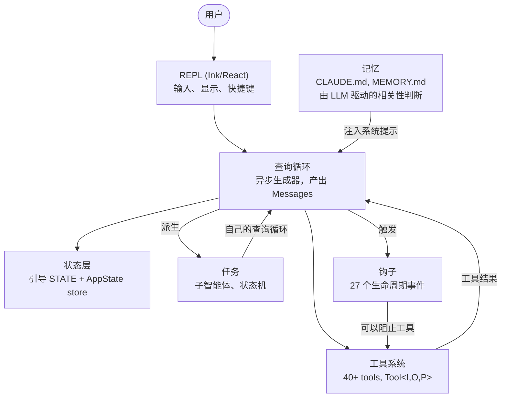
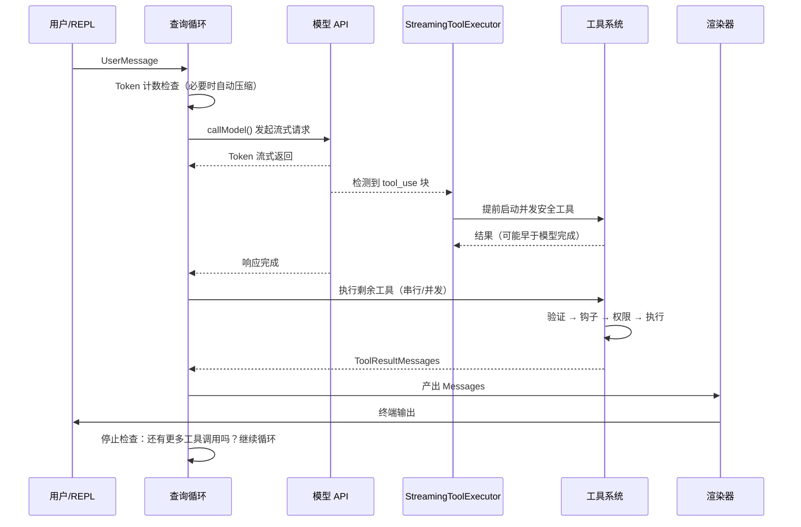
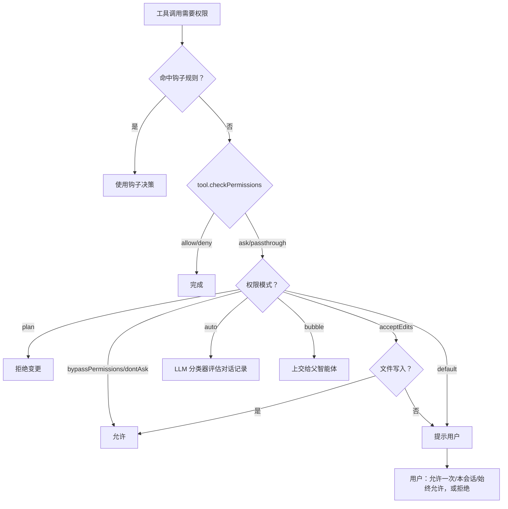
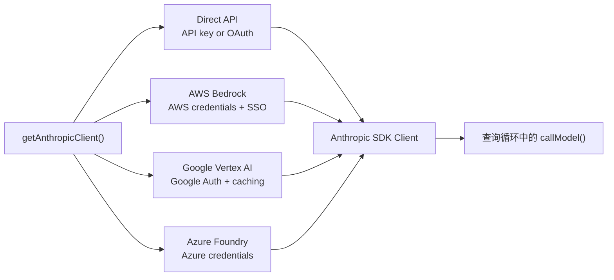
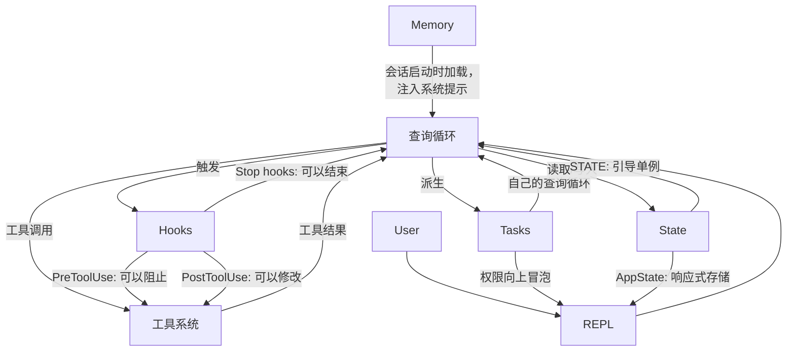

# 第 1 章：AI 智能体的架构

## 你正在看的是什么

传统 CLI 是一个函数。它接收参数，执行工作，然后退出。`grep` 不会决定顺便再运行一次 `sed`。`curl` 不会打开一个文件，并根据下载到的内容给它打补丁。契约很简单：一个命令，一个动作，确定性的输出。

智能体式 CLI 打破了这份契约的每一个部分。它接收自然语言提示，决定要使用哪些工具，按照当前情境所需的任意顺序执行这些工具，评估结果，然后不断循环，直到任务完成或用户停止它。这个“程序”不再是一串固定的指令序列，而是一个围绕语言模型构建的循环；语言模型会在运行时生成自己的指令序列。工具调用是副作用。模型的推理是控制流。

Claude Code 是 Anthropic 对这个想法的生产级实现：一个由近两千个文件组成的 TypeScript 单体应用，把终端变成了由 Claude 驱动的完整开发环境。它已经交付给数十万开发者使用，这意味着每一个架构决策都会产生真实世界的后果。本章会给你建立一套心智模型。六个抽象定义了整个系统。一条数据流把它们连接在一起。只要你内化了从按键输入到最终输出的黄金路径，后续每一章都只是对这条路径中某一段的放大。

下面是一种回顾式拆解——这六个抽象并不是一开始就在白板上设计好的。它们是在把一个生产级智能体交付给大规模用户的压力下逐渐浮现出来的。按它们现在的样子来理解，而不是按它们原本可能的规划来理解，才能为阅读本书余下部分建立正确预期。

---

## 六个关键抽象

Claude Code 建立在六个核心抽象之上。其他所有东西——400 多个实用工具文件、fork 出来的终端渲染器、vim 仿真、成本跟踪器——都是为了支撑这六个抽象而存在。



下面说明每个抽象做什么，以及它为什么存在。

**1. 查询循环**（`query.ts`，约 1,700 行）。这是一个异步生成器，也是整个系统的心跳。它以流式方式接收模型响应，收集工具调用，执行它们，把结果追加到消息历史中，然后继续循环。每一种交互——REPL、SDK、子智能体、无头模式 `--print`——都会流经这个单一函数。它产出供 UI 消费的 `Message` 对象。它的返回类型是一个名为 `Terminal` 的判别联合，精确编码了循环停止的原因：正常完成、用户中止、token 预算耗尽、停止钩子介入、达到最大轮次，或不可恢复错误。生成器模式——而不是回调或事件发射器——带来了自然的背压、干净的取消机制，以及带类型的终止状态。第 5 章会完整讲解这个循环的内部机制。

**2. 工具系统**（`Tool.ts`、`tools.ts`、`services/tools/`）。工具是智能体在世界中可以做的任何事：读取文件、运行 shell 命令、编辑代码、搜索网页。这个目的看似简单，背后却隐藏着大量机制。每个工具都实现了一个丰富的接口，覆盖身份、schema、执行、权限和渲染。工具不只是函数——它们携带自己的权限逻辑、并发声明、进度报告和 UI 渲染。系统会把工具调用划分为并发批次和串行批次，并且流式执行器会在模型甚至还没完成响应之前，就启动并发安全的工具。第 6 章会讲解完整的工具接口和执行流水线。

**3. 任务**（`Task.ts`、`tasks/`）。任务是后台工作单元，主要形式是子智能体。它们遵循一个状态机：`pending -> running -> completed | failed | killed`。`AgentTool` 会派生一个新的 `query()` 生成器，它拥有自己的消息历史、工具集合和权限模式。任务赋予 Claude Code 递归能力：一个智能体可以委派给子智能体，而子智能体还可以继续委派。

**4. 状态**（两层）。系统在两个层级维护状态。一个可变单例（`STATE`）保存大约 80 个会话级基础设施字段：工作目录、模型配置、成本跟踪、遥测计数器、会话 ID。它在启动时设置一次，之后直接变更——没有响应式。一个极简响应式存储（34 行，Zustand 风格）驱动 UI：消息、输入模式、工具审批、进度指示器。这种分离是刻意设计的：基础设施状态很少变化，不需要触发重新渲染；UI 状态频繁变化，而且必须触发重新渲染。第 3 章会深入讲解这种双层架构。

**5. 记忆**（`memdir/`）。这是智能体跨会话持久化的上下文。它分为三层：项目级（仓库中的 `CLAUDE.md` 文件）、用户级（`~/.claude/MEMORY.md`）和团队级（通过符号链接共享）。会话启动时，系统会扫描所有记忆文件，解析 frontmatter，然后由一个 LLM 选择哪些记忆与当前对话相关。记忆让 Claude Code 能够“记住”你的代码库约定、架构决策和调试历史。

**6. 钩子**（`hooks/`、`utils/hooks/`）。用户定义的生命周期拦截器，会在 4 类执行类型中的 27 个不同事件上触发：shell 命令、单次 LLM 提示、多轮智能体对话，以及 HTTP webhook。钩子可以阻止工具执行、修改输入、注入额外上下文，或者让整个查询循环提前短路。权限系统本身也有一部分是通过钩子实现的——`PreToolUse` 钩子可以在交互式权限提示出现之前就拒绝工具调用。

---

## 黄金路径：从按键输入到输出

跟踪一次请求在系统中的流动。用户输入 “add error handling to the login function”，然后按下 Enter。



这条流程里有三点值得注意。

第一，查询循环是生成器，而不是回调链。REPL 通过 `for await` 从中拉取消息，这意味着背压是天然存在的——如果 UI 跟不上，生成器就会暂停。这是刻意选择的结果，优于事件发射器或 observable 流。

第二，工具执行会与模型流式生成重叠。`StreamingToolExecutor` 不会等模型结束后才启动并发安全工具。一次 `Read` 调用可以在模型仍在生成响应剩余部分时就完成并返回结果。这就是推测执行——如果模型的最终输出让这个工具调用失效（少见但可能），结果会被丢弃。

第三，整个循环是可重入的。当模型发起工具调用时，结果会追加到消息历史里，然后循环会带着更新后的上下文再次调用模型。不存在单独的“工具结果处理”阶段——所有事情都在同一个循环里完成。模型通过不再发起更多工具调用来决定自己已经完成。

---

## 权限系统

Claude Code 会在你的机器上运行任意 shell 命令。它会编辑你的文件。它可以派生子进程、发起网络请求，并修改你的 git 历史。如果没有权限系统，这就是一场安全灾难。

系统定义了七种权限模式，按权限从高到低排列：

| 模式 | 行为 |
|------|----------|
| `bypassPermissions` | 全部允许。没有检查。仅用于内部/测试。 |
| `dontAsk` | 全部允许，但仍会记录日志。不提示用户。 |
| `auto` | 由对话记录分类器（LLM）决定允许/拒绝。 |
| `acceptEdits` | 文件编辑自动批准；所有其他变更都会提示。 |
| `default` | 标准交互模式。用户批准每个动作。 |
| `plan` | 只读。阻止所有变更。 |
| `bubble` | 将决策上交给父智能体（子智能体模式）。 |

当一个工具调用需要权限时，解析流程遵循一条严格的链：



`auto` 模式值得特别关注。它会运行一次独立的轻量级 LLM 调用，根据对话记录对工具调用进行分类。分类器会看到工具输入的一种紧凑表示，并判断这个动作是否符合用户提出的请求。正是这个模式让 Claude Code 可以半自主地工作——批准常规操作，同时标记那些看起来偏离用户意图的动作。

子智能体默认使用 `bubble` 模式，这意味着它们不能批准自己的危险动作。权限请求会向上传递给父智能体，最终可能传递给用户。这可以防止子智能体在用户完全看不到的情况下静默运行破坏性命令。

---

## 多提供商架构

Claude Code 通过四条不同的基础设施路径与 Claude 通信，而系统的其他部分完全不需要感知这些差异。



关键洞察是，Anthropic SDK 为每个云提供商都提供了包装类，而这些包装类暴露的接口与直接 API 客户端相同。`getAnthropicClient()` 工厂会读取环境变量和配置，决定使用哪个提供商，构造相应客户端并返回它。从这一点开始，`callModel()` 和其他所有消费者都会把它当成一个通用的 Anthropic 客户端来处理。

提供商选择在启动时确定，并存储在 `STATE` 中。查询循环从不检查当前激活的是哪个提供商。这意味着从 Direct API 切换到 Bedrock 是配置变更，而不是代码变更——智能体循环、工具系统和权限模型都完全与提供商无关。

---

## 构建系统

Claude Code 同时作为 Anthropic 内部工具和公开 npm 包发布。同一个代码库服务于这两种形态，通过编译期 feature flag 控制哪些内容会被包含进去。

```typescript
// 由 feature flag 保护的条件导入
const reactiveCompact = feature('REACTIVE_COMPACT')
  ? require('./services/compact/reactiveCompact.js')
  : null
```

`feature()` 函数来自 `bun:bundle`，也就是 Bun 内置的 bundler API。构建时，每个 feature flag 都会解析为布尔字面量。随后 bundler 的死代码消除（dead code elimination）会在 flag 为 false 时完全移除对应的 `require()` 调用——模块不会被加载，不会被包含进 bundle，也不会被发布出去。

这个模式是一致的：用顶层 `feature()` guard 包住一个 `require()` 调用。这里专门使用 `require()` 而不是 `import`，是因为当 guard 为 false 时，动态 `require()` 可以被 bundler 完全消除；而动态 `import()` 不行，因为它返回一个 Promise，bundler 必须保留它。

这里有一个值得注意的讽刺点。早期 npm 发布包中的 source map 文件包含 `sourcesContent`——完整的原始 TypeScript 源码，包括仅供内部使用的代码路径。feature flag 成功剥离了运行时代码，却把源码留在了 source map 文件里。这就是 Claude Code 源码变得公开可读的原因。

---

## 各部分如何连接

这六个抽象构成了一张依赖图：



记忆作为系统提示的一部分流入查询循环。查询循环驱动工具执行。工具结果作为消息反馈回查询循环。任务是递归的查询循环，拥有隔离的消息历史。钩子在定义好的点位拦截查询循环。状态被所有部分读取和写入，其中响应式存储负责连接到 UI。

查询循环和工具系统之间的循环依赖，是这个系统最本质的特征。模型生成工具调用。工具执行并产生结果。结果追加到消息历史。模型看到结果后决定下一步做什么。这个循环会持续下去，直到模型停止生成工具调用，或者某个外部约束（token 预算、最大轮次、用户中止）终止它。

下面是它们如何连接到后续章节：从输入到输出的黄金路径，是贯穿全书的主线。第 2 章会追踪系统如何启动，直到这条路径可以执行。第 3 章解释这条路径所读写的双层状态架构。第 4 章讲解查询循环所调用的 API 层。后续每一章都会放大你刚刚端到端看到的这条路径中的某一段。

---

## 应用到你的系统

如果你正在构建智能体系统——任何由 LLM 在运行时决定要采取哪些动作的系统——下面这些来自 Claude Code 架构的模式都可以迁移。

**生成器循环模式。** 使用异步生成器作为你的智能体循环，而不是回调或事件发射器。生成器会给你自然的背压（消费者按自己的节奏拉取）、干净的取消机制（对生成器调用 `.return()`），以及用于表达终止状态的带类型返回值。它解决的问题是：在基于回调的智能体循环里，很难知道循环何时“完成”，以及为什么完成。生成器让终止成为类型系统中的一等概念。

**自描述工具接口。** 每个工具都应该声明自己的并发安全性、权限要求和渲染行为。不要把这些逻辑放进一个“了解”每个工具的中央编排器里。它解决的问题是：中央编排器会变成一个 god object，每新增一个工具都必须更新它。自描述工具可以线性扩展——添加第 N+1 个工具时，不需要修改任何现有代码。

**把基础设施状态与响应式状态分开。** 不是所有状态都需要触发 UI 更新。会话配置、成本跟踪和遥测适合放在一个普通可变对象中。消息历史、进度指示器和审批队列适合放在响应式存储里。它解决的问题是：让所有东西都响应式，会给那些启动时变化一次、之后被读取上千次的状态增加订阅开销和复杂度。两层状态正好匹配两种访问模式。

**使用权限模式，而不是零散的权限检查。** 定义一小组命名模式（例如 `plan`、`default`、`auto`、`bypassPermissions`），并通过模式来解析每一个权限决策。不要把 `if (isAllowed)` 检查散落在各个工具实现中。它解决的问题是：权限执行不一致。当每个工具都经过同一条基于模式的解析链时，你只要知道当前处于哪个模式，就能推理系统的安全姿态。

**通过任务实现递归智能体架构。** 子智能体应该是同一个智能体循环的新实例，拥有自己的消息历史，而不是特殊分支代码路径。权限升级通过 `bubble` 模式向上流动。它解决的问题是：子智能体逻辑与主智能体循环分叉后，会在行为和错误处理上产生细微差异。如果子智能体就是同一个循环，它就继承同样的保证。
