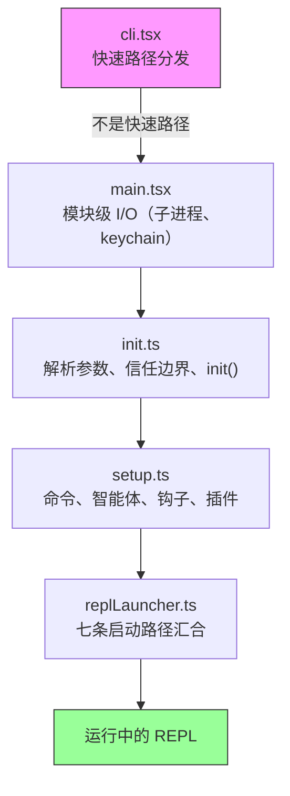
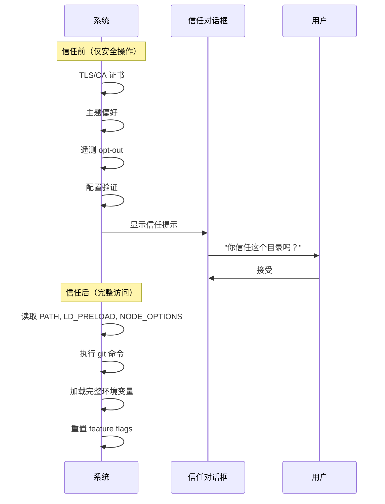

# 第 2 章：快速启动——引导流水线

如果说第 1 章给了你 Claude Code 架构的地图，那么本章给你的就是它抵达可工作状态所走的路线。六个抽象中的每个组件——查询循环、工具系统、状态层、钩子、记忆——都必须在用户看到光标之前完成初始化。留给这一切的预算是：300 毫秒。

300 毫秒是人类把一个工具感知为“瞬时响应”的阈值。超过它，CLI 就会显得迟钝。如果超出很多，开发者就会停止使用它。本章中的所有设计，都是为了保持在这条线之下。

引导过程必须完成四件事：验证环境、建立安全边界、配置通信层，并渲染 UI。它必须在 300ms 内完成全部四件事。这里的架构洞察是：这四项工作可以部分重叠、谨慎排序，并被激进裁剪，从而塞进一个对如此复杂的系统而言近乎不可能的预算里。

关于方法论需要说明一点：本章中的时间戳都是近似值，来自代码库自身的 profiling 检查点。它们代表现代硬件上典型的热启动耗时。冷启动会更慢。绝对数字没有相对结构重要：哪些操作可以重叠，哪些操作会阻塞，哪些操作被延后。

---

## 流水线的形状

启动流水线分布在五个文件中，并按顺序执行。每个文件都会收窄系统接下来需要做的事情范围：



每个文件都会在把控制权交给下一个文件之前，只做必要的最小工作。`cli.tsx` 会尝试在导入任何重型模块之前就退出。`main.tsx` 会在 import 求值期间，把慢操作作为副作用启动。`init.ts` 解析配置并建立信任边界。`setup.ts` 注册能力。`replLauncher.ts` 选择正确入口并启动 UI。

有三种并行策略让这个过程保持快速：

1. **模块级子进程分发。** 在 *import 求值期间*，把 keychain 和 MDM 读取作为副作用启动。子进程会在剩余约 135ms 的静态 import 加载期间运行。
2. **setup 中的 Promise 并行。** socket 绑定、钩子快照、命令加载和智能体定义加载全部并发运行。
3. **渲染后的延迟预取。** 用户在输入第一条消息之前不需要的所有东西——git status、模型能力、AWS 凭证——都在提示符可见之后再运行。

第四种策略不那么显眼，但同样重要：**通过动态 import 延迟模块求值**。代码库至少在十几个地方使用 `await import('./module.js')`，避免在真正需要之前加载代码。OpenTelemetry（400KB + 700KB gRPC）只在遥测初始化时加载。React 组件只在渲染时加载。每个动态 import 都是在用冷路径延迟（首次使用会触发模块求值）换取热路径速度（启动时不为可能永远用不到的模块付费）。

---

## 阶段 0：快速路径分发（cli.tsx）

进程进入的第一个文件是 `cli.tsx`，它只有一个任务：判断是否真的需要完整的引导流水线。很多调用——`claude --version`、`claude --help`、`claude mcp list`——只需要一个特定答案，不需要其他任何东西。加载 React、初始化遥测、读取 keychain、设置工具系统，都是纯粹浪费。

这个模式是：检查 `argv`，只动态导入所需的 handler，然后在系统其他部分加载之前退出。

```typescript
// Pseudocode for the fast-path pattern
if (args.length === 1 && args[0] === '--version') {
  const { printVersion } = await import('./commands/version.js')
  await printVersion()
  process.exit(0)
}
```

大约有十几条快速路径，覆盖版本、帮助、配置、MCP 服务器管理和更新检查。具体细节不重要——模式才重要。每条路径都只动态导入一个模块，调用一个函数，然后退出。代码库的其余部分根本不会加载。

这是一个会在整个引导过程中反复出现的原则的第一次体现：**通过更了解意图来少做事**。`argv` 数组揭示了用户意图。如果意图很窄，执行路径也应该很窄。

如果没有命中任何快速路径，`cli.tsx` 就会落入完整的 `main.tsx` import，真正的启动过程从这里开始。

---

## 阶段 1：模块级 I/O（main.tsx）

当 `main.tsx` 被导入时，它的模块级副作用会在求值期间触发——早于文件中任何函数被调用。这是整个引导过程中最关键的性能技术：

```typescript
// These run at import time, not at call time
const mdmPromise = startMDMSubprocess()
const keychainPromise = readKeychainCredentials()
```

当 JavaScript 引擎继续求值 `main.tsx` 的其余部分及其传递 import（约 138ms 的模块求值）时，这两个 promise 已经在执行中。MDM（Mobile Device Management，移动设备管理）子进程检查组织安全策略。keychain 读取会获取已存储的凭证。二者都是 I/O 绑定操作，否则就会在关键路径上串行执行。

这里的洞察是：模块求值并不是空闲时间——你可以把它与 I/O 重叠起来。等到 `main.tsx` 导出的函数第一次被调用时，这些 promise 往往已经完成解析。

这种技术要求在相关文件中压制 ESLint 的 top-level-await 和 side-effect-in-module-scope 规则。代码库有一条专门针对 `process.env` 访问模式的自定义 ESLint 规则，它允许在模块作用域中进行受控副作用，同时防止其他地方出现不受控副作用。

---

## 阶段 2：解析与信任（init.ts）

`init()` 函数经过了记忆化（memoization）处理——多次调用是安全的，并且会返回同一个结果。这一点很重要，因为多个入口点（REPL、print 模式、SDK 模式）都可能调用 `init()`，而记忆化保证它只会真正运行一次。

这个函数通过 Commander 解析命令行参数，从多个来源加载配置（全局设置、项目设置、环境变量），然后抵达流水线中最重要的边界。

### 信任边界

在信任边界之前，系统以受限模式运行。跨过边界之后，完整能力才可用。这个边界之所以存在，是因为 Claude Code 会读取环境变量——而环境变量可能被投毒。



信任边界并不是关于用户是否信任 Claude Code。它关心的是 Claude Code 是否信任 *环境*。恶意 `.bashrc` 可能设置 `LD_PRELOAD`，把代码注入到每个子进程中。信任对话框确保用户明确同意在一个可能由他人配置过的目录中运行。

系统有十种不同的信任敏感操作。在用户接受信任对话框之前，只运行安全操作：TLS 证书配置、主题偏好、遥测 opt-out。信任之后，系统才会读取可能危险的环境变量（PATH、LD_PRELOAD、NODE_OPTIONS），执行 git 命令，并应用完整的环境配置。

### preAction 钩子

Commander 的 `preAction` 钩子是架构上的关键枢纽。Commander 会解析命令结构（flag、subcommand、位置参数），但 *不会* 执行任何东西。`preAction` 钩子会在解析完成之后、匹配到的命令 handler 运行之前触发：

```typescript
program.hook('preAction', async (thisCommand) => {
  await init(thisCommand)
})
```

这种分离意味着，快速路径命令（在 Commander 加载之前就由 `cli.tsx` 处理）永远不需要支付 `init()` 的成本。只有需要完整环境的命令才会触发初始化。

---

## 阶段 3：设置（setup.ts）

`init()` 完成后，`setup()` 会注册系统需要的所有能力：

```mermaid
gantt
    title 阶段 3：并行设置
    dateFormat X
    axisFormat %Lms

    section 串行
    命令注册   :0, 5
    section 并行
    智能体定义      :5, 15
    钩子注册      :5, 12
    插件初始化  :5, 20
    MCP 服务器连接 :5, 25
```



命令、智能体、钩子和插件都会在可能的情况下并行注册。setup 阶段是系统从“我知道自己的配置”过渡到“我具备全部能力”的地方。setup 完成后，每个工具都已注册，每个钩子都已接线，系统已经准备好处理用户输入。

setup 还会处理安全钩子快照。钩子配置会从磁盘读取一次，被冻结成不可变快照，并在会话剩余时间内使用。之后对磁盘上钩子配置文件的修改都会被忽略。这可以防止攻击者在会话启动后修改钩子规则——冻结快照才是权限决策的唯一真实来源。

---

## 阶段 4：启动（replLauncher.ts）

七条不同的代码路径会汇合到 `replLauncher.ts`：交互式 REPL、print 模式（`--print`）、SDK 模式、resume（`--resume`）、continue（`--continue`）、pipe 模式和 headless。launcher 会检查 `init()` 产出的配置，并分发到正确的入口点。

两个例子可以展示这个范围：

**交互式 REPL**——标准情况。launcher 挂载 React/Ink 组件树，启动终端渲染器，并进入事件循环。用户看到提示符，随后可以开始输入。

**Print 模式**（`--print`）——来自 argv 的单个提示。launcher 创建一个没有 React 树的 headless 查询循环，运行到完成，把输出流式写入 stdout，然后退出。同一个智能体循环，不同的呈现方式。

重要细节是：七条路径最终都会调用 `query()`——也就是第 1 章中的同一个智能体循环。启动路径决定的是这个循环 *如何* 呈现（交互式终端、单次执行、SDK 协议），而不是它 *做什么*。这种汇合让架构变得可测试、可预测：无论用户如何调用 Claude Code，核心行为都是一样的。

---

## 启动时间线

完整流水线在时间上大致如下：

```mermaid
gantt
    title 引导时间线（约 240ms）
    dateFormat X
    axisFormat %Lms

    section 阶段 0
    快速路径检查          :0, 5

    section 阶段 1
    模块求值        :5, 143
    MDM 子进程（并行） :8, 60
    Keychain 读取（并行）  :8, 50

    section 阶段 2
    Commander 解析          :143, 146
    init()                   :146, 160
    信任边界           :160, 175

    section 阶段 3
    setup() + 并行注册 :175, 210

    section 阶段 4
    启动路径选择    :210, 215
    首次渲染             :215, 240
```



关键路径经过模块求值（最长的单个阶段，约 138ms），然后是 Commander 解析、init 和 setup。并行 I/O 操作（MDM、keychain）与模块求值重叠，通常在真正需要它们之前就已经完成。

### 性能预算

| 阶段 | 时间 | 发生了什么 |
|-------|------|-------------|
| 快速路径检查 | ~5ms | 检查 argv，可能的话提前退出 |
| 模块求值 | ~138ms | 导入树，触发并行 I/O |
| Commander 解析 | ~3ms | 解析 flags 和 subcommands |
| init() | ~14ms | 配置解析，信任边界 |
| setup() | ~35ms | 命令、智能体、钩子、插件 |
| 启动 + 首次渲染 | ~25ms | 选择路径，挂载 React，首次绘制 |
| **合计** | **~240ms** | 低于 300ms 预算 |

在现代机器上，总耗时约 240ms——比 300ms 预算多出 60ms 余量。冷启动（重启后的首次运行、OS 缓存为空）可能把模块求值推到 200ms+，让总耗时更接近上限。

---

## 迁移系统

简要说明 init 期间运行的一个子系统：schema migrations。Claude Code 会把配置和会话数据存储在本地文件和目录中。当版本之间的格式发生变化时，迁移会在启动时自动运行。

每个 migration 都是一个带版本号的函数。系统会把当前 schema 版本与最高 migration 版本比较，按顺序运行待处理迁移，并更新版本。迁移是幂等且快速的（操作的是小型本地文件，而不是数据库）。完整迁移过程通常在 5ms 内完成。如果某个迁移失败，它会记录错误并继续——对本地配置来说，可用性优先于严格一致性。

---

## 启动过程教给我们的系统设计原则

引导流水线是一项关于收窄范围的研究。每个阶段都会减少可能性空间：

- 阶段 0 把“任意 CLI 调用”收窄为“需要完整引导”
- 阶段 1 把“所有东西都必须加载”收窄为“在 I/O 期间并行加载”
- 阶段 2 把“未知环境”收窄为“可信且已配置的环境”
- 阶段 3 把“没有能力”收窄为“能力已完整注册”
- 阶段 4 把“七种可能模式”收窄为“一条具体启动路径”

到 REPL 渲染时，每个决策都已经完成。查询循环拿到的是一个完全配置好的环境：当前处于什么模式、有哪些工具可用、适用哪些权限，都没有歧义。300ms 预算不只是性能目标——它还是一种强约束，防止引导过程变成一个懒初始化系统，把决策推迟并散落到整个代码库中。

---

## 应用到你的系统

**把 I/O 与初始化重叠。** 在真正需要慢操作（派生子进程、读取凭证、网络检查）之前，就在模块求值时启动它们。JavaScript 引擎无论如何都在做同步工作——利用这段时间并行执行 I/O。模式是：在文件顶部写 `const promise = startSlowThing()`，在使用点写 `await promise`。

**尽早收窄范围。** 引导流水线的五个文件形成一个漏斗：每个阶段都会消除后续阶段不需要做的工作。快速路径分发是最明显的例子，但这个原则适用于所有地方。如果你能在解析时判断某条代码路径不需要执行，就跳过它。

**显式建立信任边界。** 如果你的应用会读取自己无法控制的环境（环境变量、配置文件、shell 设置），就在“用户同意之前可以安全读取”和“只有同意之后才能读取”之间画出一条清晰边界。信任边界可以阻止一类攻击：恶意环境在用户有机会评估之前就投毒应用。

**记忆化你的 init 函数。** 让初始化幂等——调用两次会产生相同结果。当多个入口点都可能触发初始化时，这能消除顺序 bug。memoization 模式本身很简单，但可以消除整整一类重复初始化 bug。

**在让出控制权之前捕获早期输入。** 在事件驱动系统中，初始化期间到达的用户输入可能会丢失。Claude Code 会在任何异步工作开始之前从 argv 捕获初始提示，确保 `claude "fix the bug"` 不会因为初始化耗时超过预期而丢掉提示。
