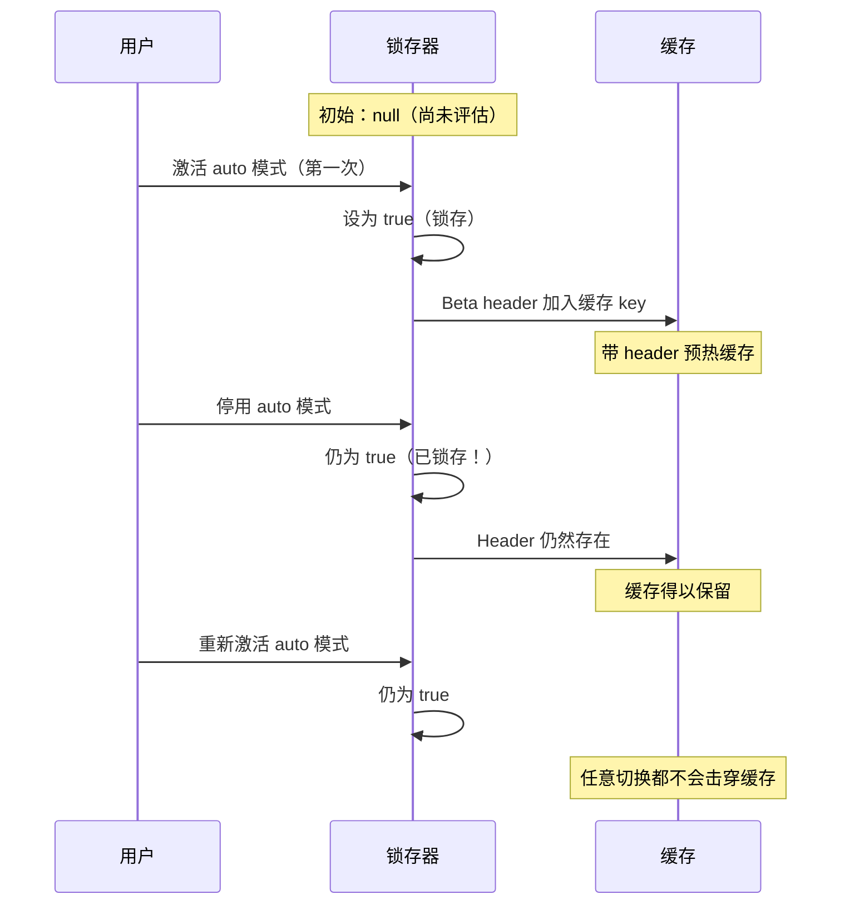
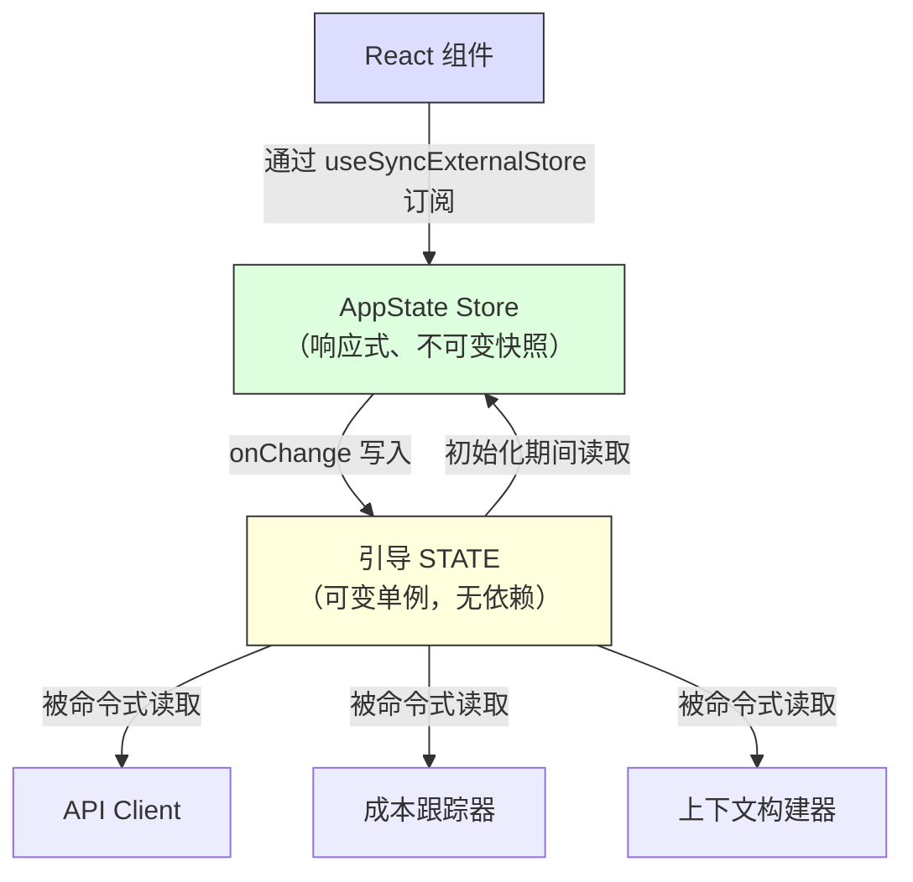

# 第 3 章：状态——双层架构

第 2 章追踪了从进程启动到首次渲染的引导流水线。到最后，系统已经拥有一个完全配置好的环境。但它到底配置了 *什么*？会话 ID 存在哪里？当前模型呢？消息历史呢？成本跟踪器呢？权限模式呢？状态到底住在哪里，为什么住在那里？

每个长时间运行的应用最终都会面对这个问题。对于一个简单 CLI 工具，答案很平凡——`main()` 里的几个变量。但 Claude Code 不是简单 CLI 工具。它是一个通过 Ink 渲染的 React 应用，进程生命周期可以持续数小时；它有一个会在任意时间加载内容的插件系统；它有一个必须从缓存上下文构造提示的 API 层；它有一个能跨进程重启存活的成本跟踪器；还有几十个基础设施模块需要在不互相导入的情况下读写共享数据。

幼稚做法——一个全局 store——会立刻失败。如果成本跟踪器更新的是驱动 React 重新渲染的同一个 store，那么每次 API 调用都会触发完整组件树 reconciliation。基础设施模块（引导、上下文构建、成本跟踪、遥测）不能导入 React。它们在 React 挂载前运行，在 React 卸载后运行，也会在根本不存在组件树的上下文中运行。把所有东西都塞进一个感知 React 的 store，会在整个 import 图中制造循环依赖。

Claude Code 用双层架构解决这个问题：一个用于基础设施状态的可变进程单例，以及一个用于 UI 状态的极简响应式 store。本章会解释这两层、连接它们的副作用系统，以及依赖这个基础的支撑子系统。后续每一章都默认你已经理解状态住在哪里，以及为什么住在那里。

---

## 3.1 引导状态——进程单例

### 为什么是可变单例

引导状态模块（`bootstrap/state.ts`）是在进程启动时创建一次的单个可变对象：

```typescript
const STATE: State = getInitialState()
```

这行代码上方的注释写着：`AND ESPECIALLY HERE`。类型定义上方两行还有一句：`DO NOT ADD MORE STATE HERE - BE JUDICIOUS WITH GLOBAL STATE`。这些注释的语气，像是工程师已经用艰难方式学过了不受治理的全局对象会带来什么代价。

可变单例在这里是正确选择，原因有三个。第一，引导状态必须在任何框架初始化之前可用——早于 React 挂载，早于 store 创建，早于插件加载。模块作用域初始化是唯一能保证 import 时可用的机制。第二，这些数据本质上属于进程作用域：会话 ID、遥测计数器、成本累加器、缓存路径。不存在有意义的“前一个状态”可供 diff，没有订阅者需要通知，也没有撤销历史。第三，这个模块必须是 import 依赖图中的叶子节点。如果它导入 React、store 或任何服务模块，就会制造循环依赖，破坏第 2 章描述的引导顺序。它只依赖工具类型和 `node:crypto`，因此可以从任何地方导入。

### 约 80 个字段

`State` 类型包含大约 80 个字段。抽样即可看出它覆盖范围很广：

**身份与路径**——`originalCwd`、`projectRoot`、`cwd`、`sessionId`、`parentSessionId`。`originalCwd` 会在进程启动时通过 `realpathSync` 解析，并做 NFC 规范化。它永远不会改变。

**成本与指标**——`totalCostUSD`、`totalAPIDuration`、`totalLinesAdded`、`totalLinesRemoved`。这些值会在会话期间单调累加，并在退出时持久化到磁盘。

**遥测**——`meter`、`sessionCounter`、`costCounter`、`tokenCounter`。这些是 OpenTelemetry 句柄，全部可为空（遥测初始化前为 null）。

**模型配置**——`mainLoopModelOverride`、`initialMainLoopModel`。当用户在会话中途切换模型时，会设置 override。

**会话标志**——`isInteractive`、`kairosActive`、`sessionTrustAccepted`、`hasExitedPlanMode`。这些布尔值会在会话持续期间作为行为门控。

**缓存优化**——`promptCache1hAllowlist`、`promptCache1hEligible`、`systemPromptSectionCache`、`cachedClaudeMdContent`。它们存在的目的，是防止重复计算和提示缓存失效。

### Getter/Setter 模式

`STATE` 对象从不直接导出。所有访问都通过大约 100 个独立的 getter 和 setter 函数进行：

```typescript
// Pseudocode — illustrates the pattern
export function getProjectRoot(): string {
  return STATE.projectRoot
}

export function setProjectRoot(dir: string): void {
  STATE.projectRoot = dir.normalize('NFC')  // NFC normalization on every path setter
}
```

这个模式强制实现封装、每个路径 setter 的 NFC 规范化（防止 macOS 上的 Unicode 不匹配）、类型收窄，以及引导隔离。代价是啰嗦——为了 80 个字段写 100 个函数。但在一个随手一次错误变更就可能击穿 50,000 token 提示缓存的代码库里，显式胜过简洁。

### Signal 模式

引导层不能导入 listener（它是 DAG 叶子节点），所以它使用一个名为 `createSignal` 的最小 pub/sub 原语。`sessionSwitched` signal 只有一个消费者：`concurrentSessions.ts`，它负责同步 PID 文件。这个 signal 以 `onSessionSwitch = sessionSwitched.subscribe` 的形式暴露，让调用方可以注册自己，而不需要引导层知道它们是谁。

### 五个粘性锁存器

引导状态中最微妙的字段，是五个遵循相同模式的布尔锁存器：某个功能在会话中第一次激活后，对应 flag 会在会话剩余时间内一直保持 `true`。它们存在的原因只有一个：保住提示缓存。



Claude 的 API 支持服务端提示缓存。当连续请求共享同一个系统提示前缀时，服务器会复用已缓存的计算结果。但缓存 key 包含 HTTP header 和请求体字段。如果某个 beta header 出现在请求 N 中，却没有出现在请求 N+1 中，缓存就会失效——即使提示内容完全相同。对于超过 50,000 token 的系统提示来说，缓存未命中代价很高。

这五个锁存器是：

| 锁存器 | 它防止什么 |
|-------|-----------------|
| `afkModeHeaderLatched` | Shift+Tab auto 模式切换导致 AFK beta header 开/关翻转 |
| `fastModeHeaderLatched` | fast mode 冷却进入/退出导致 fast mode header 翻转 |
| `cacheEditingHeaderLatched` | 远程 feature flag 变化击穿每个活跃用户的缓存 |
| `thinkingClearLatched` | 在确认缓存未命中（空闲 >1h）时触发。防止重新启用 thinking blocks 击穿刚预热好的缓存 |
| `pendingPostCompaction` | 用于遥测的消费一次 flag：区分由压缩导致的缓存未命中和由 TTL 过期导致的未命中 |

五者都使用三态类型：`boolean | null`。初始值 `null` 表示“尚未评估”。`true` 表示“已经锁存开启”。一旦设为 `true`，它们永远不会回到 `null` 或 `false`。这是锁存器的定义性属性。

实现模式如下：

```typescript
function shouldSendBetaHeader(featureCurrentlyActive: boolean): boolean {
  const latched = getAfkModeHeaderLatched()
  if (latched === true) return true       // Already latched -- always send
  if (featureCurrentlyActive) {
    setAfkModeHeaderLatched(true)          // First activation -- latch it
    return true
  }
  return false                             // Never activated -- don't send
}
```

为什么不总是发送所有 beta header？因为 header 是缓存 key 的一部分。发送一个未被识别的 header 会创建不同的缓存命名空间。锁存器确保你只在真正需要时进入某个缓存命名空间，然后一直留在那里。

---

## 3.2 AppState——响应式 Store

### 34 行实现

UI 状态 store 位于 `state/store.ts`：

store 实现大约 30 行：一个围绕 `state` 变量的闭包，一个用于防止虚假更新的 `Object.is` 相等性检查，同步 listener 通知，以及一个用于副作用的 `onChange` callback。骨架如下：

```typescript
// Pseudocode — illustrates the pattern
function makeStore(initial, onTransition) {
  let current = initial
  const subs = new Set()
  return {
    read:      () => current,
    update:    (fn) => { /* Object.is guard, then notify */ },
    subscribe: (cb) => { subs.add(cb); return () => subs.delete(cb) },
  }
}
```

三十四行。没有 middleware，没有 devtools，没有 time-travel debugging，没有 action type。只有一个包住可变变量的闭包、一个 listener 的 Set，以及一次 `Object.is` 相等性检查。这就是不引入库版本的 Zustand。

值得审视的设计决策包括：

**Updater function 模式。** 没有 `setState(newValue)`——只有 `setState((prev) => next)`。每次变更都会接收当前状态，并且必须产出下一个状态，从而消除并发变更中的 stale-state bug。

**`Object.is` 相等性检查。** 如果 updater 返回同一个引用，这次变更就是 no-op。不会触发 listener。不会运行副作用。它对性能至关重要——那些 spread-and-set 但实际没有改变值的组件不会产生重新渲染。

**`onChange` 早于 listener 触发。** 可选的 `onChange` callback 会同时接收旧状态和新状态，并在任何 subscriber 收到通知之前同步触发。它用于必须在 UI 重新渲染前完成的副作用（见 3.4 节）。

**没有 middleware，没有 devtools。** 这不是疏忽。当你的 store 只需要三种操作（get、set、subscribe）、一次 `Object.is` 相等性检查，以及一个同步 `onChange` 钩子时，34 行你自己拥有的代码比一个依赖更好。你可以控制精确语义。你可以在 30 秒内读完整个实现。

### AppState 类型

`AppState` 类型（约 452 行）描述了 UI 渲染所需的一切形状。大多数字段都包在 `DeepImmutable<>` 中，同时对包含函数类型的字段显式排除：

```typescript
export type AppState = DeepImmutable<{
  settings: SettingsJson
  verbose: boolean
  // ... ~150 more fields
}> & {
  tasks: { [taskId: string]: TaskState }  // Contains abort controllers
  agentNameRegistry: Map<string, AgentId>
}
```

这个 intersection type 让大多数字段深度不可变，同时豁免那些保存函数、Map 和可变 ref 的字段。完整不可变是默认值；只有在类型系统会和运行时语义冲突的地方，才做外科手术式逃逸。

### React 集成

store 通过 `useSyncExternalStore` 与 React 集成：

```typescript
// Standard React pattern — useSyncExternalStore with a selector
export function useAppState<T>(selector: (state: AppState) => T): T {
  const store = useContext(AppStoreContext)
  return useSyncExternalStore(
    store.subscribe,
    () => selector(store.getState()),
  )
}
```

selector 必须返回已有的子对象引用（而不是新构造对象），这样 `Object.is` 比较才能防止不必要的重新渲染。如果你写 `useAppState(s => ({ a: s.a, b: s.b }))`，每次 render 都会产生一个新的对象引用，组件会在每次状态变化时重新渲染。这是 Zustand 用户也会遇到的同一个约束——比较更便宜，但 selector 作者必须理解引用身份。

---

## 3.3 两层如何关联

两层通过显式且狭窄的接口通信。



引导状态会在初始化期间流入 AppState：`getDefaultAppState()` 从磁盘读取设置（引导层帮助定位这些设置），检查 feature flag（引导层已经评估过），并设置初始模型（引导层已从 CLI 参数和设置中解析）。

AppState 会通过副作用流回引导状态：当用户更改模型时，`onChangeAppState` 会调用引导层的 `setMainLoopModelOverride()`。当设置变化时，引导层中的凭证缓存会被清除。

但这两层从不共享引用。导入引导状态的模块不需要知道 React。读取 AppState 的组件不需要知道进程单例。

一个具体例子可以澄清数据流。当用户输入 `/model claude-sonnet-4` 时：

1. 命令 handler 调用 `store.setState(prev => ({ ...prev, mainLoopModel: 'claude-sonnet-4' }))`
2. store 的 `Object.is` 检查检测到变化
3. `onChangeAppState` 触发，检测到模型发生变化，调用 `setMainLoopModelOverride()`（更新引导状态）和 `updateSettingsForSource()`（持久化到磁盘）
4. 所有 store subscriber 触发——React 组件重新渲染以显示新的模型名称
5. 下一次 API 调用从引导状态中的 `getMainLoopModelOverride()` 读取模型

步骤 1-4 是同步的。步骤 5 中的 API client 可能几秒后才运行。但它读取的是引导状态（已在步骤 3 更新），而不是 AppState。这就是双层交接：UI store 是“用户选择了什么”的真实来源，而引导状态是“API client 使用什么”的真实来源。

DAG 属性——引导层不依赖任何东西，AppState 在初始化时依赖引导层，React 依赖 AppState——由一条 ESLint 规则强制执行。这条规则会阻止 `bootstrap/state.ts` 导入允许集合之外的模块。

---

## 3.4 副作用：onChangeAppState

`onChange` callback 是两层同步的地方。每次 `setState` 调用都会触发 `onChangeAppState`，它接收前后两个状态，并决定要触发哪些外部效果。

**权限模式同步** 是主要用例。在这个集中 handler 出现之前，权限模式只会被 8+ 条变更路径中的 2 条同步到远程会话（CCR）。其他六条——Shift+Tab 循环切换、对话框选项、slash commands、rewind、bridge callbacks——都会修改 AppState，却不会通知 CCR。外部元数据因此漂移到不同步状态。

修复方式是：停止在各个变更点分散发送通知，而是在一个地方 hook 状态 diff。源码中的注释列出了所有曾经出问题的变更路径，并指出“上面那些分散的 callsite 不需要任何改动”。这就是集中式副作用的架构收益——覆盖是结构性的，而不是手工维护的。

**模型变化** 会让引导状态与 UI 渲染内容保持同步。**设置变化** 会清除凭证缓存并重新应用环境变量。**Verbose toggle** 和 **expanded view** 会持久化到全局配置。

这个模式——在可 diff 的状态转移上集中处理副作用——本质上是把 Observer 模式应用在状态 diff 粒度，而不是单个事件粒度。它比分散的事件发射更容易扩展，因为副作用数量的增长速度远低于变更点数量。

---

## 3.5 上下文构建

`context.ts` 中的三个记忆化异步函数负责构建会追加到每次对话前面的系统提示上下文。每个函数每个会话只计算一次，而不是每轮计算一次。

`getGitStatus` 会并行运行五个 git 命令（`Promise.all`），生成一个包含当前分支、默认分支、最近提交和工作树状态的块。`--no-optional-locks` flag 可以防止 git 获取写锁，从而避免干扰另一个终端中的并发 git 操作。

`getUserContext` 加载 CLAUDE.md 内容，并通过 `setCachedClaudeMdContent` 把它缓存在引导状态中。这个缓存打破了一个循环依赖：auto 模式分类器需要 CLAUDE.md 内容，但 CLAUDE.md 加载要经过文件系统，文件系统要经过权限检查，而权限检查又会调用分类器。把内容缓存在引导状态（DAG 叶子节点）中，这个循环就被切断了。

三个上下文函数都使用 Lodash 的 `memoize`（计算一次，永久缓存），而不是基于 TTL 的缓存。理由是：如果每 5 分钟重新计算 git status，变化就会击穿服务端提示缓存。系统提示甚至会告诉模型：“这是对话开始时的 git 状态。注意，这个状态是某一时刻的快照。”

---

## 3.6 成本跟踪

每个 API 响应都会流经 `addToTotalSessionCost`，它会累加每个模型的使用量、更新引导状态、上报到 OpenTelemetry，并递归处理 advisor tool usage（响应内部嵌套的模型调用）。

成本状态通过保存到项目配置文件并在恢复时读取，可以跨进程重启存活。会话 ID 被用作保护条件——只有当持久化的会话 ID 与正在恢复的会话匹配时，成本才会恢复。

直方图使用 reservoir sampling（Algorithm R）在准确表示分布的同时保持有界内存。1,024 个条目的 reservoir 可以产出 p50、p95 和 p99 百分位。为什么不用简单的 running average？因为平均值会掩盖分布形状。一个会话中 95% 的 API 调用耗时 200ms、5% 耗时 10 秒，和另一个所有调用都耗时 690ms 的会话可能有相同平均值，但用户体验截然不同。

---

## 3.7 我们学到了什么

这个代码库已经从一个简单 CLI 成长为一个拥有约 450 行状态类型定义、约 80 个进程状态字段、一个副作用系统、多个持久化边界和缓存优化锁存器的系统。这些东西都不是一开始设计好的。粘性锁存器是在缓存击穿变成可测量的成本问题时加入的。`onChange` handler 是在发现 8 条权限同步路径中有 6 条失效后集中化的。CLAUDE.md 缓存是在出现循环依赖后加入的。

这就是复杂应用中状态自然增长的模式。双层架构提供了足够的结构来容纳这种增长——新的引导字段不会影响 React 渲染，新的 AppState 字段不会制造 import 循环——同时又足够灵活，可以容纳原始设计中未预见到的模式。

---

## 3.8 状态架构总结

| 属性 | 引导状态 | AppState |
|---|---|---|
| **位置** | 模块作用域单例 | React context |
| **可变性** | 通过 setter 可变 | 通过 updater 产生不可变快照 |
| **订阅者** | 针对特定事件的 Signal（pub/sub） | 面向 React 的 `useSyncExternalStore` |
| **可用性** | import 时（早于 React） | provider 挂载后 |
| **持久化** | 进程退出 handler | 通过 onChange 写入磁盘 |
| **相等性** | N/A（命令式读取） | `Object.is` 引用检查 |
| **依赖** | DAG 叶子节点（只导入允许的基础依赖） | 从整个代码库导入类型 |
| **测试重置** | `resetStateForTests()` | 创建新的 store 实例 |
| **主要消费者** | API client、成本跟踪器、上下文构建器 | React 组件、副作用 |

---

## 应用到你的系统

**按访问模式拆分状态，而不是按领域拆分。** 会话 ID 属于单例，不是因为它抽象上属于“基础设施”，而是因为它必须能在 React 挂载前读取，并且可以在不通知 subscriber 的情况下写入。权限模式属于响应式 store，因为它的变化必须触发重新渲染和副作用。让访问模式决定层级，架构就会自然成形。

**粘性锁存器模式。** 任何与缓存交互的系统（提示缓存、CDN、查询缓存）都会面对同一个问题：会话中途改变缓存 key 的 feature toggle 会导致失效。一旦某个功能被激活，它对缓存 key 的贡献就在本会话中保持活跃。三态类型（`boolean | null`，表示“未评估 / 开启 / 永不关闭”）让意图自文档化。当缓存不受你控制时，这尤其有价值。

**在状态 diff 上集中处理副作用。** 当多条代码路径都能改变同一个状态时，不要把通知散落到各个变更点。hook store 的 `onChange` callback，并检测哪些字段发生了变化。覆盖会变成结构性的（任何变更都会触发 effect），而不是手工性的（每个变更点都必须记得通知）。

**宁可要 34 行自己拥有的代码，也不要一个你不拥有的库。** 当你的需求正好就是 get、set、subscribe 和一个 change callback 时，最小实现能让你完全控制语义。在一个状态管理 bug 会造成真实金钱成本的系统里，这种透明性有价值。关键洞察是识别什么时候你 *不* 需要一个库。

**有意识地把进程退出作为持久化边界。** 多个子系统会在进程退出时持久化状态。这里的取舍是明确的：非优雅终止（SIGKILL、OOM）会丢失已累积数据。这可以接受，因为这些数据是诊断性的，不是事务性的；而且对每次状态变化都写磁盘，对一个每会话递增数百次的计数器来说太昂贵。

---

本章建立的双层架构——用于基础设施的引导单例、用于 UI 的响应式 store，以及连接二者的副作用——是后续每一章的基础。API 层（第 4 章）会从记忆化构建器中读取上下文。查询循环（第 5 章）会消费这些上下文并推进对话。工具系统（第 6 章）会从 AppState 检查权限。智能体系统（第 8 章）会在 AppState 中创建任务条目，同时在引导状态中跟踪成本。理解状态住在哪里，以及为什么住在那里，是理解这些系统如何工作的前提。

有些字段横跨边界。主循环模型同时存在于两层：AppState 中的 `mainLoopModel`（用于 UI 渲染）和引导状态中的 `mainLoopModelOverride`（供 API client 消费）。`onChangeAppState` handler 让二者保持同步。这种重复是双层拆分的成本。但另一种选择——让 API client 导入 React store，或者让 React 组件从进程单例读取——会违反让架构保持健全的依赖方向。少量受控重复，加上一个集中式同步点，优于纠缠不清的依赖图。
