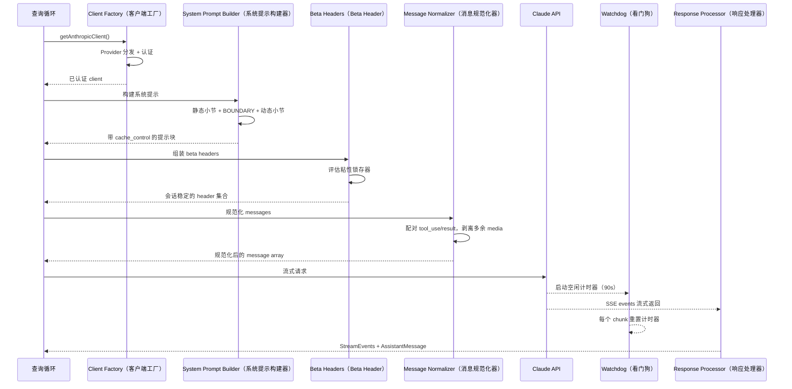
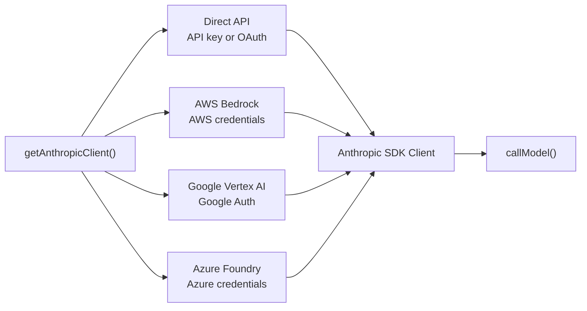
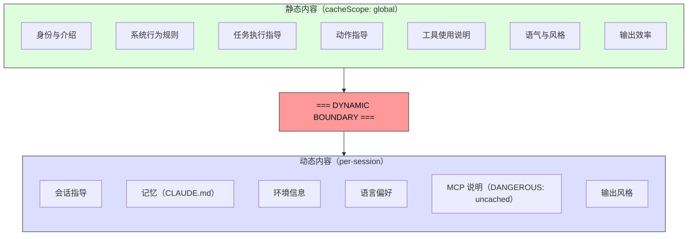

# 第 4 章：与 Claude 对话——API 层

第 3 章建立了状态住在哪里，以及两层状态如何通信。现在我们沿着这条线继续，看这些状态被真正使用时会发生什么：系统需要与语言模型对话。Claude Code 中的一切——引导序列、状态系统、权限框架——都是为了服务这一刻。

这一层处理的失败模式比系统中任何其他部分都多。它必须通过一个透明接口路由到四个云提供商。它必须以字节级意识构造系统提示，因为服务器端提示缓存的工作方式意味着，一个放错位置的小节就可能击穿价值 50,000+ token 的缓存。它必须在流式响应中主动检测故障，因为 TCP 连接可能静默死亡。它还必须维护会话稳定的不变量，确保对话中途的 feature flag 变化不会造成不可见的性能悬崖。

我们从头到尾追踪一次 API 调用。

---

## 多提供商 Client Factory

`getAnthropicClient()` 函数是所有模型通信的唯一工厂。它会返回一个 Anthropic SDK client，并根据当前部署目标配置为对应提供商：

分发完全由环境变量驱动，并按固定优先级顺序求值。四个提供商特定的 SDK 类都会通过 `as unknown as Anthropic` 被强制转换为 `Anthropic`。源码中的注释非常坦诚：“we have always been lying about the return type.” 这种有意的类型擦除意味着每个消费者看到的都是统一接口。代码库的其他部分永远不需要按 provider 分支。

每个 provider SDK 都是动态导入的——`AnthropicBedrock`、`AnthropicFoundry`、`AnthropicVertex` 都是重型模块，有各自的依赖树。动态 import 确保未使用的提供商永远不会加载。

Provider 选择在启动时确定，并存储在引导 `STATE` 中。查询循环从不检查当前激活的是哪个 provider。从 Direct API 切换到 Bedrock 是配置变更，而不是代码变更。

### buildFetch 包装器

每个出站 fetch 都会被包装，以注入 `x-client-request-id` header——这是每个请求生成一个 UUID。当请求超时时，服务器永远不会为响应分配 request ID。如果没有客户端侧 ID，API 团队就无法把这次超时与服务端日志关联起来。这个 header 弥补了这道缺口。它只会发送给第一方 Anthropic endpoint——第三方 provider 可能会拒绝未知 header。

---

## 系统提示构造

系统提示是整个系统中对缓存最敏感的产物。Claude 的 API 提供服务端提示缓存：跨请求完全相同的提示前缀可以被缓存，从而同时节省延迟和成本。一次 200K token 的对话中，可能有 50-70K token 与上一轮完全相同。击穿这个缓存会迫使服务器重新处理全部内容。

### 动态边界标记

提示会被构建成一个字符串小节数组，其中有一条关键分界线：

边界之前的所有内容在不同会话、用户和组织之间都是相同的——它会获得最高层级的服务端缓存。边界之后的内容包含用户特定信息，因此降级为按会话缓存。

小节命名约定刻意很醒目。添加新小节时，必须在 `systemPromptSection`（安全、可缓存）和 `DANGEROUS_uncachedSystemPromptSection`（会破坏缓存，必须提供 reason 字符串）之间选择。`_reason` 参数在运行时没有使用，但它充当强制文档——每个会破坏缓存的小节都必须在源码中携带自己的理由。

### 2^N 问题

`prompts.ts` 中的一条注释解释了为什么条件小节必须放在边界之后：

> Each conditional here is a runtime bit that would otherwise multiply the Blake2b prefix hash variants (2^N).

边界之前的每个布尔条件都会让唯一 global cache entry 的数量翻倍。三个条件会产生 8 个变体；五个条件会产生 32 个。静态小节被刻意设计成无条件。编译期 feature flag（由 bundler 解析）可以出现在边界之前。运行时检查（这是 Haiku 吗？用户有 auto mode 吗？）必须放在边界之后。

这种约束在被违反之前是不可见的。一个出于好意的工程师，如果在边界前添加了一个由用户设置 gate 的小节，就可能静默地碎片化全局缓存，并让整个 fleet 的提示处理成本翻倍。

---

## 流式传输

### 绕过 SDK 抽象，直接使用原始 SSE

流式实现使用原始的 `Stream<BetaRawMessageStreamEvent>`，而不是 SDK 的更高层 `BetaMessageStream`。原因是：`BetaMessageStream` 会在每个 `input_json_delta` event 上调用 `partialParse()`。对于带有大型 JSON 输入的工具调用（例如包含数百行的文件编辑），这会在每个 chunk 上从头重新解析不断增长的 JSON 字符串——形成 O(n^2) 行为。Claude Code 自己处理工具输入累积，因此 partial parsing 是纯粹浪费。

### 空闲 Watchdog（看门狗）

TCP 连接可能在没有通知的情况下死亡。服务器可能崩溃，负载均衡器可能静默丢弃连接，企业代理也可能超时。SDK 的 request timeout 只覆盖初始 fetch——一旦 HTTP 200 到达，timeout 就算满足。如果 streaming body 停止传输，没有任何东西会捕获它。

watchdog 是一个 `setTimeout`，每收到一个 chunk 就会重置。如果 90 秒内没有 chunk 到达，stream 会被 abort，系统会回退到非流式重试。45 秒时会触发 warning。当 watchdog 触发时，它会带上 client request ID 记录事件，便于关联。

### 非流式回退

当 streaming 在响应中途失败（网络错误、停滞、截断）时，系统会回退到一次同步的 `messages.create()` 调用。这可以处理代理故障：代理返回 HTTP 200 但 body 不是 SSE，或者在中途截断 SSE stream。

当流式工具执行处于活动状态时，可以禁用这个回退，因为回退会重新执行整个请求，并可能导致工具运行两次。

---

## 提示缓存系统

### 三个层级

提示缓存分三个层级运行：

**Ephemeral cache**（默认）：按会话缓存，TTL 由服务器定义（约 5 分钟）。所有用户都会获得这一层。

**1-hour TTL**：符合条件的用户会获得扩展缓存。资格由订阅状态决定，并被锁存在引导状态中——第 3 章中的 `promptCache1hEligible` 粘性锁存器确保会话中途的超额状态翻转不会改变 TTL。

**Global scope**：系统提示缓存条目可以跨会话、跨组织共享。提示的静态部分对所有 Claude Code 用户都相同，因此一个缓存副本可以服务所有人。当存在 MCP 工具时，会禁用 global scope，因为 MCP 工具定义是用户特定的，会把缓存碎片化成数百万个唯一前缀。

### 粘性锁存器的实际作用

第 3 章中的五个粘性锁存器会在这里，也就是请求构造期间被评估。每个锁存器都从 `null` 开始，一旦设为 `true`，就在本会话中保持 `true`。锁存器代码块上方的注释非常精确：“Sticky-on latches for dynamic beta headers. Each header, once first sent, keeps being sent for the rest of the session so mid-session toggles don't change the server-side cache key and bust ~50-70K tokens.”

关于锁存器模式、五个具体锁存器，以及为什么“总是发送所有 header”不是正确解法，请参见第 3 章 3.1 节。

---

## queryModel 生成器

`queryModel()` 函数是一个异步生成器（约 700 行），负责编排整个 API 调用生命周期。它会产出 `StreamEvent`、`AssistantMessage` 和 `SystemAPIErrorMessage` 对象。

请求组装遵循一套精心排序的序列：

1. **Kill switch 检查**——最高成本模型层级的安全阀
2. **Beta header 组装**——特定于模型，并应用粘性锁存器
3. **工具 schema 构建**——通过 `Promise.all()` 并行执行，延迟工具在发现前排除
4. **消息规范化**——修复孤立的 tool_use/tool_result 不匹配，剥离多余 media，移除陈旧块
5. **系统提示块构建**——在动态边界处分割，并分配 cache scope
6. **包裹 retry 的 streaming**——处理 529（overloaded）、模型回退、thinking 降级、OAuth refresh

### 输出 Token 上限

默认输出上限是 8,000 token，而不是典型的 32K 或 64K。生产数据表明，p99 输出是 4,911 token——标准限制会多预留 8-16 倍。当某个响应触及上限时（<1% 的请求），它会以 64K 上限干净重试一次。这在 fleet 规模上能节省显著成本。

### 错误处理与重试

`withRetry()` 函数本身也是一个异步生成器，会产出 `SystemAPIErrorMessage` event，让 UI 可以显示重试状态。重试策略包括：

- **529（overloaded）**：等待并重试，可选地降级 fast mode
- **模型回退**：主模型失败后尝试 fallback（例如从 Opus 到 Sonnet）
- **Thinking 降级**：上下文窗口溢出会触发 reduced thinking budget
- **OAuth 401**：刷新 token 并重试一次

生成器模式意味着重试进度（“Server overloaded, retrying in 5s...”）会作为事件流的自然组成部分出现，而不是作为旁路通知出现。

---

## 应用到你的系统

**把提示缓存当成架构约束，而不是 feature toggle。** 大多数 LLM 应用只是“打开”缓存。Claude Code 把它当成一种会塑造提示排序、小节 memoization、header 锁存和配置管理的设计约束。结构良好的提示（50K token 缓存命中）和结构糟糕的提示（每轮完整重处理）之间的差异，是系统中最大的单一成本杠杆。

**对昂贵逃逸口使用 DANGEROUS 命名约定。** 当代码库中存在一个很容易被意外违反的不变量时，用醒目前缀命名逃逸口有三重效果：让违反行为在 code review 中可见，强制文档化（必填 reason 参数），并对安全默认路径形成心理摩擦。这个模式可以从缓存推广到任何具有隐性成本的操作。

**构建 streaming 时使用 watchdog，而不只是 timeout。** SDK 的 request timeout 会在 HTTP 200 时满足，但 response body 可能在任何时刻停止到达。一个会在每个 chunk 上重置的 `setTimeout` 可以捕获这种情况。非流式回退可以处理代理故障模式（HTTP 200 但 body 不是 SSE、中途截断），这些模式在企业环境中比你想象得更常见。

**让重试策略基于 yield，而不是基于异常。** 让 retry wrapper 成为一个会产出状态 event 的异步生成器，调用方就能把重试进度作为事件流的自然组成部分显示出来。模型回退模式（Opus 失败，尝试 Sonnet）对生产韧性尤其有用。

**把快速路径与完整流水线分开。** 不是每次 API 调用都需要工具搜索、advisor 集成、thinking budget 和 streaming 基础设施。Claude Code 的 `queryHaiku()` 函数为内部操作（压缩、分类）提供了一条精简路径，跳过所有智能体相关关注点。一个接口简化的独立函数可以防止复杂度意外泄漏。

---

## 接下来

API 层位于后续所有系统的基础之上。第 5 章会展示查询循环如何使用流式响应来驱动工具执行——包括工具如何在模型完成响应之前就开始执行。第 5 章也会解释当对话接近上下文上限时，压缩系统如何保持缓存效率。第 6 章会深入工具系统本身，第 7 章会展示并发执行如何组织多个请求与工具结果。

所有这些系统都会继承这里建立的约束：把缓存稳定性作为架构不变量，通过 client factory 实现 provider 透明性，并通过锁存器系统实现会话稳定配置。API 层不只是发送请求——它定义了其他所有系统运行所遵循的规则。
