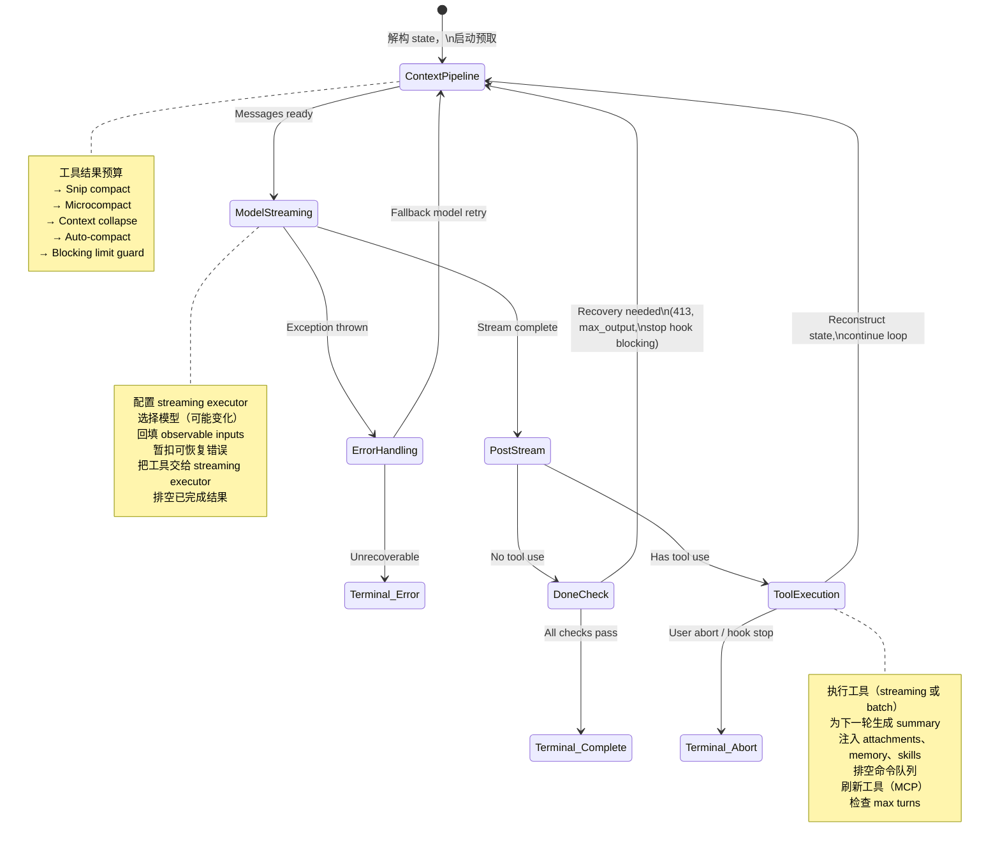
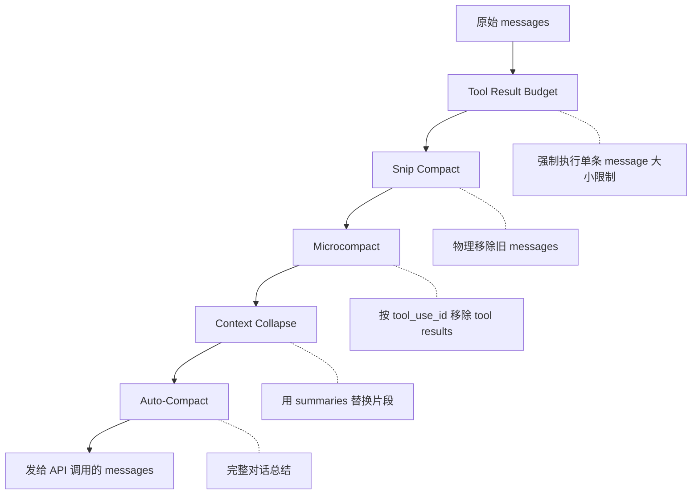
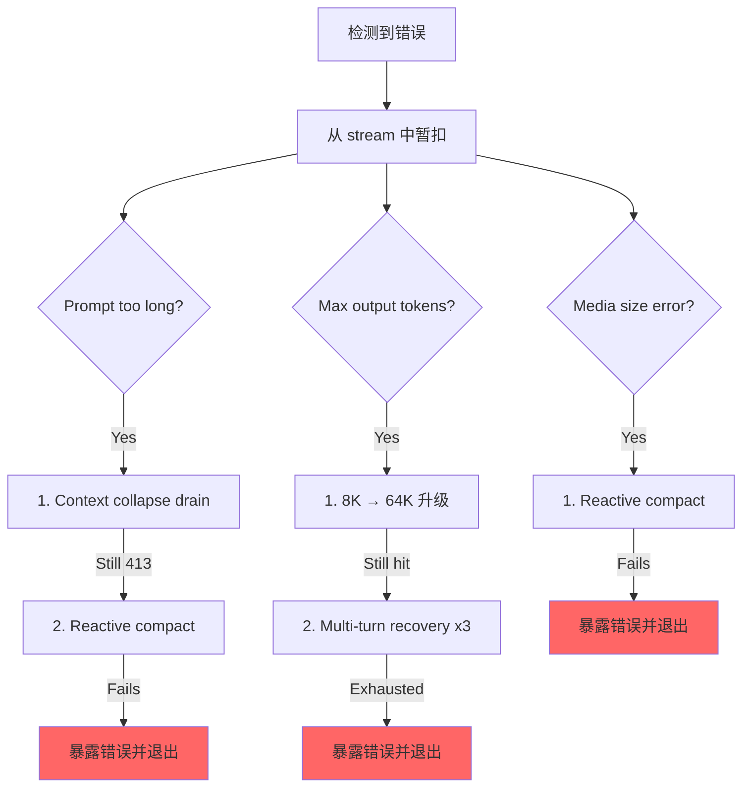

# 第 5 章：智能体循环

## 跳动的心脏

第 4 章展示了 API 层如何把配置转化为流式 HTTP 请求——client 如何构建，系统提示如何组装，响应如何以 server-sent events 的形式到达。那一层处理的是与模型对话的 *机制*。但单次 API 调用不是智能体。智能体是一个循环：调用模型，执行工具，把结果反馈回去，再次调用模型，直到工作完成。

每个系统都有自己的重心。数据库的重心是存储引擎。编译器的重心是中间表示。Claude Code 的重心是 `query.ts`——一个 1,730 行的单文件，里面包含驱动每一次交互的异步生成器，从 REPL 中的第一次按键，到无头 `--print` 调用中的最后一次工具调用，都由它运行。

这不是夸张。只有一条代码路径会与模型对话、执行工具、管理上下文、从错误中恢复，并决定何时停止。这条代码路径就是 `query()` 函数。REPL 调用它。SDK 调用它。子智能体调用它。headless runner 调用它。如果你正在使用 Claude Code，你就在 `query()` 里面。

这个文件很密，但它的复杂性不是纠缠的继承层级那种复杂。它更像潜艇的复杂：一个单一船体，包含许多冗余系统；每个系统都是因为海水曾经找到过渗入方式而被加上的。每个 `if` 分支都有故事。每条被暂扣的错误消息，都代表一个真实 bug：SDK 消费者曾在恢复过程中途断开连接。每个 circuit breaker 阈值，都是用那些在无限循环中烧掉数千次 API 调用的真实会话调出来的。

本章会从头到尾追踪整个循环。读完之后，你理解的不只是发生了什么，还包括每个机制为什么存在，以及没有它会坏在哪里。

---

## 为什么是异步生成器

第一个架构问题：为什么智能体循环是生成器，而不是基于回调的事件发射器？

```typescript
// Simplified — shows the concept, not the exact types
async function* agentLoop(params: LoopParams): AsyncGenerator<Message | Event, TerminalReason>
```

实际签名会产出多种 message 和 event 类型，并返回一个判别联合，用来编码循环停止的原因。

原因有三个，按重要性排序。

**背压。** 事件发射器不管消费者是否准备好，都会触发事件。生成器只有在消费者调用 `.next()` 时才会产出值。当 REPL 的 React 渲染器正忙着绘制上一帧时，生成器会自然暂停。当 SDK 消费者正在处理工具结果时，生成器会等待。没有缓冲区溢出，没有消息丢失，也没有“快速生产者 / 慢速消费者”问题。

**返回值语义。** 生成器的返回类型是 `Terminal`——一个判别联合，精确编码循环为何停止。是正常完成？用户中止？token 预算耗尽？停止钩子介入？达到最大轮次？不可恢复的模型错误？一共有 10 种不同终止状态。调用方不需要订阅一个 “end” event，然后祈祷 payload 里带着原因。它们会从 `for await...of` 或 `yield*` 中拿到一个带类型的返回值。

**通过 `yield*` 组合。** 外层 `query()` 函数通过 `yield*` 委托给 `queryLoop()`，透明转发每个产出的值以及最终返回值。`handleStopHooks()` 这样的子生成器也使用同样模式。这创建了一条干净的职责链，不需要回调，不需要 promise 包 promise，也不需要事件转发样板代码。

这个选择有代价——JavaScript 中的异步生成器不能“倒带”或 fork。但智能体循环两者都不需要。它是一个严格向前推进的状态机。

还有一个微妙点：`function*` 语法让函数变成 *惰性* 的。函数体直到第一次 `.next()` 调用时才会执行。这意味着 `query()` 会立即返回——所有重型初始化（配置快照、记忆预取、预算跟踪器）只会在消费者开始拉取值时发生。在 REPL 中，这意味着 React 渲染管线已经准备好之后，循环的第一行才会运行。

---

## 调用方提供什么

在追踪循环之前，先看输入是什么会有帮助：

```typescript
// Simplified — illustrates the key fields
type LoopParams = {
  messages: Message[]
  prompt: SystemPrompt
  permissionCheck: CanUseToolFn
  context: ToolUseContext
  source: QuerySource         // 'repl', 'sdk', 'agent:xyz', 'compact', etc.
  maxTurns?: number
  budget?: { total: number }  // API-level task budget
  deps?: LoopDeps             // Injected for testing
}
```

值得注意的字段：

- **`querySource`**：一个字符串判别符，例如 `'repl_main_thread'`、`'sdk'`、`'agent:xyz'`、`'compact'` 或 `'session_memory'`。许多条件分支都依赖它。compact agent 使用 `querySource: 'compact'`，这样 blocking limit guard 不会死锁（compact agent 需要运行来 *降低* token 数）。

- **`taskBudget`**：API 级任务预算（`output_config.task_budget`）。它不同于 `+500k` 自动继续 token 预算功能。`total` 是整个智能体式 turn 的预算；`remaining` 会根据累计 API 用量在每次迭代中计算，并跨压缩边界调整。

- **`deps`**：可选依赖注入。默认值是 `productionDeps()`。这是测试替换假模型调用、假压缩和确定性 UUID 的接缝。

- **`canUseTool`**：一个返回给定工具是否允许使用的函数。这就是权限层——它会检查信任设置、钩子决策和当前权限模式。

---

## 双层入口点

公共 API 是真实循环外面的一层薄包装：

外层函数包装内层循环，并跟踪本轮中哪些排队命令被消费。turn 期间排队的命令（通过 `/` slash commands 或任务通知）会在循环内部标记为 `'started'`，并在 wrapper 中标记为 `'completed'`。如果循环抛出异常，或者生成器通过 `.return()` 被关闭，完成通知就不会触发。这是刻意设计的——失败的 turn 不应该把命令标记为已成功处理。

---

## 状态对象

循环把状态携带在一个单一的带类型对象中：

```typescript
// Simplified — illustrates the key fields
type LoopState = {
  messages: Message[]
  context: ToolUseContext
  turnCount: number
  transition: Continue | undefined
  // ... plus recovery counters, compaction tracking, pending summaries, etc.
}
```

十个字段。每个字段都有存在的理由：

| 字段 | 为什么存在 |
|-------|---------------|
| `messages` | 对话历史，每次迭代都会增长 |
| `toolUseContext` | 可变上下文：工具、abort controller、智能体状态、选项 |
| `autoCompactTracking` | 跟踪压缩状态：turn counter、turn ID、连续失败次数、是否已压缩 |
| `maxOutputTokensRecoveryCount` | 输出 token 上限的多轮恢复尝试次数（最多 3 次） |
| `hasAttemptedReactiveCompact` | 防止无限 reactive compaction 循环的一次性 guard |
| `maxOutputTokensOverride` | 升级期间设为 64K，之后清除 |
| `pendingToolUseSummary` | 上一轮 Haiku summary 返回的 promise，会在当前 streaming 期间 resolve |
| `stopHookActive` | 防止 blocking retry 后重新运行 stop hooks |
| `turnCount` | 单调计数器，会与 `maxTurns` 比较 |
| `transition` | 上一次迭代为什么继续——第一次迭代为 `undefined` |

### 可变循环中的不可变转移

下面是在循环中每个 `continue` 语句处都会出现的模式：

```typescript
const next: State = {
  messages: [...messagesForQuery, ...assistantMessages, ...toolResults],
  toolUseContext: toolUseContextWithQueryTracking,
  autoCompactTracking: tracking,
  turnCount: nextTurnCount,
  maxOutputTokensRecoveryCount: 0,
  hasAttemptedReactiveCompact: false,
  pendingToolUseSummary: nextPendingToolUseSummary,
  maxOutputTokensOverride: undefined,
  stopHookActive,
  transition: { reason: 'next_turn' },
}
state = next
```

每个 continue 点都会构造一个完整的新 `State` 对象。不是 `state.messages = newMessages`。不是 `state.turnCount++`。而是完整重建。好处是每次转移都是自文档化的。你可以阅读任何一个 `continue` 点，并准确看到哪些字段变化，哪些字段被保留。新状态上的 `transition` 字段记录了循环 *为什么* 继续——测试会断言这个字段，以验证正确的恢复路径被触发。

---

## 循环主体

下面是单次迭代的完整执行流程，压缩成骨架：



这就是整个循环。Claude Code 中的每个功能——从记忆到子智能体，再到错误恢复——都会输入或消费这一个迭代结构。

---

## 上下文管理：四层压缩

每次 API 调用之前，消息历史都会经过最多四个上下文管理阶段。它们按特定顺序运行，而这个顺序很重要。



### 第 0 层：工具结果预算

在任何压缩之前，`applyToolResultBudget()` 会对工具结果执行单条 message 大小限制。没有有限 `maxResultSizeChars` 的工具会被豁免。

### 第 1 层：Snip Compact

最轻量的操作。Snip 会从数组中物理移除旧 messages，并产出一条边界消息，向 UI 表示发生了移除。它会报告释放了多少 token，而这个数字会被接入 auto-compact 的阈值检查。

### 第 2 层：Microcompact

Microcompact 会移除不再需要的工具结果，通过 `tool_use_id` 标识。对于 cached microcompact（会编辑 API cache），边界消息会延后到 API 响应之后。原因是客户端侧 token 估算不可靠。API 响应中的实际 `cache_deleted_input_tokens` 会告诉你真正释放了多少。

### 第 3 层：Context Collapse

Context collapse 会用 summary 替换对话片段。它在 auto-compact 之前运行，而且这个顺序是刻意的：如果 collapse 把上下文降到 auto-compact 阈值以下，auto-compact 就会变成 no-op。这会保留颗粒度更细的上下文，而不是把所有内容替换成一个单体 summary。

### 第 4 层：Auto-Compact

最重的操作：它会 fork 出一整段 Claude 对话来总结历史。实现中有一个 circuit breaker——连续失败 3 次后，它会停止尝试。这可以防止生产中观察到的噩梦场景：会话卡在上下文上限之上，在一个 compact-fail-retry 无限循环中每天烧掉 250K 次 API 调用。

### Auto-Compact 阈值

阈值来自模型的上下文窗口：

```
effectiveContextWindow = contextWindow - min(modelMaxOutput, 20000)

Thresholds (relative to effectiveContextWindow):
  Auto-compact fires:      effectiveWindow - 13,000
  Blocking limit (hard):   effectiveWindow - 3,000
```

| 常量 | 值 | 目的 |
|----------|-------|---------|
| `AUTOCOMPACT_BUFFER_TOKENS` | 13,000 | auto-compact 触发点低于有效窗口的余量 |
| `MANUAL_COMPACT_BUFFER_TOKENS` | 3,000 | 预留空间，让 `/compact` 仍能工作 |
| `MAX_CONSECUTIVE_AUTOCOMPACT_FAILURES` | 3 | Circuit breaker 阈值 |

13,000 token buffer 意味着 auto-compact 会在硬限制之前很早触发。auto-compact 阈值和 blocking limit 之间的间隙，就是 reactive compact 发挥作用的地方——如果主动 auto-compact 失败或被禁用，reactive compact 会捕获 413 错误，并按需压缩。

### Token 计数

权威函数 `tokenCountWithEstimation` 会把 API 报告的权威 token 计数（来自最近一次响应）与该响应之后新增 messages 的粗略估算结合起来。这个近似是保守的——它倾向于估高，因此 auto-compact 会稍早触发，而不是稍晚触发。

---

## 模型流式传输

### callModel() 循环

API 调用发生在一个 `while(attemptWithFallback)` 循环中，用来支持模型回退：

```typescript
let attemptWithFallback = true
while (attemptWithFallback) {
  attemptWithFallback = false
  try {
    for await (const message of deps.callModel({ messages, systemPrompt, tools, signal })) {
      // Process each streamed message
    }
  } catch (innerError) {
    if (innerError instanceof FallbackTriggeredError && fallbackModel) {
      currentModel = fallbackModel
      attemptWithFallback = true
      continue
    }
    throw innerError
  }
}
```

启用后，`StreamingToolExecutor` 会在 streaming 期间一看到 `tool_use` block 就开始执行工具——不等完整响应结束。工具如何被编排进并发 batch，是第 7 章的主题。

### 暂扣模式

这是文件中最重要的模式之一。可恢复错误会被从 yield stream 中压制：

```typescript
let withheld = false
if (contextCollapse?.isWithheldPromptTooLong(message)) withheld = true
if (reactiveCompact?.isWithheldPromptTooLong(message)) withheld = true
if (isWithheldMaxOutputTokens(message)) withheld = true
if (!withheld) yield yieldMessage
```

为什么要暂扣？因为 SDK 消费者——Cowork、桌面应用——会在任何带有 `error` 字段的 message 上终止会话。如果你先 yield 一个 prompt-too-long 错误，然后又通过 reactive compaction 成功恢复，消费者已经断开了。恢复循环仍在运行，但已经没人监听。所以错误会被暂扣，推入 `assistantMessages`，供下游恢复检查发现。如果所有恢复路径都失败，被暂扣的 message 才会最终暴露出来。

### 模型回退

当捕获到 `FallbackTriggeredError`（主模型需求过高）时，循环会切换模型并重试。但 thinking signature 与模型绑定——把一个模型生成的 protected-thinking block 重放给另一个 fallback 模型，会导致 400 错误。代码会在重试前剥离 signature blocks。来自失败尝试的所有孤立 assistant messages 都会被 tombstone，这样 UI 就能移除它们。

---

## 错误恢复：升级阶梯

`query.ts` 中的错误恢复不是单一策略。它是一条干预力度逐步增强的阶梯：当前一层失败时，才会触发下一层。



### 死亡螺旋 Guard

最危险的失败模式是无限循环。代码中有多重 guard：

1. **`hasAttemptedReactiveCompact`**：一次性 flag。每种错误类型只触发一次 reactive compact。
2. **`MAX_OUTPUT_TOKENS_RECOVERY_LIMIT = 3`**：多轮恢复尝试的硬上限。
3. **auto-compact 的 circuit breaker**：连续失败 3 次后，auto-compact 完全停止尝试。
4. **错误响应不运行 stop hooks**：当最后一条 message 是 API error 时，代码会在到达 stop hooks 前显式返回。注释解释了原因：“error -> hook blocking -> retry -> error -> ...（hook 每一轮都会注入更多 token）”。
5. **跨 stop hook 重试保留 `hasAttemptedReactiveCompact`**：当 stop hook 返回 blocking errors 并强制重试时，reactive compact guard 会被保留。注释记录了这个 bug：“在这里重置为 false 会导致烧掉数千次 API 调用的无限循环。”

每个 guard 都是因为有人在生产中撞上了对应失败模式才被加上的。

---

## 示例推演：“修复 auth.ts 中的 bug”

为了让循环更具体，我们追踪一次真实交互的三次迭代。

**用户输入：** `Fix the null pointer bug in src/auth/validate.ts`

**迭代 1：模型读取文件。**

循环进入。上下文管理运行（无需压缩——对话很短）。模型流式生成响应：“Let me look at the file.” 它发出一个 `tool_use` block：`Read({ file_path: "src/auth/validate.ts" })`。streaming executor 看到这是并发安全工具，于是立即启动。等模型完成响应文本时，文件内容已经在内存中。

stream 后处理：模型使用了工具，所以进入工具使用路径。Read 结果（带行号的文件内容）被推入 `toolResults`。一个 Haiku summary promise 在后台启动。状态用新 messages 重建，`transition: { reason: 'next_turn' }`，循环继续。

**迭代 2：模型编辑文件。**

上下文管理再次运行（仍低于阈值）。模型流式生成：“I see the bug on line 42 -- `userId` can be null.” 它发出 `Edit({ file_path: "src/auth/validate.ts", old_string: "const user = getUser(userId)", new_string: "if (!userId) return { error: 'unauthorized' }\nconst user = getUser(userId)" })`。

Edit 不是并发安全工具，所以 streaming executor 会把它排队到响应完成后。然后 14 步执行流水线触发：Zod validation 通过，input backfill 扩展路径，PreToolUse hook 检查权限（用户批准），编辑被应用。迭代 1 中 pending 的 Haiku summary 会在 streaming 期间 resolve——其结果会作为 `ToolUseSummaryMessage` 被产出。状态重建，循环继续。

**迭代 3：模型声明完成。**

模型流式生成：“I've fixed the null pointer bug by adding a guard clause.” 没有 `tool_use` blocks。我们进入“完成”路径。Prompt-too-long 恢复？不需要。Max output tokens？没有。Stop hooks 运行——没有 blocking errors。Token budget 检查通过。循环返回 `{ reason: 'completed' }`。

总计：三次 API 调用，两次工具执行，一次用户权限提示。循环处理了流式工具执行、与 API 调用重叠的 Haiku summarization，以及完整权限流水线——这一切都通过同一个 `while(true)` 结构完成。

---

## Token 预算

用户可以为一个 turn 请求 token 预算（例如 `+500k`）。预算系统会在模型完成响应后决定继续还是停止。

`checkTokenBudget` 用三条规则做出二元的继续/停止决策：

1. **Subagents 总是停止。** 预算只是顶层概念。
2. **90% 完成阈值。** 如果 `turnTokens < budget * 0.9`，继续。
3. **收益递减检测。** 3 次以上 continuation 后，如果当前 delta 和前一个 delta 都低于 500 token，就提前停止。模型每次 continuation 产生的输出越来越少。

当决策是“继续”时，会注入一条 nudge message，告诉模型还剩多少预算。

---

## Stop Hooks：强制模型继续工作

Stop hooks 会在模型没有请求任何工具使用就完成时运行——也就是它认为自己已经完成。hooks 会评估它实际上 *是否* 完成。

流水线会运行 template job classification，触发后台任务（prompt suggestion、memory extraction），然后执行真正的 stop hooks。当某个 stop hook 返回 blocking errors——“你说你完成了，但 linter 发现 3 个错误”——这些错误会追加到消息历史，循环带着 `stopHookActive: true` 继续。这个 flag 会防止重试时再次运行同一批 hooks。

当 stop hook 发出 `preventContinuation` 信号时，循环会立即以 `{ reason: 'stop_hook_prevented' }` 退出。

---

## 状态转移：完整目录

循环的每个出口都属于两类之一：`Terminal`（循环返回）或 `Continue`（循环迭代）。

### Terminal 状态（10 种原因）

| 原因 | 触发条件 |
|--------|---------|
| `blocking_limit` | Token count 达到硬限制，auto-compact 关闭 |
| `image_error` | ImageSizeError、ImageResizeError 或不可恢复 media error |
| `model_error` | 不可恢复的 API/model exception |
| `aborted_streaming` | 用户在模型 streaming 期间中止 |
| `prompt_too_long` | 所有恢复都耗尽后的 withheld 413 |
| `completed` | 正常完成（无工具使用、预算耗尽或 API error） |
| `stop_hook_prevented` | Stop hook 显式阻止继续 |
| `aborted_tools` | 用户在工具执行期间中止 |
| `hook_stopped` | PreToolUse hook 停止继续 |
| `max_turns` | 命中 `maxTurns` 限制 |

### Continue 状态（7 种原因）

| 原因 | 触发条件 |
|--------|---------|
| `collapse_drain_retry` | Context collapse 在 413 后排空 staged collapses |
| `reactive_compact_retry` | Reactive compact 在 413 或 media error 后成功 |
| `max_output_tokens_escalate` | 命中 8K 上限，升级到 64K |
| `max_output_tokens_recovery` | 64K 仍命中，多轮恢复（最多 3 次） |
| `stop_hook_blocking` | Stop hook 返回 blocking errors，必须重试 |
| `token_budget_continuation` | Token 预算未耗尽，注入 nudge message |
| `next_turn` | 正常工具使用 continuation |

---

## 孤立工具结果：协议安全网

API 协议要求每个 `tool_use` block 后面都要跟一个 `tool_result`。`yieldMissingToolResultBlocks` 函数会为模型发出但从未得到对应结果的每个 `tool_use` block 创建 error `tool_result` messages。没有这张安全网，streaming 期间的崩溃会留下孤立的 `tool_use` blocks，导致下一次 API 调用发生协议错误。

它会在三个地方触发：外层错误 handler（模型崩溃）、fallback handler（stream 中途切换模型）和 abort handler（用户中断）。每条路径都有不同错误消息，但机制完全相同。

---

## Abort 处理：两条路径

Abort 可能发生在两个点：streaming 期间和工具执行期间。二者行为不同。

**streaming 期间 abort**：streaming executor（如果启用）会排空剩余结果，为排队工具生成合成 `tool_results`。没有 executor 时，`yieldMissingToolResultBlocks` 会填补缺口。`signal.reason` 检查会区分硬 abort（Ctrl+C）和 submit-interrupt（用户输入了新消息）——submit-interrupt 会跳过 interruption message，因为排队的用户消息已经提供了上下文。

**工具执行期间 abort**：逻辑类似，但 interruption message 上会带 `toolUse: true` 参数，向 UI 表明当时工具正在进行。

---

## Thinking 规则

Claude 的 thinking/redacted_thinking blocks 有三条不可违反的规则：

1. 包含 thinking block 的 message 必须属于一个 `max_thinking_length > 0` 的 query
2. Thinking block 不能是 message 中的最后一个 block
3. Thinking blocks 必须在 assistant trajectory 持续期间被保留

违反任何一条都会产生不透明的 API 错误。代码在多个地方处理这些规则：fallback handler 会剥离 signature blocks（它们与模型绑定），compaction pipeline 会保留受保护尾部，microcompact 层永远不会触碰 thinking blocks。

---

## 依赖注入

`QueryDeps` 类型刻意很窄——四个依赖，而不是四十个：

四个注入依赖分别是：模型调用器、compactor、microcompactor 和 UUID 生成器。测试通过 loop params 传入 `deps`，直接注入 fake。类型定义使用 `typeof fn`，可以让签名自动保持同步。除了可变 `State` 和可注入 `QueryDeps`，不可变 `QueryConfig` 会在进入 `query()` 时快照一次——feature flags、会话状态、环境变量只捕获一次，之后永不重新读取。三方分离（可变状态、不可变配置、可注入依赖）让循环可测试，并让未来重构成纯 `step(state, event, config)` reducer 变得直接。

---

## 应用到你的系统：构建自己的智能体循环

**使用生成器，而不是回调。** 背压是免费的。返回值语义是免费的。通过 `yield*` 组合也是免费的。智能体循环严格向前推进——你永远不需要倒带或 fork。

**让状态转移显式。** 在每个 `continue` 点重建完整状态对象。啰嗦正是这个模式的特性——它可以防止部分更新 bug，并让每次转移自文档化。

**暂扣可恢复错误。** 如果你的消费者遇到错误就会断开，不要在确认恢复失败之前 yield 错误。把它们推入内部 buffer，尝试恢复，只在耗尽恢复路径时暴露。

**分层管理上下文。** 轻量操作先运行（移除），重量操作后运行（总结）。这会在可能时保留颗粒度上下文，只在必要时退回到单体 summary。

**为每个重试添加 circuit breaker。** `query.ts` 中每个恢复机制都有显式限制：3 次 auto-compact 失败、3 次 max-output 恢复尝试、1 次 reactive compact 尝试。没有这些限制，第一个触发 retry-on-failure 循环的生产会话就会在一夜之间烧掉你的 API 预算。

如果你从零开始，最小智能体循环骨架如下：

```
async function* agentLoop(params) {
  let state = initState(params)
  while (true) {
    const context = compressIfNeeded(state.messages)
    const response = await callModel(context)
    if (response.error) {
      if (canRecover(response.error, state)) { state = recoverState(state); continue }
      return { reason: 'error' }
    }
    if (!response.toolCalls.length) return { reason: 'completed' }
    const results = await executeTools(response.toolCalls)
    state = { ...state, messages: [...context, response.message, ...results] }
  }
}
```

Claude Code 循环中的每个功能，都是这些步骤中某一步的展开。四个压缩层展开了 compress 这一步。暂扣模式展开了模型调用。升级阶梯展开了错误恢复。Stop hooks 展开了“无工具使用”退出。从这个骨架开始。只在你遇到它要解决的问题时，才添加对应展开。

---

## 总结

智能体循环是 1,730 行的单个 `while(true)`，而它什么都做。它流式传输模型响应，并发执行工具，通过四层压缩管理上下文，从五类错误中恢复，用收益递减检测跟踪 token 预算，运行可以强制模型回去继续工作的 stop hooks，管理记忆和 skills 的预取流水线，并产出一个带类型的判别联合，精确说明它为什么停止。

它是系统中最重要的文件，因为它是唯一接触所有其他子系统的文件。上下文流水线输入到它。工具系统由它驱动。错误恢复包裹着它。钩子拦截它。状态层贯穿它。UI 从它渲染。

如果你理解了 `query()`，你就理解了 Claude Code。其他一切都是外围。
