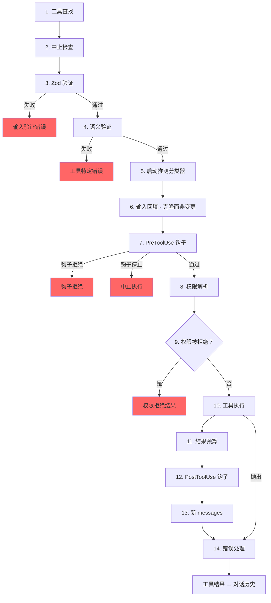

# 第 6 章：工具——从定义到执行

## 神经系统

第 5 章展示了智能体循环——那个会流式传输模型响应、收集工具调用并把结果反馈回去的 `while(true)`。循环是心跳。但如果没有神经系统把“模型想运行 `git status`”翻译成真正的 shell 命令，并附带权限检查、结果预算和错误处理，心跳就没有意义。

工具系统就是这个神经系统。它横跨 40 多个工具实现、一个带 feature-flag gate 的集中式 registry、一条 14 步执行流水线、一个拥有七种模式的权限解析器，以及一个会在模型完成响应前就启动工具的流式执行器。

Claude Code 中的每一次工具调用——每次文件读取、每条 shell 命令、每次 grep、每个子智能体派发——都会流经同一条流水线。统一性正是重点：无论工具是内置 Bash 执行器，还是第三方 MCP 服务器，它都会获得同样的验证、同样的权限检查、同样的结果预算、同样的错误分类。

`Tool` 接口大约有 45 个成员。听起来很多，但理解系统如何工作时只有五个最重要：

1. **`call()`**——执行工具
2. **`inputSchema`**——验证并解析输入
3. **`isConcurrencySafe()`**——它能并行运行吗？
4. **`checkPermissions()`**——这个调用被允许吗？
5. **`validateInput()`**——这个输入在语义上合理吗？

其他一切——12 个渲染方法、analytics hooks、搜索提示——都是为了支撑 UI 和遥测层。从这五个开始，其余部分会自然归位。

---

## Tool 接口

### 三个类型参数

每个工具都由三个类型参数参数化：

```typescript
Tool<Input extends AnyObject, Output, P extends ToolProgressData>
```

`Input` 是一个 Zod object schema，承担双重职责：它会生成发送给 API 的 JSON Schema（让模型知道应该提供哪些参数），并通过 `safeParse` 在运行时验证模型响应。`Output` 是工具结果的 TypeScript 类型。`P` 是工具运行时发出的 progress event 类型——BashTool 发出 stdout chunks，GrepTool 发出 match counts，AgentTool 发出子智能体 transcripts。

### buildTool() 与 Fail-Closed 默认值

没有工具定义会直接构造 `Tool` 对象。每个工具都会经过 `buildTool()`，这是一个工厂，会把 defaults 对象展开到工具特定定义下面：

```typescript
// Pseudocode — illustrates the fail-closed defaults pattern
const SAFE_DEFAULTS = {
  isEnabled:         () => true,
  isParallelSafe:    () => false,   // Fail-closed: new tools run serially
  isReadOnly:        () => false,   // Fail-closed: treated as writes
  isDestructive:     () => false,
  checkPermissions:  (input) => ({ behavior: 'allow', updatedInput: input }),
}

function buildTool(definition) {
  return { ...SAFE_DEFAULTS, ...definition }  // Definition overrides defaults
}
```

在关乎安全的地方，默认值刻意采用 fail-closed。一个忘记实现 `isConcurrencySafe` 的新工具默认返回 `false`——它会串行运行，绝不并行。一个忘记实现 `isReadOnly` 的工具默认返回 `false`——系统会把它当作写操作。一个忘记实现 `toAutoClassifierInput` 的工具会返回空字符串——auto mode 安全分类器会跳过它，这意味着它会交给通用权限系统处理，而不是自动绕过。

唯一一个 *不是* fail-closed 的默认值是 `checkPermissions`，它返回 `allow`。这看起来反直觉，直到你理解分层权限模型：`checkPermissions` 是工具特定逻辑，它运行在通用权限系统已经评估过规则、钩子和基于模式的策略 *之后*。一个工具从 `checkPermissions` 返回 `allow` 的意思是“我没有工具特定的反对意见”——它不是授予全局访问权。把成员组织成子对象（`options`、`readFileState` 这样的命名字段）提供了聚焦接口会提供的结构，却不需要声明、实现并把五个独立 interface 类型穿过 40 多个 call site 的仪式感。

### 并发安全取决于输入

签名 `isConcurrencySafe(input: z.infer<Input>): boolean` 接收已解析输入，因为同一个工具对某些输入安全，对另一些输入不安全。BashTool 是典型例子：`ls -la` 是只读且并发安全的，但 `rm -rf /tmp/build` 不是。工具会解析命令，把每个 subcommand 与已知安全集合比对，只有当每个非中性部分都是搜索或读取操作时，才返回 `true`。

### ToolResult 返回类型

每个 `call()` 都返回一个 `ToolResult<T>`：

```typescript
type ToolResult<T> = {
  data: T
  newMessages?: (UserMessage | AssistantMessage | AttachmentMessage | SystemMessage)[]
  contextModifier?: (context: ToolUseContext) => ToolUseContext
}
```

`data` 是带类型输出，会被序列化进 API 的 `tool_result` content block。`newMessages` 让工具可以向对话中注入额外 messages——AgentTool 用它追加子智能体 transcripts。`contextModifier` 是一个会为后续工具修改 `ToolUseContext` 的函数——`EnterPlanMode` 就是这样切换权限模式的。Context modifiers 只会对非并发安全工具生效；如果你的工具并行运行，它的 modifier 会排队到 batch 完成后再应用。

---

## ToolUseContext：God Object

`ToolUseContext` 是穿过每次工具调用的大型上下文袋。它大约有 40 个字段。按任何合理定义，它都是一个 god object。它之所以存在，是因为替代方案更糟。

像 BashTool 这样的工具需要 abort controller、文件状态缓存、app state、消息历史、工具集合、MCP 连接和半打 UI callbacks。把这些作为独立参数传递，会产生 15+ 参数的函数签名。务实解法是一个按关注点分组的上下文对象：

**配置**（`options` 子对象）：工具集合、模型名、MCP 连接、debug flags。查询开始时设置一次，大多不可变。

**执行状态**：用于取消的 `abortController`、用于 LRU 文件缓存的 `readFileState`、完整对话历史 `messages`。这些会在执行期间变化。

**UI callbacks**：`setToolJSX`、`addNotification`、`requestPrompt`。只会在交互式（REPL）上下文中接线。SDK 和 headless 模式会把它们留空。

**智能体上下文**：`agentId`、`renderedSystemPrompt`（fork 子智能体使用的冻结父提示——重新渲染可能会因为 feature flag 预热而发散并击穿缓存）。

`ToolUseContext` 的子智能体变体尤其能说明问题。当 `createSubagentContext()` 为子智能体构建上下文时，它会刻意选择哪些字段共享、哪些字段隔离：对 async agents，`setAppState` 变成 no-op；`localDenialTracking` 获得一个新对象；`contentReplacementState` 从父级克隆。每个选择都编码着从生产 bug 中学到的教训。

---

## Registry

### getAllBaseTools()：唯一真实来源

`getAllBaseTools()` 函数返回当前进程中可能存在的每个工具的穷尽列表。始终存在的工具排在前面，然后是受 feature flag gate 控制的条件包含工具：

```typescript
const SleepTool = feature('PROACTIVE') || feature('KAIROS')
  ? require('./tools/SleepTool/SleepTool.js').SleepTool
  : null
```

来自 `bun:bundle` 的 `feature()` import 会在 bundle 时解析。当 `feature('AGENT_TRIGGERS')` 静态为 false 时，bundler 会消除整个 `require()` 调用——通过 dead code elimination 保持二进制体积小。

### assembleToolPool()：合并内置工具与 MCP 工具

最终到达模型的工具集合来自 `assembleToolPool()`：

1. 获取内置工具（带 deny-rule 过滤、REPL 模式隐藏和 `isEnabled()` 检查）
2. 按 deny rules 过滤 MCP 工具
3. 对每个分区按名称字母序排序
4. 拼接内置工具（前缀）+ MCP 工具（后缀）

先排序再拼接不是审美偏好。API server 会在最后一个内置工具之后放置 prompt-cache breakpoint。如果对所有工具做扁平排序，MCP 工具会插入内置工具列表；添加或移除一个 MCP 工具就会移动内置工具位置，从而让缓存失效。

---

## 14 步执行流水线

`checkPermissionsAndCallTool()` 函数是意图变成行动的地方。每次工具调用都会经过这 14 步。



### 第 1-4 步：验证

**Tool Lookup** 会回退到 `getAllBaseTools()` 进行 alias 匹配，用来处理老会话 transcript 中工具已改名的情况。**Abort Check** 防止在 Ctrl+C 传播之前已经排队的工具调用上浪费计算。**Zod Validation** 捕获类型不匹配；对于 deferred tools，错误会追加一个提示，让模型先调用 ToolSearch。**Semantic Validation** 超越 schema 符合性——FileEditTool 会拒绝 no-op edits，BashTool 会在 MonitorTool 可用时阻止独立的 `sleep`。

### 第 5-6 步：准备

**Speculative Classifier Start** 会为 Bash commands 并行启动 auto-mode 安全分类器，在常见路径上削掉数百毫秒。**Input Backfill** 会克隆已解析输入并添加派生字段（例如把 `~/foo.txt` 扩展成绝对路径），供 hooks 和权限使用，同时保留原始输入以稳定 transcript。

### 第 7-9 步：权限

**PreToolUse Hooks** 是扩展机制——它们可以做权限决策、修改输入、注入上下文，或完全停止执行。**Permission Resolution** 连接 hooks 与通用权限系统：如果 hook 已经做出决策，那就是最终结果；否则 `canUseTool()` 会触发 rule matching、工具特定检查、基于模式的默认值和交互式提示。**Permission Denied Handling** 会构建错误消息并执行 `PermissionDenied` hooks。

### 第 10-14 步：执行与清理

**Tool Execution** 会用原始输入运行实际的 `call()`。**Result Budgeting** 会把过大的输出持久化到 `~/.claude/tool-results/{hash}.txt`，并用 preview 替换它。**PostToolUse Hooks** 可以修改 MCP 输出或阻止继续。**New Messages** 会被追加（子智能体 transcripts、系统提醒）。**Error Handling** 会为遥测分类错误，从可能被混淆的名称中提取安全字符串，并发出 OTel events。

---

## 权限系统

### 七种模式

| Mode | 行为 |
|------|----------|
| `default` | 工具特定检查；对未识别操作提示用户 |
| `acceptEdits` | 自动允许文件编辑；其他操作提示用户 |
| `plan` | 只读——拒绝所有写操作 |
| `dontAsk` | 自动拒绝任何通常会提示的操作（后台智能体） |
| `bypassPermissions` | 不提示，允许一切 |
| `auto` | 使用 transcript 分类器决策（受 feature flag 控制） |
| `bubble` | 子智能体使用的内部模式，会升级给父级 |

### 解析链

当工具调用到达权限解析时：

1. **Hook decision**：如果 PreToolUse hook 已经返回 `allow` 或 `deny`，那就是最终结果。
2. **Rule matching**：三组规则——`alwaysAllowRules`、`alwaysDenyRules`、`alwaysAskRules`——按工具名和可选 content pattern 匹配。`Bash(git *)` 会匹配任何以 `git` 开头的 Bash 命令。
3. **Tool-specific check**：工具的 `checkPermissions()` 方法。大多数返回 `passthrough`。
4. **Mode-based default**：`bypassPermissions` 允许一切。`plan` 拒绝写操作。`dontAsk` 拒绝需要提示的操作。
5. **Interactive prompt**：在 `default` 和 `acceptEdits` 模式下，未解决的决策会显示提示。
6. **Auto-mode classifier**：两阶段分类器（快速模型，然后对模糊情况使用 extended thinking）。

`safetyCheck` 变体有一个 `classifierApprovable` 布尔值：`.claude/` 和 `.git/` edits 是 `classifierApprovable: true`（不寻常但有时合理），而 Windows path bypass attempts 是 `classifierApprovable: false`（几乎总是对抗性的）。

### 权限规则与匹配

权限规则存储为 `PermissionRule` 对象，由三部分组成：追踪来源的 `source`（userSettings、projectSettings、localSettings、cliArg、policySettings、session 等）、`ruleBehavior`（allow、deny、ask），以及带工具名和可选 content pattern 的 `ruleValue`。

`ruleContent` 字段支持细粒度匹配。`Bash(git *)` 允许任何以 `git` 开头的 Bash 命令。`Edit(/src/**)` 只允许 `/src` 内的编辑。`Fetch(domain:example.com)` 允许从特定 domain fetch。没有 `ruleContent` 的规则会匹配该工具的所有调用。

BashTool 的权限 matcher 会通过 `parseForSecurity()`（一个 bash AST parser）解析命令，并把复合命令拆成 subcommands。如果 AST 解析失败（包含 heredocs 或嵌套 subshells 的复杂语法），matcher 会返回 `() => true`——fail-safe，意味着安全检查总会运行。假设是：如果命令复杂到无法解析，它也复杂到无法被自信地排除在安全检查之外。

### 子智能体的 Bubble 模式

coordinator-worker 模式中的子智能体不能显示权限提示——它们没有终端。`bubble` 模式会让权限请求向上传播到父级上下文。运行在主线程、拥有终端访问能力的 coordinator agent 会处理提示，并把决策传回子级。

---

## 工具延迟加载

带有 `shouldDefer: true` 的工具会以 `defer_loading: true` 发送给 API——只发送名称和描述，不发送完整参数 schema。这会降低初始提示大小。要使用 deferred tool，模型必须先调用 `ToolSearchTool` 加载它的 schema。失败模式很有启发性：如果未加载就调用 deferred tool，Zod validation 会失败（所有 typed parameters 都会以字符串形式到达），系统会追加有针对性的恢复提示。

延迟加载还能提高缓存命中率：以 `defer_loading: true` 发送的工具只向提示贡献它的名称，因此添加或移除一个 deferred MCP tool 只会让提示变化几个 token，而不是几百个。

---

## 结果预算

### 单工具大小限制

每个工具都会声明 `maxResultSizeChars`：

| Tool | maxResultSizeChars | 理由 |
|------|-------------------|-----------|
| BashTool | 30,000 | 足够覆盖大多数有用输出 |
| FileEditTool | 100,000 | Diff 可能很大，但模型需要看到它们 |
| GrepTool | 100,000 | 带上下文行的搜索结果很快会累积变大 |
| FileReadTool | Infinity | 通过自己的 token limit 自我约束；持久化会制造循环 Read loop |

当结果超过阈值时，完整内容会保存到磁盘，并替换成一个包含 preview 和文件路径的 `<persisted-output>` wrapper。模型随后可以在需要时使用 `Read` 访问完整输出。

### 单对话聚合预算

除了单工具限制，`ContentReplacementState` 还会跟踪整个对话的聚合预算，防止“千刀万剐式死亡”——许多工具各自返回自己限制的 90%，仍然可能压垮上下文窗口。

---

## 单个工具亮点

### BashTool：最复杂的工具

BashTool 远远是系统中最复杂的工具。它解析复合命令，把 subcommands 分类为只读或写入，管理后台任务，通过 magic bytes 检测图片输出，并为安全编辑预览实现 sed simulation。

复合命令解析尤其有意思。`splitCommandWithOperators()` 会把 `cd /tmp && mkdir build && ls build` 这样的命令拆成独立 subcommands。每个 subcommand 都会与已知安全命令集（`BASH_SEARCH_COMMANDS`、`BASH_READ_COMMANDS`、`BASH_LIST_COMMANDS`）比对。只有当所有非中性部分都安全时，复合命令才是只读的。中性集合（echo、printf）会被忽略——它们不会让命令变成只读，但也不会让命令变成写操作。

sed simulation（`_simulatedSedEdit`）值得特别关注。当用户在权限对话框中批准 sed 命令时，系统会先在 sandbox 中运行 sed 命令并捕获输出，预计算结果。预计算结果会以 `_simulatedSedEdit` 注入输入中。当 `call()` 执行时，它会直接应用编辑，绕过 shell 执行。这保证用户预览到的内容与最终写入的内容完全一致——不会因为 preview 和 execution 之间文件发生变化而重新执行出不同结果。

### FileEditTool：陈旧性检测

FileEditTool 会与 `readFileState` 集成，后者是在对话期间维护文件内容和时间戳的 LRU 缓存。应用编辑前，它会检查文件自模型上次读取以来是否被修改。如果文件已陈旧——被后台进程、另一个工具或用户修改过——编辑会被拒绝，并告诉模型先重新读取文件。

`findActualString()` 中的 fuzzy matching 处理了常见情况：模型把空白字符稍微写错。它会在匹配前规范化 whitespace 和 quote styles，因此一个带 trailing spaces 的 `old_string` 仍然可以匹配文件实际内容。`replace_all` flag 启用批量替换；没有它时，非唯一匹配会被拒绝，要求模型提供足够上下文来识别单一位置。

### FileReadTool：多用途读取器

FileReadTool 是唯一一个 `maxResultSizeChars: Infinity` 的内置工具。如果 Read 输出被持久化到磁盘，模型就需要 Read 这个持久化文件，而它本身也可能超过限制，从而制造无限循环。这个工具改为通过 token estimation 自我约束，并在源头截断。

这个工具用途非常广：它读取带行号的文本文件、图片（返回 base64 multimodal content blocks）、PDF（通过 `extractPDFPages()`）、Jupyter notebooks（通过 `readNotebook()`）和目录（回退到 `ls`）。它会阻止危险设备路径（`/dev/zero`、`/dev/random`、`/dev/stdin`），并处理 macOS 截图文件名怪异问题（“Screen Shot” 文件名中的 U+202F 窄不换行空格 vs 普通空格）。

### GrepTool：通过 head_limit 分页

GrepTool 包装 `ripGrep()`，并通过 `head_limit` 添加分页机制。默认值是 250 条——足够有用，又小到可以避免上下文膨胀。当发生截断时，响应会包含 `appliedLimit: 250`，提示模型在下一次调用中使用 `offset` 分页。显式设置 `head_limit: 0` 会完全禁用限制。

GrepTool 会自动排除六个 VCS 目录（`.git`、`.svn`、`.hg`、`.bzr`、`.jj`、`.sl`）。搜索 `.git/objects` 几乎永远不是模型想做的事，而且意外包含 binary pack files 会击穿 token 预算。

### AgentTool 与 Context Modifiers

AgentTool 会派生运行自己查询循环的子智能体。它的 `call()` 返回包含子智能体 transcript 的 `newMessages`，并可选返回一个把状态变更传播回父级的 `contextModifier`。因为 AgentTool 默认不是并发安全的，单个响应中的多个 Agent tool calls 会串行运行——每个子智能体的 context modifier 会在下一个子智能体开始前被应用。在 coordinator mode 中，这个模式会反转：coordinator 为独立任务派发子智能体，`isAgentSwarmsEnabled()` 检查会解锁并行智能体执行。

---

## 工具如何与消息历史交互

工具结果不是简单地把数据返回给模型。它们会作为结构化 messages 参与对话。

API 期望工具结果是 `ToolResultBlockParam` 对象，并通过 ID 引用原始 `tool_use` block。大多数工具会序列化为文本。FileReadTool 可以序列化为图片 content blocks（base64 编码），用于 multimodal 响应。BashTool 会通过检查 stdout 中的 magic bytes 检测图片输出，并相应切换到 image blocks。

`ToolResult.newMessages` 是工具把对话扩展到简单 call-and-response 模式之外的方式。**Agent transcripts**：AgentTool 会把子智能体消息历史注入为 attachment messages。**System reminders**：Memory tools 会注入出现在工具结果之后的 system messages——模型下一轮可见，但会在 `normalizeMessagesForAPI` 边界被剥离。**Attachment messages**：Hook results、额外上下文和错误详情携带结构化 metadata，模型可以在后续 turn 中引用。

`contextModifier` 函数是工具改变执行环境的机制。当 `EnterPlanMode` 执行时，它返回一个把权限模式设为 `'plan'` 的 modifier。当 `ExitWorktree` 执行时，它会修改工作目录。这些 modifier 是工具影响后续工具的唯一方式——不能直接修改 `ToolUseContext`，因为每次工具调用前上下文都会被 spread-copy。串行限定由编排层强制执行：如果两个并发工具都修改工作目录，谁赢？

---

## 应用到你的系统：设计工具系统

**Fail-closed 默认值。** 新工具在被显式标记为其他行为之前应该保守。开发者忘记设置 flag 时得到的是安全行为，而不是危险行为。

**输入相关的安全性。** `isConcurrencySafe(input)` 和 `isReadOnly(input)` 接收已解析输入，因为同一个工具在不同输入下有不同安全画像。一个把 BashTool 标为“总是串行”的工具 registry 是正确的，但很浪费。

**分层权限。** 工具特定检查、基于规则的匹配、基于模式的默认值、交互式提示和自动分类器分别处理不同情况。没有单一机制是充分的。

**预算结果，而不只是预算输入。** 对输入设置 token limit 很常见。但工具结果可以任意大，而且会跨 turn 累积。单工具限制防止单次爆炸。对话聚合限制防止累积溢出。

**让错误分类对遥测安全。** 在 minified builds 中，`error.constructor.name` 会被混淆。`classifyToolError()` 函数会提取可用的最有信息量的安全字符串——telemetry-safe messages、errno codes、稳定错误名——且永远不会把原始错误消息记录到 analytics 中。

---

## 接下来

本章追踪了一次工具调用如何从定义流经验证、权限、执行和结果预算。但模型很少一次只请求一个工具。工具如何被编排进并发 batch，是第 7 章的主题。
