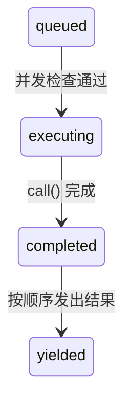

# 第 7 章：并发工具执行

## 等待的成本

第 6 章追踪了单个工具调用的生命周期——从 API 响应中的原始 `tool_use` block，到输入验证、权限检查、执行和结果格式化。那条流水线处理一个工具。但模型很少只请求一个工具。

一次典型的 Claude Code 交互，每个 turn 会包含三到五个工具调用。“读取这两个文件，grep 这个模式，然后编辑这个函数。”模型会在单个响应中发出所有这些调用。如果每个工具耗时 200 毫秒，串行运行会花掉整整一秒。如果 Read 和 Grep 调用相互独立——事实也是如此——并行运行就能把耗时降到 200 毫秒。五比一的提升，免费获得。

但不是所有工具都相互独立。一个修改 `config.ts` 的 Edit 不能和另一个修改 `config.ts` 的 Edit 并发运行。一个创建目录的 Bash 命令必须在另一个向该目录写文件的 Bash 命令之前完成。并发性不是工具的全局属性。它是一次带有具体输入的具体工具调用的属性。

这就是驱动整个并发系统的洞察：**安全性是按调用判断的，不是按工具类型判断的**。`Bash("ls -la")` 可以安全并行。`Bash("rm -rf build/")` 不行。同一个工具，不同输入，不同并发分类。系统必须先检查输入，再做决定。

Claude Code 实现了两层并发优化。第一层是 **batch orchestration**：在完整收到模型响应之后，把工具调用划分成并发组和串行组，然后用合适方式执行每组。第二层是 **speculative execution**：在模型仍在流式生成响应时就 *开始运行工具*，甚至在响应完成之前就收割结果。这两个机制结合起来，消除了原本会花在等待上的大部分墙钟时间。

---

## 分区算法

入口点是 `toolOrchestration.ts` 中的 `partitionToolCalls()`。它接收一个有序的 `ToolUseBlock` messages 数组，并产出一个 batches 数组，其中每个 batch 要么是“全部并发安全”，要么是“单个串行工具”。

```typescript
// Pseudocode — illustrates the partition algorithm
type Group = { parallel: boolean; calls: ToolCall[] }

function groupBySafety(calls: ToolCall[], registry: ToolRegistry): Group[] {
  return calls.reduce((groups, call) => {
    const def = registry.lookup(call.name)
    const input = def?.schema.safeParse(call.input)
    // Fail-closed: parse failure or exception → serial
    const safe = input?.success
      ? tryCatch(() => def.isParallelSafe(input.data), false)
      : false
    // Merge consecutive safe calls into one group
    if (safe && groups.at(-1)?.parallel) {
      groups.at(-1)!.calls.push(call)
    } else {
      groups.push({ parallel: safe, calls: [call] })
    }
    return groups
  }, [] as Group[])
}
```

算法从左到右遍历数组。对于每个工具调用：

1. **按名称查找工具定义**。
2. **用工具的 Zod schema 通过 `safeParse()` 解析输入**。如果解析失败，工具会被保守分类为非并发安全。
3. **在工具定义上调用 `isConcurrencySafe(parsedInput)`**。按输入分类就发生在这里。Bash 工具会解析命令字符串，检查每个 subcommand 是否都是只读的（`ls`、`grep`、`cat`、`git status`），只有当整个复合命令都是纯读取时才返回 `true`。Read 工具总是返回 `true`。Edit 工具总是返回 `false`。调用被包在 try-catch 中——如果 `isConcurrencySafe` 抛错（例如 Bash 命令字符串无法被 shell-quote 库解析），工具默认串行。
4. **合并或创建 batch。** 如果当前工具并发安全，且最近一个 batch 也并发安全，就追加到该 batch。否则，启动一个新 batch。

结果是一串在并发组和单个串行项之间交替的 batches。看一个具体例子：

```
Model requests: [Read, Read, Grep, Edit, Read]

Step 1: Read  → concurrent-safe → new batch {safe, [Read]}
Step 2: Read  → concurrent-safe → append   {safe, [Read, Read]}
Step 3: Grep  → concurrent-safe → append   {safe, [Read, Read, Grep]}
Step 4: Edit  → NOT safe        → new batch {serial, [Edit]}
Step 5: Read  → concurrent-safe → new batch {safe, [Read]}

Result: 3 batches
  Batch 1: [Read, Read, Grep]  — run concurrently
  Batch 2: [Edit]              — run alone
  Batch 3: [Read]              — run concurrently (just one tool)
```

分区是贪心且保序的。连续的安全工具会累积到同一个 batch。任何不安全工具都会打断这一段，并开始一个新 batch。这意味着模型发出工具调用的顺序很重要——如果它在两个 Reads 之间插入一个 Write，你会得到三个 batch，而不是两个。实践中，模型倾向于把读取聚在一起，这正是算法优化的常见情况。

---

## Batch 执行

`runTools()` 生成器会遍历分区后的 batches，并把每个 batch 分发给对应 executor。

### 并发 Batches

对于并发 batch，`runToolsConcurrently()` 会用一个 `all()` 工具并行启动所有工具，并把活跃生成器数量限制在并发上限内：

```typescript
// Pseudocode — illustrates the concurrent dispatch pattern
async function* dispatchParallel(calls, context) {
  yield* boundedAll(
    calls.map(async function* (call) {
      context.markInProgress(call.id)
      yield* executeSingle(call, context)
      context.markComplete(call.id)
    }),
    MAX_CONCURRENCY,  // Default: 10
  )
}
```

并发上限默认是 10，可通过 `CLAUDE_CODE_MAX_TOOL_USE_CONCURRENCY` 配置。10 已经很宽松——单个模型响应中很少会看到超过五六个工具调用。这个限制是病态情况的安全阀，不是典型约束。

`all()` 工具是一个支持 generator 的有界并发版 `Promise.all`。它同时启动最多 N 个 generators，哪个先完成就 yield 哪个结果，并在每个完成后启动下一个排队 generator。机制类似带 semaphore 的 task pool，但适配了会产出中间结果的 async generators。

**Context modifier 排队** 是微妙部分。有些工具会产生 *context modifiers*——转换后续工具所用 `ToolUseContext` 的函数。当工具并发运行时，不能立即应用这些 modifiers，因为同一个 batch 中的其他工具正在读取同一个上下文。相反，modifiers 会被收集到一个以 tool use ID 为 key 的 map 中：

```typescript
const queuedContextModifiers: Record<
  string,
  ((context: ToolUseContext) => ToolUseContext)[]
> = {}
```

整个并发 batch 完成后，modifiers 会按工具顺序（不是完成顺序）应用，保持确定性的上下文演化：

```typescript
for (const block of blocks) {
  const modifiers = queuedContextModifiers[block.id]
  if (!modifiers) continue
  for (const modifier of modifiers) {
    currentContext = modifier(currentContext)
  }
}
```

实践中，目前没有任何并发安全工具会产生 context modifiers——代码库中的注释明确承认这一点。但基础设施仍然存在，因为 MCP 服务器可以添加工具，一个自定义只读 MCP 工具完全可能有合理理由修改上下文（例如更新“已经看过的文件”集合）。

### 串行 Batches

串行执行很直接。每个工具运行，其 context modifiers 立即应用，下一个工具看到更新后的上下文：

```typescript
for (const toolUse of toolUseMessages) {
  for await (const update of runToolUse(toolUse, /* ... */)) {
    if (update.contextModifier) {
      currentContext = update.contextModifier.modifyContext(currentContext)
    }
    yield { message: update.message, newContext: currentContext }
  }
}
```

这是关键区别。串行工具可以为后续工具改变世界。Edit 修改文件；下一次 Read 看到修改后的版本。Bash 命令创建目录；下一条 Bash 命令向里面写文件。Context modifiers 是这种依赖的形式化表达：它们让工具可以说“执行环境变了，变化如下”。

---

## 流式工具执行器

Batch orchestration 消除了模型响应到达 *之后* 的不必要串行化。但还有更大的机会：模型响应流式传输本身需要时间。一个典型的多工具响应可能需要 2-3 秒才能完整到达。第一个工具调用在 500 毫秒后就可以解析出来。为什么要等剩下的 2 秒？

`StreamingToolExecutor` 类实现了推测执行。随着模型流式生成响应，每个 `tool_use` block 一旦被完整解析，就会立即交给 executor。executor 会立刻开始运行它——同时模型还在生成下一个工具调用。等响应完成 streaming 时，几个工具可能已经完成了。

```mermaid
gantt
    title 串行 vs 流式工具执行
    dateFormat X
    axisFormat %Ls

    section 串行
    模型流式生成响应     :a1, 0, 2500
    工具 1（0.2s）              :a2, after a1, 200
    工具 2（0.3s）              :a3, after a2, 300
    工具 3（0.1s）              :a4, after a3, 100

    section Streaming Executor
    模型流式生成响应     :b1, 0, 2500
    工具 1 在 0.5s 启动      :b2, 500, 700
    工具 2 在 1.2s 启动      :b3, 1200, 1500
    工具 3 stream 后排空  :b4, 2500, 2600
```



串行总耗时：3.1s。流式总耗时：2.6s——工具 1 和工具 2 在 streaming 期间已经完成，节省了 16% 的墙钟时间。

收益会叠加。当模型请求五个只读工具，而响应需要 3 秒才能 streaming 完成时，五个工具都可以在这 3 秒内启动并完成。post-stream drain 阶段没有剩余工作。用户几乎会在模型响应的最后一个字符出现后立刻看到结果。

### 工具生命周期

executor 跟踪的每个工具都会经历四个状态：



- **queued**：`tool_use` block 已解析并注册。等待并发条件允许执行。
- **executing**：工具的 `call()` 函数正在运行。结果累积在 buffer 中。
- **completed**：执行完成。结果已准备好产出到对话。
- **yielded**：结果已发出。终止状态。

### addTool()：在 Stream 期间排队

```typescript
addTool(block: ToolUseBlock, assistantMessage: AssistantMessage): void
```

流式响应 parser 每次收到一个完整 `tool_use` block 时调用。这个方法会：

1. 查找工具定义。如果找不到，立即创建一个带错误消息的 `completed` entry——把不存在的工具排队没有意义。
2. 解析输入，并使用与 `partitionToolCalls()` 相同的逻辑判断 `isConcurrencySafe`。
3. 推入一个状态为 `'queued'` 的 `TrackedTool`。
4. 调用 `processQueue()`——这可能会立即启动工具。

对 `processQueue()` 的调用是 fire-and-forget（`void this.processQueue()`）。executor 不会 await 它。这是刻意设计的：`addTool()` 是从 streaming parser 的 event handler 中调用的，如果在那里阻塞，就会卡住响应解析。工具会在后台开始执行，而 parser 继续消费 stream。

### processQueue()：准入检查

准入检查是一个单一谓词：

```typescript
// Pseudocode — illustrates the mutual exclusion rule
canRun = noToolsRunning || (newToolIsSafe && allRunningAreSafe)
```

当且仅当满足以下条件时，一个工具可以开始执行：
- **当前没有工具在执行**（队列为空），或
- **新工具和所有正在执行的工具都并发安全。**

这是一份互斥契约。非并发工具需要独占访问——不能有其他工具同时运行。并发工具可以和其他并发工具共享跑道，但执行集合中只要有一个非并发工具，就会阻塞所有人。

`processQueue()` 方法会按顺序遍历所有工具。对于每个 queued 工具，它会检查 `canExecuteTool()`。如果工具可以运行，就启动它。如果某个非并发工具暂时不能运行，循环会 *break*——它完全停止检查后续工具，因为非并发工具必须维持顺序。如果某个并发工具不能运行（被正在执行的非并发工具阻塞），循环会 *continue*——但实践中这很少有帮助，因为位于非并发 blocker 后面的并发工具通常也依赖它的结果。

### executeTool()：核心执行循环

真正的复杂性在这个方法里。它管理 abort controllers、错误级联、进度报告和 context modifiers。

**子 abort controllers。** 每个工具都有自己的 `AbortController`，它是共享 sibling-level controller 的子级。

层级有三层：query-level controller（由 REPL 拥有，在用户 Ctrl+C 时触发）作为 sibling controller（由 streaming executor 拥有，在 Bash 错误时触发）的父级，而 sibling controller 又作为每个工具 individual controller 的父级。Abort sibling controller 会杀掉所有运行中的工具。Abort 单个工具的 individual controller 只会杀掉这个工具——但如果 abort reason 不是 sibling error，它也会向上冒泡到 query controller。这个冒泡可以防止系统在例如权限拒绝应该结束整个 turn 时静默丢弃 executor。

这个冒泡对权限拒绝至关重要。当用户在权限对话框中拒绝某个工具时，工具的 abort controller 会触发。这个 signal 必须到达查询循环，让它结束本轮。如果没有它，查询循环会像什么都没发生一样继续，把一个陈旧的拒绝消息发送给模型。

**Sibling error cascade。** 当某个工具产生错误结果时，executor 会检查是否要取消 sibling tools。规则是：**只有 Bash 错误会级联。** 当 shell 命令报错时，executor 会记录失败，捕获出错工具的描述，并 abort sibling controller——这会取消 batch 中所有其他正在运行的工具。

理由很务实。Bash 命令经常形成隐式依赖链：`mkdir build && cp src/* build/ && tar -czf dist.tar.gz build/`。如果 `mkdir` 失败，继续运行 `cp` 和 `tar` 没有意义。立即取消 siblings 可以节省时间，并避免令人困惑的错误消息。

相比之下，Read 和 Grep 错误是独立的。如果一个文件读取失败是因为文件被删除了，这与另一个并发 grep 搜索不同目录没有关系。取消 grep 只会无谓浪费工作。

错误级联会为 sibling tools 生成合成错误消息：

```
Cancelled: parallel tool call Bash(mkdir build) errored
```

描述中包含出错工具命令或文件路径的前 40 个字符，给模型足够上下文来理解发生了什么。

**Progress messages** 与结果分开处理。结果会被 buffer 并按顺序 yield，而 progress messages（例如 “Reading file...” 或 “Searching...” 这样的状态更新）会进入 `pendingProgress` 数组，并通过 `getCompletedResults()` 立即 yield。一个 resolve callback 会在新 progress 到达时唤醒 `getRemainingResults()` 循环，防止 UI 在长时间运行的工具期间看起来卡死。

**队列重新处理。** 每个工具完成后，都会再次调用 `processQueue()`：

```typescript
void promise.finally(() => {
  void this.processQueue()
})
```

这就是被并发 batch 阻塞的串行工具如何开始运行的。当最后一个并发工具完成时，后续非并发工具的 `canExecuteTool()` 检查通过，于是它开始执行。

### 结果收割

流式 executor 暴露两个收割方法，分别服务于响应生命周期中的两个阶段。

**`getCompletedResults()`——stream 中途收割。** 这是一个同步生成器，会在 streaming API 响应的 chunks 之间调用。它按顺序遍历 tools 数组，并产出任何已完成工具的结果：

`getCompletedResults()` 是一个同步生成器，会按提交顺序遍历 tools 数组。对于每个工具，它首先排空 pending progress messages。如果工具已完成，它会 yield 结果并标记为 yielded。关键规则是：如果一个非并发工具仍在执行，遍历会 **break**——它后面的任何东西都不能 yield，即使后续工具已经完成。串行工具后面的结果可能依赖它的 context modifications，因此必须等待。对于并发工具，这个限制不适用；循环会跳过正在执行的并发工具，并继续检查后续条目。

**`getRemainingResults()`——stream 后排空。** 在完整收到模型响应后调用。这个异步生成器会循环直到每个工具都被 yielded：

`getRemainingResults()` 是 post-stream drain。它会循环直到每个工具都 yielded。每次迭代中，它会处理队列（启动任何新解除阻塞的工具），通过 `getCompletedResults()` yield 任何已完成结果，然后——如果仍有工具执行中但没有新结果完成——使用 `Promise.race` 空闲等待最先完成的事件：任一执行中工具的 promise，或 progress-available signal。这样既避免 busy-polling，又能在事情发生的瞬间唤醒。当没有工具完成且没有新工具可以启动时，executor 会等待任一执行中工具完成（或 progress 到达）。

### 保序

结果按工具 *接收* 顺序 yield，而不是按工具 *完成* 顺序 yield。这是刻意设计。

考虑一个模型响应请求 `[Read("a.ts"), Read("b.ts"), Read("c.ts")]`。三者并发启动。`c.ts` 最先完成（它更小），然后是 `a.ts`，再然后是 `b.ts`。如果结果按完成顺序 yield，对话会显示：

```
Tool result: c.ts contents
Tool result: a.ts contents
Tool result: b.ts contents
```

但模型发出的顺序是 a-b-c。对话历史必须匹配模型预期，否则下一轮会混淆哪个结果对应哪个请求。按到达顺序 yield 时，对话保持一致：

```
Tool result: a.ts contents  (completed second, yielded first)
Tool result: b.ts contents  (completed third, yielded second)
Tool result: c.ts contents  (completed first, yielded third)
```

代价很小：如果工具 1 很慢，而工具 2-5 很快，快速结果会留在 buffer 中等工具 1 完成。但替代方案——对话不一致——糟糕得多。

### discard()：Streaming Fallback 的逃生舱

当 API 响应 stream 中途失败（网络错误、服务器断开）时，系统会用新的 API 调用重试。但 streaming executor 可能已经从失败尝试中启动了工具。这些结果现在变成了孤儿——它们对应的是一个从未完整收到的响应。

```typescript
discard(): void {
  this.discarded = true
}
```

设置 `discarded = true` 会导致：
- `getCompletedResults()` 立即返回，不产生结果。
- `getRemainingResults()` 立即返回，不产生结果。
- 任何开始执行的工具都会检查 `getAbortReason()`，看到 `streaming_fallback`，并得到合成错误，而不是真正运行。

被 discard 的 executor 会被放弃。重试尝试会创建一个新的 executor。

---

## 工具并发属性

每个内置工具都通过 `isConcurrencySafe()` 方法声明自己的并发特征。这个分类不是随意的——它反映了工具对共享状态的真实影响。

| Tool | 并发安全 | 条件 | 理由 |
|------|-----------------|-----------|-----------|
| **Read** | 总是 | -- | 纯读取。无副作用。 |
| **Grep** | 总是 | -- | 纯读取。包装 ripgrep。 |
| **Glob** | 总是 | -- | 纯读取。文件列表。 |
| **Fetch** | 总是 | -- | HTTP GET。无本地副作用。 |
| **WebSearch** | 总是 | -- | 对搜索 provider 的 API 调用。 |
| **Bash** | 有时 | 仅只读命令 | `isReadOnly()` 解析命令并分类 subcommands。`ls`、`git status`、`cat`、`grep` 安全。`rm`、`mkdir`、`mv` 不安全。 |
| **Edit** | 从不 | -- | 修改文件。对同一文件的两个并发编辑会破坏文件。 |
| **Write** | 从不 | -- | 创建或覆盖文件。同样有破坏风险。 |
| **NotebookEdit** | 从不 | -- | 修改 `.ipynb` 文件。 |

Bash 工具的分类值得展开。它使用 `splitCommandWithOperators()` 分解复合命令（`&&`、`||`、`;`、`|`），然后把每个 subcommand 与已知安全集合比对：

- **Search commands**：`grep`、`rg`、`find`、`fd`、`ag`、`ack`
- **Read commands**：`cat`、`head`、`tail`、`wc`、`jq`、`less`、`file`、`stat`
- **List commands**：`ls`、`tree`、`du`、`df`
- **Neutral commands**：`echo`、`printf`（无副作用，但也不是“读取”）

只有当每个非中性 subcommand 都在 search、read 或 list 集合中时，复合命令才是只读的。`ls -la && cat README.md` 是安全的。`ls -la && rm -rf build/` 不安全——`rm` 污染了整个命令。

---

## 中断行为契约

工具执行期间，用户可以输入新消息。应该发生什么？答案取决于工具。

每个工具都会声明一个 `interruptBehavior()` 方法，返回 `'cancel'` 或 `'block'`：

- **`'cancel'`**：立即停止工具，丢弃部分结果，并处理新的用户消息。用于部分执行无害的工具（读取、搜索）。
- **`'block'`**：让工具继续运行到完成。用户的新消息等待。用于中断会让系统处于不一致状态的工具（进行中的写操作、长时间运行的 bash 命令）。这是默认值。

streaming executor 会跟踪当前工具集合的 interruptible 状态：

interruptible 状态通过检查所有当前执行中的工具来更新：只有当每个执行中的工具都支持 cancellation 时，这个集合才是 interruptible 的。如果哪怕一个工具的 interrupt behavior 是 `'block'`，整个集合都会被视为不可中断。

UI 只有在所有执行中的工具都支持 cancellation 时，才会显示“interruptible”指示器。如果哪怕一个工具是 `'block'`，整个集合都会被视为不可中断。这很保守，但正确：当一个工具无论如何都会继续运行时，你无法有意义地中断这个 batch。

当用户确实中断且所有工具都可取消时，abort controller 会以 reason `'interrupt'` 触发。executor 的 `getAbortReason()` 方法会逐个检查工具的 interrupt behavior——`'cancel'` 工具会得到一个合成的 `user_interrupted` 错误，而 `'block'` 工具（它本不该出现在完全 interruptible 的集合中，但代码处理了这个边缘情况）会继续运行。

---

## Context Modifiers：仅串行契约

Context modifiers 是类型为 `(context: ToolUseContext) => ToolUseContext` 的函数。它们让工具可以表达：“我改变了执行环境中的某些东西，后续工具需要知道。”

契约很简单：**context modifiers 只会应用于串行（非并发安全）工具。** 源码明确写着：

```typescript
// NOTE: we currently don't support context modifiers for concurrent
//       tools. None are actively being used, but if we want to use
//       them in concurrent tools, we need to support that here.
if (!tool.isConcurrencySafe && contextModifiers.length > 0) {
  for (const modifier of contextModifiers) {
    this.toolUseContext = modifier(this.toolUseContext)
  }
}
```

在 batch orchestration 路径（`toolOrchestration.ts`）中，并发 batch 的 modifiers 会被收集起来，在 batch 完成后按工具提交顺序应用。这意味着同一个 batch 内的并发工具看不到彼此的上下文变化，但它们之后的 batch 可以看到。

这种不对称是刻意的。如果工具 A 修改上下文，而工具 B 读取该上下文，它们之间就有数据依赖。数据依赖意味着它们不能并发运行。按定义，如果两个工具并发安全，那么二者都不应该依赖对方的上下文修改。系统通过延后应用来强制这一点。

---

## 应用到你的系统

Claude Code 中的并发模式可以推广到任何编排多个独立操作的系统。三个原则值得提炼。

**按安全性分区，而不是按类型分区。** `isConcurrencySafe(input)` 方法接收已解析输入，而不只是工具名。这种按调用分类比静态声明“这个工具类型总是安全”更精确。在你自己的系统中，先检查操作参数，再决定是否并行。数据库读取可以并行；写同一行的数据库写入不行。仅凭操作类型无法提供足够信息。

**在 I/O 等待期间推测执行。** streaming executor 会在 API 响应仍在到达时启动工具。任何存在慢生产者和快消费者的地方都可以使用同样模式：在后续项目仍在生成时，提前处理早到的项目。HTTP/2 server push、编译器 pipeline parallelism 和 CPU speculative execution 都共享这个结构。关键要求是：你能在完整指令集到达之前识别独立工作。

**保持结果提交顺序。** 按完成顺序 yield 结果很诱人——它最小化了首个结果延迟。但如果消费者（这里是语言模型）期望特定顺序，重排会造成混淆，而解决混淆的成本超过延迟收益。把完成的结果放入 buffer，并按请求顺序释放。实现成本只是一次简单数组遍历；正确性收益是绝对的。

streaming executor 模式对智能体系统尤其强大。只要你的智能体循环包含“思考，然后行动”的周期，并且思考阶段会产生多个独立动作，你就可以把思考尾部与行动开头重叠起来。节省量与 think-time 和 act-time 的比例成正比。对语言模型智能体来说，think-time（API 响应生成）占主导，因此收益可观。

---

## 总结

Claude Code 的并发系统运行在两个层级。分区算法（`partitionToolCalls`）把连续的并发安全工具分组成并行运行的 batches，同时把不安全工具隔离到串行 batches 中，让每个工具都能看到前一个工具的效果。流式工具执行器（`StreamingToolExecutor`）更进一步，在模型响应 streaming 期间工具一到达就推测启动，把工具执行与响应生成重叠起来。

安全模型刻意保守。并发安全性通过检查已解析输入按调用判断。未知工具默认串行。解析失败默认串行。安全检查中的异常默认串行。系统绝不猜测某个东西可以安全并行——工具必须主动声明它是安全的。

错误处理遵循工具的依赖结构。Bash 错误会级联到 siblings，因为 shell 命令经常形成隐式流水线。Read 和 search 错误被隔离，因为它们是独立操作。abort controller 层级——query controller、sibling controller、per-tool controller——让每个层级都能取消自己的作用域，而不干扰上一级。

结果是一个能从模型工具请求中提取最大并行度，同时保持对话历史代表一组连贯有序动作的系统。模型按自己请求的顺序看到结果。用户看到工具以底层操作允许的最快速度完成。两者之间的差距——执行速度 vs 呈现顺序——由 buffering 弥合，而这个 buffer 是整个系统中最简单的部分。
