# 第 8 章：派生子智能体

## 智能的倍增

单个智能体很强大。它可以读取文件、编辑代码、运行测试、搜索网页，并对结果进行推理。但一个智能体在单次对话中能做的事情有硬上限：上下文窗口会被填满，任务会分叉到需要不同能力的方向，工具执行的串行本质也会变成瓶颈。解决方案不是更大的模型，而是更多的智能体。

Claude Code 的子智能体系统让模型可以请求帮助。当父智能体遇到适合委派的任务时——一次不应该污染主对话的代码库搜索、一次需要对抗性思维的验证 pass、一组可以并行执行的独立编辑——它会调用 `Agent` 工具。这个调用会派生一个子级：一个完全独立的智能体，拥有自己的对话循环、自己的工具集合、自己的权限边界和自己的 abort controller。子级完成工作并返回结果。父级不会看到子级的内部推理，只会看到最终输出。

这不是一个便利功能。它是从并行文件探索，到 coordinator-worker 层级，再到多智能体 swarm team 的架构基础。而这一切都流经两个文件：`AgentTool.tsx` 定义模型可见的接口，`runAgent.ts` 实现生命周期。

设计挑战很大。子智能体需要足够上下文来完成工作，但不能多到把 token 浪费在无关信息上。它需要足够严格的权限边界来保证安全，又要足够灵活以保持实用。它需要生命周期管理来清理它接触过的每个资源，而不能要求调用方记住该清理什么。而且这些都必须适用于一系列不同智能体类型——从便宜、快速、只读的 Haiku 搜索器，到昂贵、彻底、由 Opus 驱动并在后台运行对抗性测试的验证智能体。

本章会追踪从模型说“我需要帮助”，到一个完全可运行的子智能体被创建出来的路径。我们会考察模型看到的工具定义、创建执行环境的十五步生命周期、六种内置智能体类型及其各自优化目标、允许用户定义自定义智能体的 frontmatter 系统，以及从所有这些机制中浮现出来的设计原则。

术语说明：本章中，“父级”指调用 `Agent` 工具的智能体，“子级”指被派生出来的智能体。父级通常（但不总是）是顶层 REPL 智能体。在 coordinator mode 中，coordinator 会派生 workers，后者就是子级。在嵌套场景中，子级自己也可以派生孙级——同一套生命周期会递归适用。

编排层横跨 `tools/AgentTool/`、`tasks/`、`coordinator/`、`tools/SendMessageTool/` 和 `utils/swarm/` 下的大约 40 个文件。本章聚焦派生机制——AgentTool 定义和 runAgent 生命周期。后续第 10 章会覆盖运行时：进度跟踪、结果获取和多智能体协调模式。

---

## AgentTool 定义

`AgentTool` 以名称 `"Agent"` 注册，并保留 legacy alias `"Task"`，用于兼容旧 transcript、权限规则和 hook 配置。它用标准的 `buildTool()` 工厂构建，但它的 schema 比系统中任何其他工具都更动态。

### 输入 Schema

输入 schema 通过 `lazySchema()` 惰性构造——这是第 6 章见过的模式，会把 zod 编译延迟到首次使用。有两层：base schema，以及加入多智能体和隔离参数的 full schema。

基础字段始终存在：

| 字段 | 类型 | 必填 | 目的 |
|-------|------|----------|---------|
| `description` | `string` | 是 | 3-5 个词的任务简短摘要 |
| `prompt` | `string` | 是 | 给智能体的完整任务描述 |
| `subagent_type` | `string` | 否 | 使用哪个专门智能体 |
| `model` | `enum('sonnet','opus','haiku')` | 否 | 该智能体的模型 override |
| `run_in_background` | `boolean` | 否 | 异步启动 |

full schema 会添加多智能体参数（当 swarm features 激活时）和隔离控制：

| 字段 | 类型 | 目的 |
|-------|------|---------|
| `name` | `string` | 让该智能体可通过 `SendMessage({to: name})` 寻址 |
| `team_name` | `string` | 派生时的团队上下文 |
| `mode` | `PermissionMode` | 被派生 teammate 的权限模式 |
| `isolation` | `enum('worktree','remote')` | 文件系统隔离策略 |
| `cwd` | `string` | 工作目录的绝对路径 override |

多智能体字段启用第 10 章会介绍的 swarm 模式：具名智能体可以在并发运行时通过 `SendMessage({to: name})` 相互发送消息。隔离字段启用文件系统安全：worktree isolation 会创建临时 git worktree，让智能体在仓库副本上操作，防止多个智能体同时处理同一代码库时发生编辑冲突。

这个 schema 的不同之处在于，它会 **被 feature flags 动态塑形**：

```typescript
// Pseudocode — illustrates the feature-gated schema pattern
inputSchema = lazySchema(() => {
  let schema = baseSchema()
  if (!featureEnabled('ASSISTANT_MODE')) schema = schema.omit({ cwd: true })
  if (backgroundDisabled || forkMode)    schema = schema.omit({ run_in_background: true })
  return schema
})
```

当 fork experiment 激活时，`run_in_background` 会从 schema 中完全消失，因为该路径下所有派生都会被强制为 async。当 background tasks 被禁用（通过 `CLAUDE_CODE_DISABLE_BACKGROUND_TASKS`）时，这个字段也会被剥离。当 KAIROS feature flag 关闭时，`cwd` 会被省略。模型永远看不到自己不能使用的字段。

这是一个微妙但重要的设计选择。schema 不只是验证——它是模型的说明书。schema 中的每个字段都会在模型读取的工具定义中描述。移除模型不应该使用的字段，比在 prompt 中添加“不要使用这个字段”更有效。模型无法误用它看不到的东西。

### 输出 Schema

输出是一个带两个公开变体的判别联合：

- `{ status: 'completed', prompt, ...AgentToolResult }`——同步完成，包含智能体最终输出
- `{ status: 'async_launched', agentId, description, prompt, outputFile }`——后台启动确认

另外还有两个内部变体（`TeammateSpawnedOutput` 和 `RemoteLaunchedOutput`），但它们被排除在导出的 schema 之外，以便外部构建可以进行 dead code elimination。当对应 feature flags 禁用时，bundler 会剥离这些变体及其关联代码路径，让分发二进制更小。

`async_launched` 变体值得注意的是它包含 `outputFile` 路径：智能体完成时结果会写入这里。这让父级（或任何其他消费者）可以轮询或 watch 该文件来获取结果，提供一种能跨进程重启存活的基于文件系统的通信通道。

### 动态 Prompt

`AgentTool` prompt 由 `getPrompt()` 生成，并且对上下文敏感。它会根据可用智能体（以内联方式列出，或作为 attachment 列出以避免击穿提示缓存）、fork 是否激活（添加“When to fork”指导）、会话是否处于 coordinator mode（prompt 更精简，因为 coordinator system prompt 已经覆盖用法）以及订阅层级进行调整。非 pro 用户会看到关于并发启动多个智能体的说明。

基于 attachment 的智能体列表值得特别强调。代码库注释提到，动态工具描述造成了“大约 10.2% 的 fleet cache_creation tokens”。把智能体列表从工具描述移动到 attachment message，可以让工具描述保持静态；连接 MCP server 或加载插件时，不会击穿后续每次 API 调用的提示缓存。

对于任何使用带动态内容工具定义的系统，这都是一个值得内化的模式。Anthropic API 会缓存提示前缀——系统提示、工具定义和对话历史——并在后续共享相同前缀的请求中复用缓存计算。如果工具定义在两次 API 调用之间变化（因为新增智能体或连接了 MCP server），整个缓存都会失效。把易变内容从工具定义（缓存前缀的一部分）移动到 attachment message（追加在缓存部分之后），既能保留缓存，又能把信息传给模型。

理解工具定义之后，我们现在可以追踪模型真正调用它时会发生什么。

### Feature Gating

子智能体系统拥有代码库中最复杂的 feature gating。至少十二个 feature flags 和 GrowthBook experiments 会控制哪些智能体可用、schema 中出现哪些参数，以及走哪些代码路径：

| Feature Gate | 控制内容 |
|-------------|----------|
| `FORK_SUBAGENT` | Fork agent 路径 |
| `BUILTIN_EXPLORE_PLAN_AGENTS` | Explore 和 Plan agents |
| `VERIFICATION_AGENT` | Verification agent |
| `KAIROS` | `cwd` override、assistant 强制 async |
| `TRANSCRIPT_CLASSIFIER` | Handoff classification、`auto` mode override |
| `PROACTIVE` | Proactive module 集成 |

每个 gate 都使用来自 Bun dead code elimination 系统的 `feature()`（编译期），或来自 GrowthBook 的 `getFeatureValue_CACHED_MAY_BE_STALE()`（运行时 A/B testing）。编译期 gates 会在构建期间被字符串替换——当 `FORK_SUBAGENT` 是 `'ant'` 时，整个 fork code path 会被包含；当它是 `'external'` 时，可能会被完全排除。GrowthBook gates 支持线上实验：`tengu_amber_stoat` experiment 可以 A/B test 移除 Explore 和 Plan agents 是否改变用户行为，而无需发布新二进制。

### call() 决策树

在 `runAgent()` 被调用之前，`AgentTool.tsx` 中的 `call()` 方法会通过一棵决策树路由请求，决定要派生 *哪种* 智能体，以及 *如何* 派生：

```
1. Is this a teammate spawn? (team_name + name both set)
   YES -> spawnTeammate() -> return teammate_spawned
   NO  -> continue

2. Resolve effective agent type
   - subagent_type provided -> use it
   - subagent_type omitted, fork enabled -> undefined (fork path)
   - subagent_type omitted, fork disabled -> "general-purpose" (default)

3. Is this the fork path? (effectiveType === undefined)
   YES -> Recursive fork guard check -> Use FORK_AGENT definition

4. Resolve agent definition from activeAgents list
   - Filter by permission deny rules
   - Filter by allowedAgentTypes
   - Throw if not found or denied

5. Check required MCP servers (wait up to 30s for pending)

6. Resolve isolation mode (param overrides agent def)
   - "remote" -> teleportToRemote() -> return remote_launched
   - "worktree" -> createAgentWorktree()
   - null -> normal execution

7. Determine sync vs async
   shouldRunAsync = run_in_background || selectedAgent.background ||
                    isCoordinator || forceAsync || isProactiveActive

8. Assemble worker tool pool

9. Build system prompt and prompt messages

10. Execute (async -> registerAsyncAgent + void lifecycle; sync -> iterate runAgent)
```

第 1 到第 6 步都是纯路由——此时还没有创建智能体。真正的生命周期从 `runAgent()` 开始；同步路径会直接迭代它，异步路径会用 `runAsyncAgentLifecycle()` 包装它。

路由逻辑放在 `call()` 而不是 `runAgent()` 中，是有原因的：`runAgent()` 是一个纯生命周期函数，不知道 teammates、remote agents 或 fork experiment。它接收一个已解析的 agent definition 并执行它。解析 *哪个* definition、*如何* 隔离智能体、以及 *是否* 同步运行，属于上一层的职责。这种分离让 `runAgent()` 可测试且可复用——它既会被普通 AgentTool 路径调用，也会在恢复后台智能体时被 async lifecycle wrapper 调用。

第 3 步的 fork guard 值得关注。Fork children 会保留工具池中的 `Agent` 工具（以便与父级保持字节完全相同的工具定义，利于缓存），但递归 fork 会很糟糕。两个 guard 防止这种情况：`querySource === 'agent:builtin:fork'`（设置在子级 context options 上，可跨 autocompact 保留）和 `isInForkChild(messages)`（扫描对话历史中的 `<fork-boilerplate>` tag 作为 fallback）。腰带加吊带——主 guard 快速且可靠，fallback 捕获 querySource 没有正确穿透的边缘情况。

---

## runAgent 生命周期

`runAgent.ts` 中的 `runAgent()` 是一个异步生成器，驱动子智能体的完整生命周期。它会在智能体工作时产出 `Message` 对象。每个子智能体——fork、内置、自定义、coordinator worker——都会流经这个单一函数。函数大约 400 行，每一行都有存在理由。

函数签名揭示了问题的复杂性：

```typescript
export async function* runAgent({
  agentDefinition,       // What kind of agent
  promptMessages,        // What to tell it
  toolUseContext,        // Parent's execution context
  canUseTool,           // Permission callback
  isAsync,              // Background or blocking?
  canShowPermissionPrompts,
  forkContextMessages,  // Parent's history (fork only)
  querySource,          // Origin tracking
  override,             // System prompt, abort controller, agent ID overrides
  model,                // Model override from caller
  maxTurns,             // Turn limit
  availableTools,       // Pre-assembled tool pool
  allowedTools,         // Permission scoping
  onCacheSafeParams,    // Callback for background summarization
  useExactTools,        // Fork path: use parent's exact tools
  worktreePath,         // Isolation directory
  description,          // Human-readable task description
  // ...
}: { ... }): AsyncGenerator<Message, void>
```

十七个参数。每一个都代表生命周期必须处理的一种变化维度。这不是过度工程——这是单个函数同时服务 fork agents、built-in agents、custom agents、sync agents、async agents、worktree-isolated agents 和 coordinator workers 的自然结果。替代方案是七个不同生命周期函数和重复逻辑，那更糟。

`override` 对象尤其重要——它是 fork agents 和 resumed agents 的逃生口，可以把预计算值（system prompt、abort controller、agent ID）注入生命周期，而不用重新推导。

下面是十五个步骤。

### 第 1 步：模型解析

```typescript
const resolvedAgentModel = getAgentModel(
  agentDefinition.model,                    // Agent's declared preference
  toolUseContext.options.mainLoopModel,      // Parent's model
  model,                                    // Caller's override (from input)
  permissionMode,                           // Current permission mode
)
```

解析链是：**调用方 override > agent definition > 父级模型 > 默认值**。`getAgentModel()` 函数处理 `'inherit'` 这样的特殊值（使用父级当前使用的模型），以及针对特定 agent types 的 GrowthBook-gated overrides。例如 Explore agent 对外部用户默认使用 Haiku——最便宜且最快的模型，适合每周运行 3,400 万次的只读搜索专家。

这个顺序很重要：调用方（父模型）可以在工具调用中传入 `model` 参数，覆盖 agent definition 的偏好。这样父级可以把一个通常便宜的 agent 提升到更强模型来处理特别复杂的搜索，或者在任务简单时把昂贵 agent 降级。但 agent definition 的模型是默认值，而不是父级模型——Haiku Explore agent 不应该因为没人显式指定，就意外继承父级的 Opus 模型。

理解模型解析链很重要，因为它建立了一个贯穿生命周期的设计原则：**显式 override 胜过声明，声明胜过继承，继承胜过默认值。** 同样原则也适用于权限模式、abort controllers 和 system prompts。统一性让系统可预测——理解一条解析链，就理解了所有解析链。

### 第 2 步：Agent ID 创建

```typescript
const agentId = override?.agentId ? override.agentId : createAgentId()
```

Agent IDs 遵循 `agent-<hex>` 模式，其中 hex 部分来自 `crypto.randomUUID()`。branded type `AgentId` 在类型层防止它与普通字符串混淆。override 路径用于 resumed agents，它们需要保留原始 ID，以保持 transcript 连续性。

### 第 3 步：上下文准备

Fork agents 和 fresh agents 在这里分叉：

```typescript
const contextMessages: Message[] = forkContextMessages
  ? filterIncompleteToolCalls(forkContextMessages)
  : []
const initialMessages: Message[] = [...contextMessages, ...promptMessages]

const agentReadFileState = forkContextMessages !== undefined
  ? cloneFileStateCache(toolUseContext.readFileState)
  : createFileStateCacheWithSizeLimit(READ_FILE_STATE_CACHE_SIZE)
```

对于 fork agents，父级的完整对话历史会被克隆进 `contextMessages`。但这里有一个关键过滤器：`filterIncompleteToolCalls()` 会剥离任何缺少匹配 `tool_result` 的 `tool_use` blocks。没有这个过滤器，API 会拒绝格式不合法的对话。当父级在 fork 时正处于工具执行中时，这种情况就会发生——`tool_use` 已经发出，但结果还没到。

文件状态缓存遵循同样的 fork-or-fresh 模式。Fork children 会拿到父级缓存的 clone（它们已经“知道”哪些文件被读过）。Fresh agents 从空缓存开始。clone 是浅拷贝——文件内容字符串通过引用共享，而不是复制。这对内存很重要：一个带 50 个文件缓存的 fork child 不会复制 50 份文件内容，只会复制 50 个指针。LRU eviction 行为是独立的——每个缓存根据自己的访问模式淘汰。

### 第 4 步：剥离 CLAUDE.md

Explore 和 Plan 这样的只读 agents 在定义中有 `omitClaudeMd: true`：

```typescript
const shouldOmitClaudeMd =
  agentDefinition.omitClaudeMd &&
  !override?.userContext &&
  getFeatureValue_CACHED_MAY_BE_STALE('tengu_slim_subagent_claudemd', true)
const { claudeMd: _omittedClaudeMd, ...userContextNoClaudeMd } = baseUserContext
const resolvedUserContext = shouldOmitClaudeMd
  ? userContextNoClaudeMd
  : baseUserContext
```

CLAUDE.md 文件包含项目特定指令，例如 commit messages、PR 约定、lint 规则和编码标准。只读搜索 agent 不需要这些——它不能提交、不能创建 PR、不能编辑文件。父级 agent 拥有完整上下文，并会解释搜索结果。在这里丢弃 CLAUDE.md，每周能在整个 fleet 中节省数十亿 token——这种聚合成本降低足以证明条件式上下文注入的复杂度是合理的。

类似地，Explore 和 Plan agents 会从 system context 中剥离 `gitStatus`。会话启动时捕获的 git status snapshot 可能高达 40KB，并且明确标记为 stale。如果这些 agents 需要 git 信息，它们可以自己运行 `git status`，获得新鲜数据。

这些不是过早优化。每周 3,400 万次 Explore spawns 下，每个不必要 token 都会复合成可测量成本。kill-switch（`tengu_slim_subagent_claudemd`）默认 true，但如果剥离造成回归，可以通过 GrowthBook 翻转。

### 第 5 步：权限隔离

这是最复杂的一步。每个 agent 都会获得一个自定义 `getAppState()` wrapper，把它自己的权限配置 overlay 到父级状态上：

```typescript
const agentGetAppState = () => {
  const state = toolUseContext.getAppState()
  let toolPermissionContext = state.toolPermissionContext

  // Override mode unless parent is in bypassPermissions, acceptEdits, or auto
  if (agentPermissionMode && canOverride) {
    toolPermissionContext = {
      ...toolPermissionContext,
      mode: agentPermissionMode,
    }
  }

  // Auto-deny prompts for agents that can't show UI
  const shouldAvoidPrompts =
    canShowPermissionPrompts !== undefined
      ? !canShowPermissionPrompts
      : agentPermissionMode === 'bubble'
        ? false
        : isAsync
  if (shouldAvoidPrompts) {
    toolPermissionContext = {
      ...toolPermissionContext,
      shouldAvoidPermissionPrompts: true,
    }
  }

  // Scope tool allow rules
  if (allowedTools !== undefined) {
    toolPermissionContext = {
      ...toolPermissionContext,
      alwaysAllowRules: {
        cliArg: state.toolPermissionContext.alwaysAllowRules.cliArg,
        session: [...allowedTools],
      },
    }
  }

  return { ...state, toolPermissionContext, effortValue }
}
```

这里叠加了四个不同关注点：

**权限模式级联。** 如果父级处于 `bypassPermissions`、`acceptEdits` 或 `auto` 模式，父级模式总是获胜——agent definition 不能削弱它。否则，应用 agent definition 的 `permissionMode`。这防止自定义 agent 在用户已经为会话显式设置宽松模式时降级安全语义。

**避免提示。** 后台 agents 不能显示权限对话框——没有终端附着。因此会把 `shouldAvoidPermissionPrompts` 设为 `true`，让权限系统自动拒绝而不是阻塞。例外是 `bubble` 模式：这些 agents 会把提示浮到父级终端，所以不管 sync/async 状态如何，都可以显示提示。

**自动检查排序。** 可以显示提示的后台 agents（bubble 模式）会设置 `awaitAutomatedChecksBeforeDialog`。这意味着分类器和权限 hooks 先运行；只有自动解析失败时才打扰用户。对后台工作来说，多等一秒分类器没关系——不应该不必要地打断用户。

**工具权限作用域。** 当提供 `allowedTools` 时，它会完全替换 session-level allow rules。这防止父级批准泄漏到 scoped agents。但 SDK-level permissions（来自 `--allowedTools` CLI flag）会保留——它们代表 embedding application 的显式安全策略，应该处处适用。

### 第 6 步：工具解析

```typescript
const resolvedTools = useExactTools
  ? availableTools
  : resolveAgentTools(agentDefinition, availableTools, isAsync).resolvedTools
```

Fork agents 使用 `useExactTools: true`，直接传入父级工具数组。这不只是方便——它是缓存优化。不同工具定义会序列化成不同内容（不同权限模式会产生不同工具 metadata），工具块中的任何差异都会击穿提示缓存。Fork children 需要字节完全相同的前缀。

对于普通 agents，`resolveAgentTools()` 会应用分层过滤：
- `tools: ['*']` 表示所有工具；`tools: ['Read', 'Bash']` 表示只允许这些
- `disallowedTools: ['Agent', 'FileEdit']` 从工具池移除这些
- 内置 agents 和自定义 agents 有不同的基础 disallowed tool sets
- Async agents 会经过 `ASYNC_AGENT_ALLOWED_TOOLS` 过滤

结果是每种 agent type 正好看到自己应该拥有的工具。Explore agent 不能调用 FileEdit。Verification agent 不能调用 Agent（verifier 不允许递归派生）。Custom agents 的默认 deny list 比 built-ins 更严格。

### 第 7 步：系统提示

```typescript
const agentSystemPrompt = override?.systemPrompt
  ? override.systemPrompt
  : asSystemPrompt(
      await getAgentSystemPrompt(
        agentDefinition, toolUseContext,
        resolvedAgentModel, additionalWorkingDirectories, resolvedTools
      )
    )
```

Fork agents 通过 `override.systemPrompt` 接收父级预渲染的系统提示。这个值来自 `toolUseContext.renderedSystemPrompt`——父级上一次 API 调用使用的精确字节。通过 `getSystemPrompt()` 重新计算系统提示可能会发散。GrowthBook features 可能在父级调用和子级调用之间从 cold 变成 warm。系统提示中的一个字节差异就会击穿整个提示缓存前缀。

对于普通 agents，`getAgentSystemPrompt()` 会调用 agent definition 的 `getSystemPrompt()` 函数，然后增强环境细节——绝对路径、emoji guidance（Claude 在某些上下文中倾向于过度使用 emoji），以及模型特定指令。

### 第 8 步：Abort Controller 隔离

```typescript
const agentAbortController = override?.abortController
  ? override.abortController
  : isAsync
    ? new AbortController()
    : toolUseContext.abortController
```

三行，三种行为：

- **Override**：用于恢复后台 agent，或特殊生命周期管理。优先级最高。
- **Async agents 获得新的、未链接的 controller。** 当用户按 Escape 时，父级 abort controller 会触发。Async agents 应该存活下来——它们是用户选择委派的后台工作。独立 controller 意味着它们会继续运行。
- **Sync agents 共享父级 controller。** Escape 会同时杀掉二者。子级正在阻塞父级；如果用户想停止，就想停止一切。

这个决策事后看起来显而易见，但如果做错会造成灾难。async agent 如果在父级 abort 时也 abort，那么用户每次按 Escape 提问后续问题都会丢掉它的所有工作。sync agent 如果忽略父级 abort，会让用户盯着冻结的终端。

### 第 9 步：Hook 注册

```typescript
if (agentDefinition.hooks && hooksAllowedForThisAgent) {
  registerFrontmatterHooks(
    rootSetAppState, agentId, agentDefinition.hooks,
    `agent '${agentDefinition.agentType}'`, true
  )
}
```

Agent definitions 可以在 frontmatter 中声明自己的 hooks（PreToolUse、PostToolUse 等）。这些 hooks 会通过 `agentId` 限定到该 agent 的生命周期——它们只对这个 agent 的工具调用触发，并在 agent 终止时由 `finally` block 自动清理。

`isAgent: true` flag（最后一个 `true` 参数）会把 `Stop` hooks 转换为 `SubagentStop` hooks。子智能体触发 `SubagentStop`，不是 `Stop`，因此转换确保 hooks 在正确事件上触发。

这里的安全性很重要。当 hooks 的 `strictPluginOnlyCustomization` 激活时，只有 plugin、built-in 和 policy-settings agent hooks 会被注册。用户控制的 agents（来自 `.claude/agents/`）的 hooks 会被静默跳过。这防止恶意或配置错误的 agent definition 注入绕过安全控制的 hooks。

### 第 10 步：Skill 预加载

```typescript
const skillsToPreload = agentDefinition.skills ?? []
if (skillsToPreload.length > 0) {
  const allSkills = await getSkillToolCommands(getProjectRoot())
  // resolve names, load content, prepend to initialMessages
}
```

Agent definitions 可以在 frontmatter 中指定 `skills: ["my-skill"]`。解析会尝试三种策略：精确匹配、加上 agent 插件名前缀（例如 `"my-skill"` 变成 `"plugin:my-skill"`），以及在 `":skillName"` 上做后缀匹配以支持插件命名空间 skills。这三种解析策略保证无论 agent 作者使用 fully-qualified name、short name 还是 plugin-relative name，skill references 都能工作。

加载后的 skills 会变成 user messages，并前置到 agent 对话中。这意味着 agent 会在看到任务 prompt 之前先“读取”自己的 skill instructions——这与主 REPL 中 slash commands 使用的是同一机制，只是被复用于自动 skill 注入。Skill 内容通过 `Promise.all()` 并发加载，以在指定多个 skills 时最小化启动延迟。

### 第 11 步：MCP 初始化

```typescript
const { clients: mergedMcpClients, tools: agentMcpTools, cleanup: mcpCleanup } =
  await initializeAgentMcpServers(agentDefinition, toolUseContext.options.mcpClients)
```

Agents 可以在 frontmatter 中定义自己的 MCP servers，它们会附加到父级 clients 之上。支持两种形式：

- **按名称引用**：`"slack"` 会查找已有 MCP config，并获得共享的 memoized client
- **内联定义**：`{ "my-server": { command: "...", args: [...] } }` 会创建一个新 client，agent 完成时清理

只有新创建的（内联）clients 会被清理。共享 clients 在父级层面 memoize，并在 agent 生命周期之外继续存在。这种区分防止 agent 意外关闭其他 agents 或父级仍在使用的 MCP connection。

MCP 初始化发生在 hook 注册和 skill 预加载之后，但在 context creation 之前。这个顺序很重要：MCP tools 必须先合并进工具池，然后 `createSubagentContext()` 才能把这些工具 snapshot 到 agent options 中。重排这些步骤会导致 agent 要么没有 MCP tools，要么有 tools 但不在自己的工具池里。

### 第 12 步：Context 创建

```typescript
const agentToolUseContext = createSubagentContext(toolUseContext, {
  options: agentOptions,
  agentId,
  agentType: agentDefinition.agentType,
  messages: initialMessages,
  readFileState: agentReadFileState,
  abortController: agentAbortController,
  getAppState: agentGetAppState,
  shareSetAppState: !isAsync,
  shareSetResponseLength: true,
  criticalSystemReminder_EXPERIMENTAL:
    agentDefinition.criticalSystemReminder_EXPERIMENTAL,
  contentReplacementState,
})
```

`utils/forkedAgent.ts` 中的 `createSubagentContext()` 会组装新的 `ToolUseContext`。关键隔离决策包括：

- **Sync agents 与父级共享 `setAppState`**。状态变化（例如权限批准）会立即对双方可见。用户看到的是一个连贯状态。
- **Async agents 获得隔离的 `setAppState`**。父级副本会成为子级写入的 no-op。但 `setAppStateForTasks` 会到达 root store——子级仍然可以更新 UI 观察到的 task state（进度、完成）。
- **二者都共享 `setResponseLength`**，用于响应指标跟踪。
- **Fork agents 继承 `thinkingConfig`**，以产生 cache-identical API requests。普通 agents 得到 `{ type: 'disabled' }`——thinking（extended reasoning tokens）被禁用以控制输出成本。父级为推理付费；子级负责执行。

`createSubagentContext()` 值得关注的是它 *隔离* 什么、*共享* 什么。隔离边界不是全有或全无——而是一组精心选择的共享和隔离通道：

| 关注点 | Sync Agent | Async Agent |
|---------|-----------|-------------|
| `setAppState` | 共享（父级看到变化） | 隔离（父级副本是 no-op） |
| `setAppStateForTasks` | 共享 | 共享（task state 必须到达 root） |
| `setResponseLength` | 共享 | 共享（指标需要全局视图） |
| `readFileState` | 自有缓存 | 自有缓存 |
| `abortController` | 父级的 | 独立 |
| `thinkingConfig` | Fork: 继承 / Normal: 禁用 | Fork: 继承 / Normal: 禁用 |
| `messages` | 自有数组 | 自有数组 |

`setAppState`（async 时隔离）和 `setAppStateForTasks`（始终共享）之间的不对称是关键设计决策。async agent 不能把状态变化推到父级响应式 store——那会让父级 UI 意外跳动。但 agent 必须仍然能更新全局 task registry，因为父级正是通过它知道后台 agent 已完成。拆分通道同时满足了两个要求。

### 第 13 步：Cache-Safe Params Callback

```typescript
if (onCacheSafeParams) {
  onCacheSafeParams({
    systemPrompt: agentSystemPrompt,
    userContext: resolvedUserContext,
    systemContext: resolvedSystemContext,
    toolUseContext: agentToolUseContext,
    forkContextMessages: initialMessages,
  })
}
```

这个 callback 由后台 summarization 使用。当 async agent 正在运行时，summarization service 可以 fork 这个 agent 的对话——使用这些精确 params 来构造 cache-identical prefix——并生成周期性进度 summary，而不干扰主对话。这些 params 是“cache-safe”的，因为它们会产生与 agent 自己使用的 API request prefix 相同的前缀，从而最大化缓存命中。

### 第 14 步：查询循环

```typescript
try {
  for await (const message of query({
    messages: initialMessages,
    systemPrompt: agentSystemPrompt,
    userContext: resolvedUserContext,
    systemContext: resolvedSystemContext,
    canUseTool,
    toolUseContext: agentToolUseContext,
    querySource,
    maxTurns: maxTurns ?? agentDefinition.maxTurns,
  })) {
    // Forward API request starts for metrics
    // Yield attachment messages
    // Record to sidechain transcript
    // Yield recordable messages to caller
  }
}
```

第 5 章中的同一个 `query()` 函数会驱动子智能体对话。子智能体的 messages 会 yield 回调用方——同步 agents 是 `AgentTool.call()`（内联迭代 generator），异步 agents 是 `runAsyncAgentLifecycle()`（在 detached async context 中消费 generator）。

每条 yield 的 message 都会通过 `recordSidechainTranscript()` 记录到 sidechain transcript——每个 agent 一个 append-only JSONL 文件。这支持 resume：如果会话被中断，可以从 transcript 重建 agent。记录是每条 message `O(1)`，只追加新 message，并带上前一个 UUID 的引用以保持链连续。

### 第 15 步：清理

`finally` block 会在正常完成、abort 或 error 时运行。这是代码库中最完整的清理序列：

```typescript
finally {
  await mcpCleanup()                              // Tear down agent-specific MCP servers
  clearSessionHooks(rootSetAppState, agentId)      // Remove agent-scoped hooks
  cleanupAgentTracking(agentId)                    // Prompt cache tracking state
  agentToolUseContext.readFileState.clear()         // Release file state cache memory
  initialMessages.length = 0                        // Release fork context (GC hint)
  unregisterPerfettoAgent(agentId)                 // Perfetto trace hierarchy
  clearAgentTranscriptSubdir(agentId)              // Transcript subdir mapping
  rootSetAppState(prev => {                        // Remove agent's todo entries
    const { [agentId]: _removed, ...todos } = prev.todos
    return { ...prev, todos }
  })
  killShellTasksForAgent(agentId, ...)             // Kill orphaned bash processes
}
```

agent 生命周期中接触过的每个子系统都会被清理。MCP connections、hooks、cache tracking、file state、perfetto tracing、todo entries 和 orphaned shell processes。关于“whale sessions” 会派生数百个 agents 的注释很说明问题——没有这种清理，每个 agent 都会留下小泄漏，在长会话中累积成可测量的内存压力。

`initialMessages.length = 0` 这一行是手动 GC hint。对于 fork agents，`initialMessages` 包含父级完整对话历史。把 length 设为零可以释放这些引用，让垃圾回收器回收内存。在一个带 200K-token context、派生五个 fork children 的会话中，每个 child 都会复制一兆字节级 message objects 引用。

这里有一条关于长时间运行智能体系统资源管理的经验。每个清理步骤都处理一种不同泄漏：MCP connections（文件描述符）、hooks（app state store 中的内存）、file state caches（内存中的文件内容）、Perfetto registrations（tracing metadata）、todo entries（reactive state keys）和 shell processes（OS-level processes）。agent 在生命周期中会与许多子系统交互，而每个子系统都必须在 agent 结束时得到通知。`finally` block 是所有这些通知发生的单一地点，而 generator 协议保证它会运行。这就是基于生成器的架构不只是便利，而是正确性要求的原因。

### 生成器链

在考察内置 agent types 之前，值得退后一步看看让这一切工作的结构模式。整个子智能体系统都建立在异步生成器之上。链路如下：

```mermaid
graph TD
    subgraph Sync Path
        S1[AgentTool.call] -->|inline 迭代| S2[runAgent generator]
        S2 -->|yield* query| S3[子级查询循环]
        S3 -->|messages| S2
        S2 -->|最终结果| S1
        S1 -->|tool_result| S4[父级查询循环]
    end

    subgraph Async Path
        A1[AgentTool.call] -->|detaches| A2[runAsyncAgentLifecycle]
        A2 -->|wraps| A3[runAgent generator]
        A3 -->|yield* query| A4[子级查询循环]
        A1 -->|立即返回| A5[父级继续]
        A4 -->|完成| A6[Task notification]
        A6 -->|注入| A5
    end

    subgraph Fork Path
        F1[AgentTool.call] -->|detaches, forced async| F2[runAsyncAgentLifecycle]
        F2 -->|wraps| F3[runAgent generator]
        F3 -->|yield* query with\nbyte-identical prefix| F4[子级查询循环]
        F1 -->|立即返回| F5[父级继续]
        F4 -->|完成| F6[Task notification]
    end
```



这种基于生成器的架构启用了四项关键能力：

**Streaming。** Messages 会增量流经系统。父级（或 async lifecycle wrapper）可以在每条 message 产生时观察到它——更新进度指示器、转发指标、记录 transcript——而无需 buffer 整个对话。

**Cancellation。** 返回 async iterator 会触发 `runAgent()` 中的 `finally` block。不管 agent 是正常完成、被用户 abort，还是抛出错误，十五步清理都会运行。JavaScript 的 async generator 协议保证这一点。

**Backgrounding。** 一个耗时过长的 sync agent 可以在执行中途被放到后台。iterator 会从前台（`AgentTool.call()` 正在迭代它）交给 async context（`runAsyncAgentLifecycle()` 接手）。agent 不会重启——它从原位置继续。

**Progress tracking。** 每条 yield 的 message 都是一个观察点。async lifecycle wrapper 利用这些观察点更新 task state machine、计算进度百分比，并在 agent 完成时生成通知。

---

## 内置 Agent 类型

内置 agents 通过 `builtInAgents.ts` 中的 `getBuiltInAgents()` 注册。registry 是动态的——哪些 agents 可用取决于 feature flags、GrowthBook experiments 和会话 entrypoint 类型。系统随附六种内置 agents，每一种都针对特定工作类别优化。

### General-Purpose

当省略 `subagent_type` 且 fork 未激活时，这是默认 agent。完整工具访问，不省略 CLAUDE.md，模型由 `getDefaultSubagentModel()` 决定。它的系统提示把自己定位为完成导向的 worker：“Complete the task fully -- don't gold-plate, but don't leave it half-done.” 它包含搜索策略指导（先宽后窄）和文件创建纪律（除非任务要求，否则永远不要创建文件）。

这是主力。当模型不知道自己需要哪种 agent 时，它会得到一个 general-purpose agent，可以做父级能做的一切，除了派生自己的子智能体。这个“除了派生”限制很重要：没有它，general-purpose child 可以派生自己的 children，children 又可以继续派生，形成指数级 fan-out，在几秒内烧穿 API 预算。`Agent` 工具出现在默认 disallowed list 里是有充分理由的。

### Explore

只读搜索专家。使用 Haiku（最便宜、最快的模型）。省略 CLAUDE.md 和 git status。从工具池中移除 `FileEdit`、`FileWrite`、`NotebookEdit` 和 `Agent`，并在 tooling 层和系统提示中的 `=== CRITICAL: READ-ONLY MODE ===` 小节双重强制。

Explore agent 是优化最激进的内置 agent，因为它也是最频繁被派生的——整个 fleet 每周 3,400 万次。它被标记为 one-shot agent（`ONE_SHOT_BUILTIN_AGENT_TYPES`），这意味着它的 prompt 会跳过 agentId、SendMessage instructions 和 usage trailer，每次调用节省约 135 个字符。3,400 万次调用下，这 135 个字符加起来大约每周节省 46 亿字符的 prompt tokens。

可用性由 `BUILTIN_EXPLORE_PLAN_AGENTS` feature flag 和 `tengu_amber_stoat` GrowthBook experiment 共同 gate，后者 A/B test 移除这些专门 agents 的影响。

### Plan

软件架构师 agent。工具集合与 Explore 一样只读，但模型使用 `'inherit'`（与父级相同能力）。系统提示引导它经过结构化四步流程：Understand Requirements、Explore Thoroughly、Design Solution、Detail the Plan。它必须以 “Critical Files for Implementation” 列表结尾。

Plan agent 继承父级模型，因为架构设计需要与实现相同的推理能力。你不会希望一个 Haiku 级模型制定设计决策，再让 Opus 级模型去执行。模型不匹配会产生执行 agent 难以遵循的计划——更糟的是，计划听起来合理，但存在只有更强模型才会发现的细微错误。

可用性 gate 与 Explore 相同（`BUILTIN_EXPLORE_PLAN_AGENTS` + `tengu_amber_stoat`）。

### Verification

对抗性测试者。只读工具，`'inherit'` 模型，总是在后台运行（`background: true`），在终端中显示为红色。它的系统提示是所有内置 agent 中最详尽的，大约 130 行。

Verification agent 有趣之处在于它的反逃避编程。prompt 明确列出模型可能使用的借口，并要求它“识别这些借口，然后做相反的事”。每个检查都必须包含带实际终端输出的 “Command run” block——不能空泛地说“这应该能工作”。agent 必须包含至少一个对抗性探针（并发、边界、幂等性、孤儿清理）。而且在报告失败之前，它必须检查该行为是否是故意的，或是否在其他地方处理。

`criticalSystemReminder_EXPERIMENTAL` 字段会在每个工具结果后注入提醒，强化这是 verification-only。这是防止模型从“验证”漂移到“修复”的 guardrail——这种倾向会破坏独立验证 pass 的全部目的。语言模型有很强的“帮忙”倾向，而在大多数上下文中，“帮忙”意味着“修复问题”。Verification agent 的全部价值取决于抵抗这种倾向。

`background: true` flag 意味着 Verification agent 总是异步运行。父级不会等待验证结果——它会在 verifier 在后台探测时继续工作。verifier 完成后，会出现带结果的通知。这类似人类 code review 的工作方式：开发者不会在 reviewer 阅读 PR 时停止编码。

可用性由 `VERIFICATION_AGENT` feature flag 和 `tengu_hive_evidence` GrowthBook experiment 共同 gate。

### Claude Code Guide

用于回答 Claude Code 本身、Claude Agent SDK 和 Claude API 相关问题的文档获取 agent。使用 Haiku，运行在 `dontAsk` 权限模式（无需用户提示——它只读取文档），并有两个 hardcoded documentation URLs。

它的 `getSystemPrompt()` 很独特，因为它接收 `toolUseContext`，并动态包含项目自定义 skills、自定义 agents、已配置 MCP servers、plugin commands 和 user settings 的上下文。这让它在回答“如何配置 X？”时，知道当前已经配置了什么。

当 entrypoint 是 SDK（TypeScript、Python 或 CLI）时会排除它，因为 SDK 用户不是在问 Claude Code 如何使用 Claude Code，而是在其上构建自己的工具。

Guide agent 是 agent 设计中的一个有趣案例，因为它是唯一一个系统提示会依赖用户项目而动态变化的内置 agent。它需要知道已有配置，才能有效回答“如何配置 X？”。这让它的 `getSystemPrompt()` 函数比其他 agents 更复杂，但这种取舍是值得的——不了解用户已经设置了什么的文档 agent，回答质量会更差。

### Statusline Setup

用于配置终端 status line 的专门 agent。使用 Sonnet，显示为橙色，只限 `Read` 和 `Edit` 工具。它知道如何把 shell PS1 escape sequences 转换为 shell commands、写入 `~/.claude/settings.json`，并处理 `statusLine` command 的 JSON input format。

这是范围最窄的内置 agent——它存在是因为 status line 配置是一个自包含领域，有特定格式规则，如果放进 general-purpose agent 的上下文会造成混乱。它始终可用，没有 feature gate。

Statusline Setup agent 说明了一个重要原则：**有时候，专门 agent 比拥有更多上下文的 general-purpose agent 更好。** 给 general-purpose agent status line 文档作为上下文，它大概率也能正确配置。但它会更贵（更大模型）、更慢（更多上下文需要处理），也更容易被 status line 语法与当前任务之间的交互搞混。一个拥有 Read 和 Edit 工具、聚焦系统提示的专用 Sonnet agent，可以更快、更便宜、更可靠地完成工作。

### Worker Agent（Coordinator Mode）

不在 `built-in/` 目录中，而是在 coordinator mode 激活时动态加载：

```typescript
if (isEnvTruthy(process.env.CLAUDE_CODE_COORDINATOR_MODE)) {
  const { getCoordinatorAgents } = require('../../coordinator/workerAgent.js')
  return getCoordinatorAgents()
}
```

worker agent 会在 coordinator mode 中替换所有标准内置 agents。它只有一个类型 `"worker"`，并拥有完整工具访问。这种简化是刻意的——当 coordinator 正在编排 workers 时，coordinator 决定每个 worker 做什么。worker 不需要 Explore 或 Plan 的专门化；它需要灵活地完成 coordinator 分配的任何任务。

---

## Fork Agents

Fork agents——子级继承父级完整对话历史、系统提示和工具数组，以利用提示缓存——是第 9 章的主题。当模型在 Agent 工具调用中省略 `subagent_type` 且 fork experiment 激活时，会触发 fork 路径。fork 系统中的每个设计决策都追溯到一个目标：让并行 children 的 API request prefixes 字节完全相同，从而在共享上下文上获得 90% 缓存折扣。

---

## 来自 Frontmatter 的 Agent Definitions

用户和插件可以把 markdown 文件放在 `.claude/agents/` 中来定义自定义 agents。frontmatter schema 支持完整的 agent 配置范围：

```yaml
---
description: "When to use this agent"
tools:
  - Read
  - Bash
  - Grep
disallowedTools:
  - FileWrite
model: haiku
permissionMode: dontAsk
maxTurns: 50
skills:
  - my-custom-skill
mcpServers:
  - slack
  - my-inline-server:
      command: node
      args: ["./server.js"]
hooks:
  PreToolUse:
    - command: "echo validating"
      event: PreToolUse
color: blue
background: false
isolation: worktree
effort: high
---

# My Custom Agent

You are a specialized agent for...
```

markdown body 会成为 agent 的系统提示。frontmatter 字段会直接映射到 `runAgent()` 消费的 `AgentDefinition` interface。`loadAgentsDir.ts` 中的加载流水线会根据 `AgentJsonSchema` 验证 frontmatter，解析来源（user、plugin 或 policy），并把 agent 注册进 available agents list。

Agent definitions 有四种来源，按优先级排序：

1. **Built-in agents**——硬编码在 TypeScript 中，始终可用（受 feature gates 约束）
2. **User agents**——`.claude/agents/` 中的 markdown 文件
3. **Plugin agents**——通过 `loadPluginAgents()` 加载
4. **Policy agents**——通过组织 policy settings 加载

当模型带 `subagent_type` 调用 `Agent` 时，系统会在这个合并列表中解析名称，并按权限规则（针对 `Agent(AgentName)` 的 deny rules）和 tool spec 中的 `allowedAgentTypes` 过滤。如果请求的 agent type 找不到或被拒绝，工具调用会以错误失败。

这种设计意味着组织可以通过插件发布自定义 agents（code review agent、security audit agent、deployment agent），并让它们无缝出现在内置 agents 旁边。模型在同一个列表里看到它们，使用同一个接口，并以同样方式委派给它们。

frontmatter-defined agents 的力量在于它们不需要任何 TypeScript。一个团队负责人如果想要一个“PR review”agent，只需要写一个带正确 frontmatter 的 markdown 文件，把它放进 `.claude/agents/`，它就会在每个团队成员下一次会话中出现在 agent 列表里。系统提示就是 markdown body。工具限制、模型偏好和权限模式在 YAML 中声明。`runAgent()` 生命周期处理其余一切——同样的十五步、同样的清理、同样的隔离保证。

这也意味着 agent definitions 可以与代码库一起版本控制。仓库可以随附针对自身架构、约定和工具链定制的 agents。agents 会随代码演化。当团队采用新的测试框架时，verification agent 的 prompt 可以在添加框架依赖的同一个 commit 中更新。

这里有一个重要安全考量：信任边界。User agents（来自 `.claude/agents/`）由用户控制——当相关 policy 激活时，它们的 hooks、MCP servers 和工具配置会受到 `strictPluginOnlyCustomization` 限制。Plugin agents 和 policy agents 被管理员信任，会绕过这些限制。Built-in agents 是 Claude Code 二进制本身的一部分。系统精确跟踪每个 agent definition 的 `source`，以便安全策略区分“用户写的”和“组织批准的”。

`source` 字段不只是 metadata——它 gate 真实行为。当 MCP 的 plugin-only policy 激活时，声明 MCP servers 的 user agent frontmatter 会被静默跳过（不会建立 MCP connections）。当 hooks 的 plugin-only policy 激活时，user agent frontmatter hooks 不会被注册。agent 仍然运行——只是没有不受信任的扩展能力。这是一种 graceful degradation 原则：即使完整能力被 policy 限制，agent 仍然有用。

---

## 应用到你的系统：设计 Agent 类型

内置 agents 展示了一套 agent 设计模式语言。如果你正在构建一个会派生子智能体的系统——无论是直接使用 Claude Code 的 AgentTool，还是设计自己的多智能体架构——设计空间可以拆成五个维度。

### 维度 1：它能看到什么？

`omitClaudeMd`、git status stripping 和 skill preloading 的组合控制 agent 的感知范围。只读 agents 看到更少（它们不需要项目约定）。专门 agents 看到更多（预加载 skills 注入领域知识）。

关键洞察是上下文不是免费的。系统提示、用户上下文或对话历史中的每个 token 都会花钱，并挤占工作记忆。Claude Code 从 Explore agents 中剥离 CLAUDE.md，不是因为这些指令有害，而是因为它们无关——而每周 3,400 万次 spawns 下，“无关”会变成基础设施账单上的一项。当设计自己的 agent types 时，问一句：“这个 agent 要完成工作需要知道什么？”然后剥离其他一切。

### 维度 2：它能做什么？

`tools` 和 `disallowedTools` 字段设置硬边界。Verification agent 不能编辑文件。Explore agent 不能写任何东西。General-Purpose agent 可以做除派生自己的子智能体之外的一切。

工具限制有两个目的：**安全**（Verification agent 不能意外“修复”它发现的问题，从而保持独立性）和 **聚焦**（工具更少的 agent 花在选择工具上的时间更少）。把工具级限制与系统提示指导结合起来（Explore 的 `=== CRITICAL: READ-ONLY MODE ===`）是一种 defense in depth——工具机械地强制边界，prompt 解释 *为什么* 有这个边界，让模型不会浪费 turn 试图绕过它。

### 维度 3：它如何与用户交互？

`permissionMode` 和 `canShowPermissionPrompts` 设置决定 agent 是请求权限、自动拒绝，还是把提示 bubble 到父级终端。不能打断用户的后台 agents 必须在预批准边界内工作，或使用 bubble。

`awaitAutomatedChecksBeforeDialog` 设置是一个值得理解的细节。可以显示提示的后台 agents（bubble mode）会等待分类器和权限 hooks 运行后再打断用户。这意味着用户只会被真正模糊的权限打断——不会被自动系统本可解决的事情打断。在一个同时运行五个后台 agents 的多智能体系统中，这是可用界面和权限提示轰炸之间的差别。

### 维度 4：它与父级是什么关系？

Sync agents 会阻塞父级并共享其状态。Async agents 以自己的 abort controller 独立运行。Fork agents 继承完整对话上下文。这个选择会塑造用户体验（父级是否等待？）和系统行为（Escape 是否杀掉子级？）。

第 8 步中的 abort controller 决策凝结了这一点：sync agents 共享父级 controller（Escape 杀掉两者），async agents 获得自己的 controller（Escape 让它们继续运行）。Fork agents 更进一步——它们继承父级的 system prompt、工具数组和 message history，以最大化提示缓存共享。每种关系类型都有清晰用例：sync 用于顺序委派（“做完这个我再继续”），async 用于并行工作（“你做这个，我去做别的”），fork 用于上下文密集型委派（“你知道我知道的一切，现在去处理这一部分”）。

### 维度 5：它有多昂贵？

模型选择、thinking config 和上下文大小都会贡献成本。Haiku 用于便宜只读工作。Sonnet 用于中等任务。需要父级推理能力的任务继承父级模型。非 fork agents 禁用 thinking 以控制输出 token 成本——父级为推理付费；子级执行。

经济维度在多智能体系统设计中常常是事后才考虑的，但它是 Claude Code 架构的核心。Explore agent 如果用 Opus 而不是 Haiku，对单次调用来说也能正常工作。但每周 3,400 万次调用下，模型选择就是乘法成本因子。每次 Explore 调用节省 135 个字符的 one-shot 优化，会转化为每周 46 亿字符的 prompt token 节省。这些不是微优化——它们是产品可行和不可负担之间的区别。

### 统一生命周期

`runAgent()` 生命周期通过十五步实现所有五个维度，并从同一组构建块为每种 agent type 组装独特执行环境。结果是，派生子智能体不是“再运行一份父级”。它是创建一个精确限定范围、受资源控制、隔离的执行上下文——为手头工作量身定制，并在工作完成后彻底清理。

架构优雅之处在于统一性。无论 agent 是 Haiku 驱动的只读搜索器，还是 Opus 驱动、带完整工具访问和 bubble 权限的 fork child，它都会流经同样十五步。这些步骤不会基于 agent type 分支——它们参数化。模型解析选出正确模型。上下文准备选出正确文件状态。权限隔离选出正确模式。agent type 不编码在控制流中；它编码在配置中。正因如此，系统具备可扩展性：添加新 agent type 意味着写一个 definition，而不是修改生命周期。

### 设计空间总结

六种内置 agents 覆盖一个光谱：

| Agent | 模型 | 工具 | 上下文 | Sync/Async | 目的 |
|-------|-------|-------|---------|------------|---------|
| General-Purpose | Default | All | Full | Either | 主力委派 |
| Explore | Haiku | Read-only | Stripped | Sync | 快速、便宜的搜索 |
| Plan | Inherit | Read-only | Stripped | Sync | 架构设计 |
| Verification | Inherit | Read-only | Full | Always async | 对抗性测试 |
| Guide | Haiku | Read + Web | Dynamic | Sync | 文档查询 |
| Statusline | Sonnet | Read + Edit | Minimal | Sync | 配置任务 |

没有两个 agents 在所有五个维度上做出相同选择。每一个都针对自身用例优化。而 `runAgent()` 生命周期通过同样十五步处理所有这些 agents，只是由 agent definition 参数化。这就是架构的力量：生命周期是一台通用机器，agent definitions 是在其上运行的程序。

下一章会深入 fork agents——让并行委派在经济上可行的提示缓存利用机制。第 10 章随后会讲编排层：async agents 如何通过 task state machine 汇报进度，父级如何获取结果，以及 coordinator 模式如何编排数十个 agents 朝同一个目标工作。如果本章讲的是如何 *创建* agents，第 9 章讲的是如何让它们便宜，第 10 章讲的是如何 *管理* 它们。
