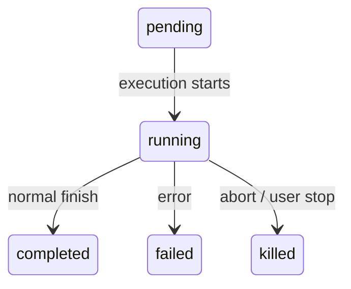
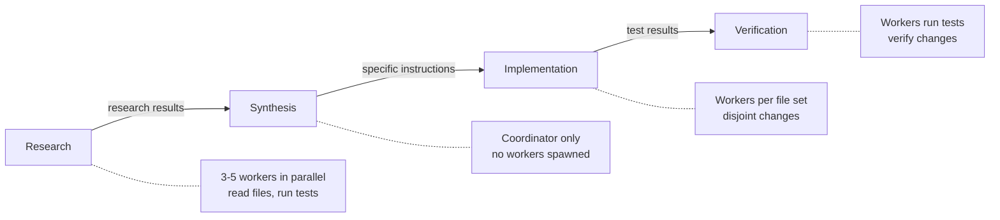
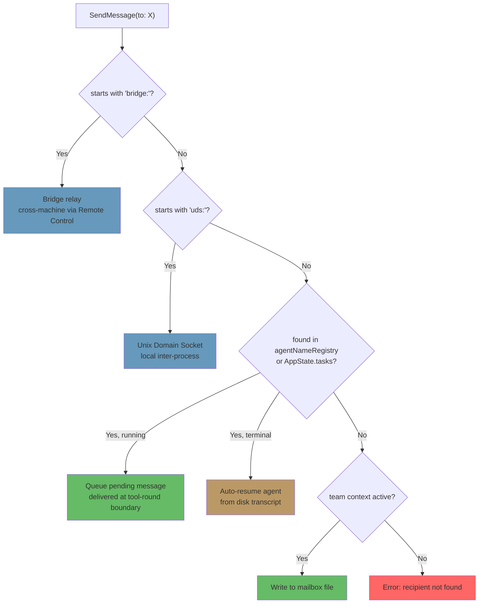

# 第 10 章：任务、协调与智能体集群

## 单线程的极限

第 8 章展示了如何创建子智能体——那个从 agent definition 构建隔离执行上下文的十五步生命周期。第 9 章展示了如何通过提示缓存利用，让并行派生在经济上可行。但创建 agents 和管理 agents 是两个不同问题。本章处理第二个。

单个智能体循环——一个模型、一次对话、一次一个工具——可以完成相当惊人的工作。它可以读取文件、编辑代码、运行测试、搜索网页，并对复杂问题进行推理。但它会碰到天花板。

天花板不是智能，而是并行度和范围。开发者在做大型重构时，需要更新 40 个文件、在每个批次后运行测试，并验证没有破坏任何东西。一次代码库迁移会同时触及前端、后端和数据库层。彻底的代码审查会在后台运行测试套件的同时阅读几十个文件。这些问题并不是更难——而是更宽。它们需要同时做多件事，把工作委派给专家，并协调结果。

Claude Code 对这个问题的回答不是一个机制，而是一组分层的编排模式，每种模式适合不同形状的工作。Background tasks 用于 fire-and-forget 命令。Coordinator mode 用于 manager-worker 层级。Swarm teams 用于 peer-to-peer 协作。一个统一通信协议把它们连接在一起。

编排层横跨 `tools/AgentTool/`、`tasks/`、`coordinator/`、`tools/SendMessageTool/` 和 `utils/swarm/` 下的大约 40 个文件。尽管范围很广，设计却锚定在一个所有模式共享的状态机上。理解这个状态机——`Task.ts` 中的 `Task` 抽象——是理解其他一切的前提。

本章会追踪整个栈，从基础 task state machine，一直到最复杂的多智能体拓扑。

---

## Task 状态机

Claude Code 中的每个后台操作——shell 命令、子智能体、远程会话、workflow script——都会作为一个 *task* 被跟踪。task 抽象位于 `Task.ts`，提供编排层其余部分建立其上的统一状态模型。

### 七种类型

系统定义了七种 task type，每种代表不同执行模型：

七种 task type 是：`local_bash`（后台 shell 命令）、`local_agent`（后台子智能体）、`remote_agent`（远程会话）、`in_process_teammate`（swarm teammates）、`local_workflow`（workflow script 执行）、`monitor_mcp`（MCP server monitors）和 `dream`（推测性后台思考）。

`local_bash` 和 `local_agent` 是主力——分别对应后台 shell 命令和后台子智能体。`in_process_teammate` 是 swarm 原语。`remote_agent` 桥接到远程 Claude Code Runtime 环境。`local_workflow` 运行多步骤脚本。`monitor_mcp` 监控 MCP server 健康。`dream` 最特殊——它是一个后台 task，让 agent 在等待用户输入时进行推测性思考。

每种类型都有一个单字符 ID 前缀，便于即时视觉识别：

| Type | Prefix | Example ID |
|------|--------|------------|
| `local_bash` | `b` | `b4k2m8x1` |
| `local_agent` | `a` | `a7j3n9p2` |
| `remote_agent` | `r` | `r1h5q6w4` |
| `in_process_teammate` | `t` | `t3f8s2v5` |
| `local_workflow` | `w` | `w6c9d4y7` |
| `monitor_mcp` | `m` | `m2g7k1z8` |
| `dream` | `d` | `d5b4n3r6` |

Task IDs 使用一个单字符前缀（a 表示 agents、b 表示 bash、t 表示 teammates 等），后接 8 个随机字母数字字符，这些字符来自大小写不敏感安全字母表（数字加小写字母）。这提供大约 2.8 万亿种组合——足以抵抗针对磁盘上 task output files 的暴力 symlink 攻击。

当你在日志行里看到 `a7j3n9p2`，就立即知道这是一个后台 agent。看到 `b4k2m8x1`，就是 shell 命令。这个前缀是给人类读者的微优化，但在一个可能有几十个并发 tasks 的系统里，它很重要。

### 五种状态

生命周期是一个没有环的简单有向图：



`pending` 是注册到首次执行之间的短暂状态。`running` 表示 task 正在主动工作。三个终止状态是 `completed`（成功）、`failed`（错误）和 `killed`（被用户、coordinator 或 abort signal 显式停止）。一个 helper function 防止与死亡 tasks 交互：

```typescript
export function isTerminalTaskStatus(status: TaskStatus): boolean {
  return status === 'completed' || status === 'failed' || status === 'killed'
}
```

这个函数到处出现——message injection guards、eviction logic、orphan cleanup，以及 SendMessage routing 中决定是排队消息还是恢复死亡 agent 的逻辑。

### 基础状态

每个 task state 都扩展 `TaskStateBase`，后者携带所有七种类型共享的字段：

```typescript
export type TaskStateBase = {
  id: string              // Prefixed random ID
  type: TaskType          // Discriminator
  status: TaskStatus      // Current lifecycle position
  description: string     // Human-readable summary
  toolUseId?: string      // The tool_use block that spawned this task
  startTime: number       // Creation timestamp
  endTime?: number        // Terminal-state timestamp
  totalPausedMs?: number  // Accumulated pause time
  outputFile: string      // Disk path for streaming output
  outputOffset: number    // Read cursor for incremental output
  notified: boolean       // Whether completion was reported to parent
}
```

两个字段值得关注。`outputFile` 是 async execution 和父级对话之间的桥梁——每个 task 都会把输出写入磁盘文件，父级可以通过 `outputOffset` 增量读取。`notified` 防止重复 completion messages；一旦父级已经被告知 task 完成，这个 flag 就翻转为 `true`，通知永远不会再发送。没有这个 guard，一个在两次连续轮询 notification queue 之间完成的 task 会生成重复通知，让模型误以为两个 tasks 完成了，而实际上只有一个。

### Agent Task State

`LocalAgentTaskState` 是最复杂的变体，携带管理后台子智能体完整生命周期所需的一切：

```typescript
export type LocalAgentTaskState = TaskStateBase & {
  type: 'local_agent'
  agentId: string
  prompt: string
  selectedAgent?: AgentDefinition
  agentType: string
  model?: string
  abortController?: AbortController
  pendingMessages: string[]       // Queued via SendMessage
  isBackgrounded: boolean         // Was this originally a foreground agent?
  retain: boolean                 // UI is holding this task
  diskLoaded: boolean             // Sidechain transcript loaded
  evictAfter?: number             // GC deadline
  progress?: AgentProgress
  lastReportedToolCount: number
  lastReportedTokenCount: number
  // ... additional lifecycle fields
}
```

三个字段揭示了重要设计决策。`pendingMessages` 是 inbox——当 `SendMessage` 目标是一个运行中的 agent 时，消息会排队到这里，而不是立即注入。消息会在工具轮次边界被 drain，这保留了 agent 的 turn 结构。`isBackgrounded` 区分天生 async 的 agents 和一开始是前台 sync、后来因用户按键而被 backgrounded 的 agents。`evictAfter` 是垃圾回收机制：未 retain 的已完成 tasks 会在宽限期后从内存中清除状态。

所有 task states 都存储在 `AppState.tasks` 中，类型是 `Record<string, TaskState>`，以带前缀 ID 为 key。这是一个扁平 map，不是树——系统不在状态 store 中建模父子关系。父子关系隐含在对话流中：父级持有派生子级的 `toolUseId`。

### Task Registry

每种 task type 背后都有一个 `Task` 对象，接口极小：

```typescript
export type Task = {
  name: string
  type: TaskType
  kill(taskId: string, setAppState: SetAppState): Promise<void>
}
```

registry 收集所有 task 实现：

```typescript
export function getAllTasks(): Task[] {
  return [
    LocalShellTask,
    LocalAgentTask,
    RemoteAgentTask,
    DreamTask,
    ...(LocalWorkflowTask ? [LocalWorkflowTask] : []),
    ...(MonitorMcpTask ? [MonitorMcpTask] : []),
  ]
}
```

注意条件包含——`LocalWorkflowTask` 和 `MonitorMcpTask` 受 feature gate 控制，运行时可能不存在。`Task` 接口被刻意设计得很小。早期迭代中包含 `spawn()` 和 `render()` 方法，但后来发现它们从未被多态调用，于是被移除。每种 task type 都有自己的 spawn 逻辑、自己的状态管理、自己的渲染。唯一真正需要按类型分发的操作是 `kill()`，因此接口只要求它。

这是通过减法演进接口的例子。初始设计想象所有 task type 会共享一个通用生命周期接口。实践中，类型分化到共享接口变成了虚构——shell 命令的 `spawn()` 和 in-process teammate 的 `spawn()` 几乎没有共同点。与其维护一个漏水抽象，团队移除了除唯一真正受益于多态的方法之外的所有东西。

---

## 通信模式

后台运行的 task 只有在父级能观察其进度并接收结果时才有用。Claude Code 支持三种通信通道，每种针对不同访问模式优化。

### 前台：生成器链

当 agent 同步运行时，父级会直接迭代它的 `runAgent()` async generator，把每条 message 沿调用栈向上 yield。这里有趣的机制是后台逃生舱——sync loop 会在“agent 的下一条 message”和“background signal”之间 race：

```typescript
const agentIterator = runAgent({ ...params })[Symbol.asyncIterator]()

while (true) {
  const nextMessagePromise = agentIterator.next()
  const raceResult = backgroundPromise
    ? await Promise.race([nextMessagePromise.then(...), backgroundPromise])
    : { type: 'message', result: await nextMessagePromise }

  if (raceResult.type === 'background') {
    // User triggered backgrounding -- transition to async
    await agentIterator.return(undefined)
    void runAgent({ ...params, isAsync: true })
    return { data: { status: 'async_launched' } }
  }

  agentMessages.push(message)
}
```

如果用户在执行中途决定一个 sync agent 应该变成后台 task，前台 iterator 会被干净地 return（触发它的 `finally` block 做资源清理），agent 会以同一个 ID 重新派生为 async task。转换是无缝的——没有工作丢失，agent 会从离开的地方继续，并拥有一个不再链接到父级 ESC 键的 async abort controller。

这是一个真正困难的状态转换。前台 agent 共享父级 abort controller（ESC 杀掉两者）。后台 agent 需要自己的 controller（ESC 不应该杀掉它）。agent 的 messages 需要从前台 generator stream 转移到后台 notification system。task state 需要翻转 `isBackgrounded`，让 UI 知道在后台面板显示它。所有这些必须原子发生——转换期间不丢消息，不留下 zombie iterators。下一条 message 和 background signal 之间的 `Promise.race` 是实现这一点的机制。

### 后台：三条通道

后台 agents 通过磁盘、通知和排队消息通信。

**磁盘输出文件。** 每个 task 都写入一个 `outputFile` 路径——指向该 agent JSONL transcript 的 symlink。父级（或任何观察者）可以用 `outputOffset` 增量读取这个文件，后者记录已经消费到文件的哪个位置。`TaskOutputTool` 把这暴露给模型：

```typescript
inputSchema = z.strictObject({
  task_id: z.string(),
  block: z.boolean().default(true),
  timeout: z.number().default(30000),
})
```

当 `block: true` 时，该工具会轮询直到 task 到达终止状态或超时。这是 coordinator 派生 worker 并等待结果的主要机制。

**Task notifications。** 当后台 agent 完成时，系统会生成一条 XML notification，并把它入队，等待投递到父级对话中：

```xml
<task-notification>
  <task-id>a7j3n9p2</task-id>
  <tool-use-id>toolu_abc123</tool-use-id>
  <output-file>/path/to/output</output-file>
  <status>completed</status>
  <summary>Agent "Investigate auth bug" completed</summary>
  <result>Found null pointer in src/auth/validate.ts:42...</result>
  <usage>
    <total_tokens>15000</total_tokens>
    <tool_uses>8</tool_uses>
    <duration_ms>12000</duration_ms>
  </usage>
</task-notification>
```

notification 会作为 user-role message 注入父级对话，这意味着模型会在正常 message flow 中看到它。它不需要特殊工具来检查完成情况——完成信息会作为上下文到达。task state 上的 `notified` flag 防止重复投递。

**命令队列。** `LocalAgentTaskState` 上的 `pendingMessages` 数组是第三条通道。当 `SendMessage` 目标是运行中的 agent 时，消息会排队：

```typescript
if (isLocalAgentTask(task) && task.status === 'running') {
  queuePendingMessage(agentId, input.message, setAppState)
  return { data: { success: true, message: 'Message queued...' } }
}
```

这些 messages 会由 `drainPendingMessages()` 在工具轮次边界 drain，并作为 user messages 注入 agent 对话。这是一个关键设计选择——messages 到达工具轮次之间，而不是执行中途。agent 先完成当前 thought，然后接收新信息。没有竞争条件，没有损坏状态。

### 进度跟踪

`ProgressTracker` 提供 agent 活动的实时可见性：

```typescript
export type ProgressTracker = {
  toolUseCount: number
  latestInputTokens: number        // Cumulative (latest value, not sum)
  cumulativeOutputTokens: number   // Summed across turns
  recentActivities: ToolActivity[] // Last 5 tool uses
}
```

input 和 output token 跟踪之间的区别是刻意的，反映 API 计费模型的细节。Input tokens 在每次 API 调用中是累积的，因为完整对话每次都会重新发送——第 15 轮包含前 14 轮，所以 API 报告的 input token count 已经反映总量。保留最新值是正确聚合方式。Output tokens 是按 turn 产生的——模型每次生成新 token——所以求和是正确聚合方式。这里弄错会导致严重高估（对累积 input tokens 求和）或严重低估（只保留最新 output tokens）。

`recentActivities` 数组（最多 5 条）提供 agent 正在做什么的人类可读 stream：“Read src/auth/validate.ts”、“Bash: npm test”、“Edit src/auth/validate.ts”。它会出现在 VS Code subagent panel 和终端后台 task 指示器中，让用户无需阅读完整 transcript 就能看到 agent 工作状态。

对于后台 agents，进度会通过 `updateAsyncAgentProgress()` 写入 `AppState`，并通过 `emitTaskProgress()` 作为 SDK events 发出。VS Code subagent panel 消费这些 events 来渲染实时 progress bars、tool counts 和 activity streams。进度跟踪不只是装饰——它是告诉用户后台 agent 是在前进还是卡在循环里的主要反馈机制。

---

## Coordinator Mode

Coordinator mode 会把 Claude Code 从一个带后台 helpers 的单智能体，变成真正的 manager-worker 架构。它是系统中最有主见的编排模式，其设计揭示了关于 LLM 应该如何委派、又不应该如何委派的深入思考。

### Coordinator Mode 解决的问题

标准 agent loop 有单一对话和单一 context window。当它派生后台 agent 时，后台 agent 独立运行，并通过 task notifications 回报结果。这对简单委派很有效——“我继续编辑时帮我跑测试”——但在复杂多步骤 workflow 中会崩溃。

考虑一次代码库迁移。agent 需要：(1) 理解 200 个文件中的当前模式，(2) 设计迁移策略，(3) 对每个文件应用修改，(4) 验证没有破坏任何东西。步骤 1 和 3 受益于并行。步骤 2 需要综合步骤 1 的结果。步骤 4 依赖步骤 3。单个 agent 串行完成会把大部分 token 预算花在重复读取文件上。多个后台 agents 如果没有协调，会产生不一致的修改。

Coordinator mode 通过把“思考”agent 与“执行”agents 分离来解决这个问题。coordinator 处理步骤 1 和 2（派发 research workers，然后综合）。workers 处理步骤 3 和 4（应用修改、运行测试）。coordinator 看全局；workers 看自己的具体任务。

### 激活

一个环境变量打开开关：

```typescript
export function isCoordinatorMode(): boolean {
  if (feature('COORDINATOR_MODE')) {
    return isEnvTruthy(process.env.CLAUDE_CODE_COORDINATOR_MODE)
  }
  return false
}
```

恢复会话时，`matchSessionMode()` 会检查被恢复会话存储的模式是否与当前环境匹配。如果二者不同，环境变量会被翻转以匹配会话。这防止令人困惑的场景：coordinator session 被恢复成普通 agent（失去对 workers 的认知），或普通 session 被恢复成 coordinator（失去工具访问）。会话模式是真实来源；环境变量是运行时信号。

### 工具限制

coordinator 的力量不是来自更多工具，而是来自更少工具。在 coordinator mode 中，coordinator agent 正好得到三个工具：

- **Agent**——派生 workers
- **SendMessage**——与已有 workers 通信
- **TaskStop**——终止运行中的 workers

就这些。不能读文件。不能编辑代码。不能运行 shell 命令。coordinator 不能直接触碰代码库。这种限制不是局限——它是核心设计原则。coordinator 的工作是思考、规划、拆分和综合。workers 做工作。

相反，workers 获得完整工具集合，减去内部协调工具：

```typescript
const INTERNAL_WORKER_TOOLS = new Set([
  TEAM_CREATE_TOOL_NAME,
  TEAM_DELETE_TOOL_NAME,
  SEND_MESSAGE_TOOL_NAME,
  SYNTHETIC_OUTPUT_TOOL_NAME,
])
```

workers 不能派生自己的 sub-teams，也不能向 peers 发送消息。它们通过正常 task completion 机制报告结果，由 coordinator 跨结果进行综合。

### 370 行系统提示

coordinator system prompt 按行数算，是代码库中最能说明如何用 LLM 做编排的文档。它大约 370 行，编码了关于委派模式的血泪经验。关键教导包括：

**“永远不要委派理解。”** 这是核心论点。coordinator 必须把 research findings 综合成带文件路径、行号和精确修改的具体 prompts。prompt 明确指出诸如“based on your findings, fix the bug”这样的反模式——这种 prompt 把 *理解* 委派给 worker，迫使它重新推导 coordinator 已经拥有的上下文。正确模式是：“在 `src/auth/validate.ts` 第 42 行，从 OAuth flow 调用时 `userId` 参数可能为 null。添加一个 null check，返回 401 response。”

**“并行是你的超能力。”** prompt 建立了清晰并发模型。只读任务可以自由并行——research、exploration、file reading。写密集任务按文件集合串行。coordinator 应该推理哪些任务可以重叠，哪些必须排序。优秀 coordinator 会同时派生五个 research workers，等待全部完成，综合后派生三个处理互不重叠文件集合的 implementation workers。糟糕 coordinator 会派生一个 worker、等待、再派生下一个、再等待——把本可并行的工作串行化。

**任务 workflow 阶段。** prompt 定义四个阶段：



1. **Research**——workers 并行探索代码库、读取文件、运行测试、收集信息
2. **Synthesis**——coordinator（不是 worker）读取所有 research results，并建立统一理解
3. **Implementation**——workers 收到从 synthesis 得出的精确指令
4. **Verification**——workers 运行测试并验证修改

coordinator 不应该跳过阶段。最常见失败模式是从 research 直接跳到 implementation，而没有 synthesis。发生这种情况时，coordinator 把理解委派给 implementation workers——每个 worker 都必须从头重新推导上下文，导致不一致修改和 token 浪费。

**continue-vs-spawn 决策。** 当 worker 完成后，coordinator 有后续工作时，应该通过 SendMessage 给现有 worker 发送消息，还是通过 Agent 派生一个新的？决策取决于上下文重叠度：

- **高重叠，同一批文件**：Continue。worker 已经在上下文里有文件内容，理解模式，可以基于先前工作继续。重新派生会迫使它重读同样文件、重新推导同样理解。
- **低重叠，不同领域**：Spawn fresh。刚调查认证系统的 worker 带着 20,000 token 认证上下文，这对 CSS 重构是死重。干净开始更便宜。
- **高重叠但 worker 失败**：Spawn fresh，并明确说明出了什么问题。继续一个失败 worker 往往意味着对抗混乱上下文。带着“上次失败是因为 X，避免 Y”的新开始更可靠。
- **后续需要 worker 的输出**：Continue，并在 SendMessage 中包含输出。worker 不需要重新推导自己的结果。

**Worker prompt 写作与反模式。** prompt 教 coordinator 如何写有效 worker prompts，并明确标记坏模式：

反模式：*“Based on your research findings, implement the fix.”* 这委派了理解。worker 并不是做 research 的那个——coordinator 才读过 research results。

反模式：*“Fix the bug in the auth module.”* 没有文件路径、没有行号、没有 bug 描述。worker 必须从头搜索整个代码库。

反模式：*“Make the same change to all the other files.”* 哪些文件？什么修改？coordinator 知道，就应该列出来。

好模式：*“In `src/auth/validate.ts` at line 42, the `userId` parameter can be null when called from `src/oauth/callback.ts:89`. Add a null check: if `userId` is null, return `{ error: 'unauthorized', status: 401 }`. Then update the test in `src/auth/__tests__/validate.test.ts` to cover the null case.”*

写具体 prompt 的成本由 coordinator 承担一次。收益——worker 首次尝试就正确执行——巨大。模糊 prompt 是虚假节省：coordinator 省下 30 秒写 prompt，worker 浪费 5 分钟探索。

### Worker Context

coordinator 会把关于可用工具的信息注入自己的上下文，让模型知道 workers 能做什么：

```typescript
export function getCoordinatorUserContext(mcpClients, scratchpadDir?) {
  return {
    workerToolsContext: `Workers spawned via Agent have access to: ${workerTools}`
      + (mcpClients.length > 0
        ? `\nWorkers also have MCP tools from: ${serverNames}` : '')
      + (scratchpadDir ? `\nScratchpad: ${scratchpadDir}` : '')
  }
}
```

scratchpad directory（由 `tengu_scratch` feature flag gate）是一个共享文件系统位置，workers 可以在其中读写且无需权限提示。它支持持久的跨 worker 知识共享——一个 worker 的 research notes 变成另一个 worker 的输入，通过文件系统而不是 coordinator 的 token window 传递。

这很重要，因为它解决了 coordinator 模式的根本限制。没有 scratchpad 时，所有信息都流经 coordinator：Worker A 产出 findings，coordinator 通过 TaskOutput 读取，把它们综合进 Worker B 的 prompt。coordinator 的 context window 变成瓶颈——它必须持有所有中间结果足够久才能综合。有了 scratchpad，Worker A 把 findings 写到 `/tmp/scratchpad/auth-analysis.md`，coordinator 告诉 Worker B：“读取 `/tmp/scratchpad/auth-analysis.md` 的认证分析，并把该模式应用到 OAuth 模块。” coordinator 通过引用移动信息，而不是通过值移动。

### 与 Fork 互斥

Coordinator mode 和 fork-based subagents 互斥：

```typescript
export function isForkSubagentEnabled(): boolean {
  if (feature('FORK_SUBAGENT')) {
    if (isCoordinatorMode()) return false
    // ...
  }
}
```

冲突是根本性的。Fork agents 继承父级完整对话上下文——它们是共享提示缓存的便宜克隆。Coordinator workers 是带新鲜上下文和具体指令的独立 agents。这是两种相反的委派哲学，系统在 feature flag 层强制选择。

---

## Swarm 系统

Coordinator mode 是层级式的：一个 manager，多个 workers，自上而下控制。swarm 系统是 peer-to-peer 替代方案——多个 Claude Code instances 作为一个团队工作，leader 通过消息传递协调多个 teammates。

### Team Context

Teams 由 `teamName` 标识，并在 `AppState.teamContext` 中跟踪：

```typescript
teamContext?: {
  teamName: string
  teammates: {
    [id: string]: { name: string; color?: string; ... }
  }
}
```

每个 teammate 获得一个名称（用于寻址）和一个颜色（用于 UI 中的视觉区分）。team file 会持久化到磁盘，让团队成员关系跨进程重启保留。

### Agent Name Registry

后台 agents 可以在派生时获得名称，让它们可以通过人类可读标识符而不是随机 task IDs 寻址：

```typescript
if (name) {
  rootSetAppState(prev => {
    const next = new Map(prev.agentNameRegistry)
    next.set(name, asAgentId(asyncAgentId))
    return { ...prev, agentNameRegistry: next }
  })
}
```

`agentNameRegistry` 是一个 `Map<string, AgentId>`。当 `SendMessage` 解析 `to` 字段时，会先检查 registry：

```typescript
const registered = appState.agentNameRegistry.get(input.to)
const agentId = registered ?? toAgentId(input.to)
```

这意味着你可以给 `"researcher"` 发送消息，而不是给 `a7j3n9p2`。这个间接层很简单，但它让 coordinator 能以角色而不是 ID 思考——这显著提升模型对多智能体 workflow 的推理能力。

### In-Process Teammates

In-process teammates 与 leader 运行在同一个 Node.js 进程中，通过 `AsyncLocalStorage` 隔离。它们的状态在基础字段上扩展了团队特定字段：

```typescript
export type InProcessTeammateTaskState = TaskStateBase & {
  type: 'in_process_teammate'
  identity: TeammateIdentity
  prompt: string
  messages?: Message[]                  // Capped at 50
  pendingUserMessages: string[]
  isIdle: boolean
  shutdownRequested: boolean
  awaitingPlanApproval: boolean
  permissionMode: PermissionMode
  onIdleCallbacks?: Array<() => void>
  currentWorkAbortController?: AbortController
}
```

`messages` 最多 50 条值得解释。开发期间的分析显示，每个 in-process agent 在 500+ turns 时会累积约 20MB RSS。Whale sessions——运行超长 workflow 的重度用户——曾在 2 分钟内启动 292 个 agents，把 RSS 推到 36.8GB。UI 表示层的 50-message cap 是一个内存安全阀。agent 的真实对话仍然保留完整历史；只有面向 UI 的快照被截断。

`isIdle` flag 支持 work-stealing 模式。idle teammate 不消耗 tokens 或 API calls——它只是在等待下一条消息。`onIdleCallbacks` 数组让系统可以 hook 从 active 到 idle 的转换，支持“等所有 teammates 完成，然后继续”这样的编排模式。

`currentWorkAbortController` 与 teammate 的主 abort controller 不同。abort 当前 work controller 会取消 teammate 正在进行的 turn，但不会杀掉 teammate。这支持“redirect”模式：leader 发送更高优先级消息，teammate 当前工作被 abort，然后接手新消息。主 abort controller 一旦 abort，会完全杀掉 teammate。两层中断对应两层意图。

`shutdownRequested` flag 实现协作式终止。leader 发送 shutdown request 时，该 flag 会被设置。teammate 可以在自然停止点检查它，并优雅收尾——完成当前文件写入、提交修改，或发送最终状态更新。这比硬 kill 更温和，后者可能让文件处于不一致状态。

### Mailbox

Teammates 通过基于文件的 mailbox 系统通信。当 `SendMessage` 目标是 teammate 时，消息会写入接收者在磁盘上的 mailbox file：

```typescript
await writeToMailbox(recipientName, {
  from: senderName,
  text: content,
  summary,
  timestamp: new Date().toISOString(),
  color: senderColor,
}, teamName)
```

Messages 可以是普通文本、结构化 protocol messages（shutdown requests、plan approvals），或 broadcasts（`to: "*"` 发送给除发送者外的所有团队成员）。poller hook 会处理 incoming messages，并把它们路由进 teammate 的对话。

基于文件的方法被刻意设计得简单。没有 message broker，没有 event bus，没有 shared memory channel。文件是持久的（能在进程崩溃后保留）、可检查的（可以 `cat` mailbox），且便宜（没有基础设施依赖）。对于每个会话消息量以几十条而不是每秒上千条计的系统，这是正确取舍。Redis-backed message queue 会增加运维复杂度、依赖和失败模式——而吞吐要求一个文件系统调用就能轻松处理。

broadcast 机制值得说明。当消息发送给 `"*"` 时，发送者会遍历 team file 中所有成员，跳过自己（大小写不敏感比较），并分别写入每个成员的 mailbox：

```typescript
for (const member of teamFile.members) {
  if (member.name.toLowerCase() === senderName.toLowerCase()) continue
  recipients.push(member.name)
}
for (const recipientName of recipients) {
  await writeToMailbox(recipientName, { from: senderName, text: content, ... }, teamName)
}
```

没有 fan-out 优化——每个接收者得到一次单独文件写入。同样，在 agent teams 的规模（通常 3-8 人）下，这完全足够。如果团队有 100 个成员，就需要重新思考。但防止 36GB RSS 场景的 50-message memory cap，也隐含限制了有效团队规模。

### 权限转发

Swarm workers 使用受限权限运行，但在需要敏感操作批准时可以升级给 leader：

```typescript
const request = createPermissionRequest({
  toolName, toolUseId, input, description, permissionSuggestions
})
registerPermissionCallback({ requestId, toolUseId, onAllow, onReject })
void sendPermissionRequestViaMailbox(request)
```

流程是：worker 遇到需要权限的工具，bash classifier 尝试自动批准；如果失败，请求会通过 mailbox 系统转发给 leader。leader 在 UI 中看到请求，可以批准或拒绝。callback 触发后，worker 继续。这让 workers 可以对安全操作自主运行，同时对危险操作保持人工监督。

---

## 智能体间通信：SendMessage

`SendMessageTool` 是通用通信原语。它通过单个工具接口处理四种不同路由模式，具体模式由 `to` 字段形状选择。

### 输入 Schema

```typescript
inputSchema = z.object({
  to: z.string(),
  // "teammate-name", "*", "uds:<socket>", "bridge:<session-id>"
  summary: z.string().optional(),
  message: z.union([
    z.string(),
    z.discriminatedUnion('type', [
      z.object({ type: z.literal('shutdown_request'), reason: z.string().optional() }),
      z.object({ type: z.literal('shutdown_response'), request_id, approve, reason }),
      z.object({ type: z.literal('plan_approval_response'), request_id, approve, feedback }),
    ]),
  ]),
})
```

`message` 字段是普通文本和结构化 protocol messages 的 union。这意味着 SendMessage 承担双重职责——既是非正式聊天通道（“这是我的发现”），也是正式协议层（“我批准你的计划” / “请关闭”）。

### 路由分发

`call()` 方法遵循按优先级排序的分发链：



**1. Bridge messages**（`bridge:<session-id>`）。通过 Anthropic Remote Control servers 进行跨机器通信。这是最宽的范围——两个位于不同机器、甚至不同大陆的 Claude Code instances，通过 relay 通信。系统要求发送 bridge messages 前获得明确用户同意——这是防止某个 agent 单方面与远程实例建立通信的安全检查。没有这个 gate，被攻陷或困惑的 agent 可能向远程会话外泄信息。consent check 使用 `postInterClaudeMessage()`，它会处理通过 Remote Control relay 的序列化和传输。

**2. UDS messages**（`uds:<socket-path>`）。通过 Unix Domain Sockets 进行本地进程间通信。这用于同一机器上运行在不同进程中的 Claude Code instances——例如 VS Code extension 托管一个实例，终端托管另一个。UDS 通信快速（无网络往返）、安全（文件系统权限控制访问）且可靠（内核处理投递）。`sendToUdsSocket()` 函数会序列化 message 并写入 `to` 字段指定的 socket path。Peers 通过扫描活跃 UDS endpoints 的 `ListPeers` 工具发现彼此。

**3. In-process subagent routing**（普通名称或 agent ID）。这是最常见路径。路由逻辑：

- 在 `agentNameRegistry` 中查找 `input.to`
- 如果找到且正在运行：`queuePendingMessage()`——消息等待下一个工具轮次边界
- 如果找到但处于终止状态：`resumeAgentBackground()`——agent 被透明重启
- 如果不在 `AppState` 中：尝试从磁盘 transcript 恢复

**4. Team mailbox**（team context 激活时的 fallback）。具名接收者的消息会写入其 mailbox files。`"*"` wildcard 会触发广播给所有团队成员。

### 结构化协议

除了普通文本，SendMessage 还承载两个正式协议。

**Shutdown 协议。** leader 向 teammate 发送 `{ type: 'shutdown_request', reason: '...' }`。teammate 以 `{ type: 'shutdown_response', request_id, approve: true/false, reason }` 响应。如果批准，in-process teammates 会 abort 自己的 controller；tmux-based teammates 会收到 `gracefulShutdown()` 调用。这个协议是协作式的——如果 teammate 正在做关键工作，可以拒绝 shutdown request，leader 必须处理这种情况。

**Plan approval 协议。** 在 plan mode 中运行的 teammates 必须在执行前获得批准。它们提交 plan，leader 用 `{ type: 'plan_approval_response', request_id, approve, feedback }` 响应。只有 team lead 可以发出批准。这创建了 review gate——leader 可以在任何文件被触碰前检查 worker 的预期方案，尽早捕获误解。

### Auto-Resume 模式

路由系统最优雅的功能是透明 agent 恢复。当 `SendMessage` 目标是已完成或已 kill 的 agent 时，它不会返回错误，而是复活该 agent：

```typescript
if (task.status !== 'running') {
  const result = await resumeAgentBackground({
    agentId,
    prompt: input.message,
    toolUseContext: context,
    canUseTool,
  })
  return {
    data: {
      success: true,
      message: `Agent "${input.to}" was stopped; resumed with your message`
    }
  }
}
```

`resumeAgentBackground()` 函数会从磁盘 transcript 重建 agent：

1. 读取 sidechain JSONL transcript
2. 重建 message history，过滤 orphaned thinking blocks 和 unresolved tool uses
3. 为提示缓存稳定性重建 content replacement state
4. 从存储的 metadata 解析原始 agent definition
5. 以新 abort controller 重新注册为后台 task
6. 调用 `runAgent()`，传入恢复后的 history，并把新 message 作为 prompt

从 coordinator 视角看，给死亡 agent 发送消息和给活 agent 发送消息是同一个操作。路由层处理复杂性。这意味着 coordinators 不需要跟踪哪些 agents 活着——它们只发送消息，系统会自己搞定。

影响很大。没有 auto-resume 时，coordinator 需要维护 agent liveness 的心智模型：“`researcher` 还在运行吗？我检查一下。它完成了。我需要派生一个新 agent。等等，我该用同一个名字吗？它会有同样上下文吗？”有了 auto-resume，这些全部坍缩为：“给 `researcher` 发消息。”如果它活着，消息排队。如果它死了，就带完整历史复活。coordinator prompt 复杂度显著下降。

当然有成本。从磁盘 transcript 恢复意味着重读可能数千条 messages、重建内部状态，并发起一次带完整 context window 的新 API 调用。对于长寿命 agent，这在延迟和 token 上都可能昂贵。但替代方案——要求 coordinator 手动管理 agent 生命周期——更糟。coordinator 是 LLM。它擅长推理问题和编写指令，不擅长记账。Auto-resume 通过完全消除一类记账工作来发挥 LLM 的优势。

---

## TaskStop：Kill Switch

`TaskStopTool` 是 Agent 和 SendMessage 的补充——它终止运行中的 tasks：

```typescript
inputSchema = z.strictObject({
  task_id: z.string().optional(),
  shell_id: z.string().optional(),  // Deprecated backward compat
})
```

实现会委托给 `stopTask()`，后者按 task type 分发：

1. 在 `AppState.tasks` 中查找 task
2. 调用 `getTaskByType(task.type).kill(taskId, setAppState)`
3. 对 agents：abort controller、把 status 设为 `'killed'`、启动 eviction timer
4. 对 shells：kill process group

这个工具有一个 legacy alias `"KillShell"`——提醒我们 task 系统来自更简单的起点，那时唯一后台操作是 shell 命令。

kill 机制随 task type 而异，但模式一致。对 agents，killing 意味着 abort abort controller（使 `query()` loop 在下一个 yield point 退出）、把 status 设为 `'killed'`，并启动 eviction timer，让 task state 在宽限期后清理。对 shells，killing 意味着向 process group 发送 signal——先 `SIGTERM`，如果进程在超时内不退出，再 `SIGKILL`。对 in-process teammates，killing 还会向 team 触发 shutdown notification，让其他成员知道该 teammate 已离开。

Eviction timer 值得注意。agent 被 killed 时，它的状态不会立即清除。它会在 `AppState.tasks` 中停留一段宽限期（由 `evictAfter` 控制），让 UI 可以显示 killed status，任何最终输出仍可读取，并且通过 SendMessage 的 auto-resume 仍有可能。宽限期后，状态被垃圾回收。这与 completed tasks 使用的是同一模式——系统区分“已结束”（结果可用）和“已遗忘”（状态清除）。

---

## 如何选择模式

（命名说明：代码库中还有 `TaskCreate`/`TaskGet`/`TaskList`/`TaskUpdate` 工具，用于管理结构化 todo list——这与这里描述的后台 task state machine 完全不同。`TaskStop` 操作 `AppState.tasks`；`TaskUpdate` 操作 project tracking data store。命名重叠是历史原因，也是模型混淆的反复来源。）

有三种可用编排模式——后台委派、coordinator mode 和 swarm teams——自然问题是何时使用哪一种。

**简单委派**（带 `run_in_background: true` 的 Agent 工具）适合父级有一两个独立任务要卸载的情况。一边继续编辑，一边在后台跑测试。等待构建时搜索代码库。父级保持控制，在准备好时检查结果，并且不需要复杂通信协议。开销很小——一个 task state entry，一个磁盘 output file，一个完成时 notification。

**Coordinator mode** 适合问题可以拆成 research phase、synthesis phase 和 implementation phase 的情况——尤其是 coordinator 需要跨多个 workers 的结果进行推理后再指导下一步。coordinator 不能触碰文件，这强制了关注点分离：思考发生在一个上下文中，执行发生在另一个上下文中。370 行系统提示不是仪式——它编码了防止 LLM 委派最常见失败模式的模式，而这个失败模式就是委派理解而不是委派行动。

**Swarm teams** 适合长时间运行的协作会话，其中 agents 需要 peer-to-peer 通信，工作是持续的而不是 batch-oriented，并且 agents 可能需要根据 incoming messages idle 和 resume。mailbox 系统支持 coordinator mode（同步 spawn-wait-synthesize）不支持的异步模式。Plan approval gates 增加 review layer。Permission forwarding 在不要求每个 agent 拥有全部权限的情况下维持安全性。

一个实用决策表：

| 场景 | 模式 | 原因 |
|----------|---------|-----|
| 编辑时运行测试 | 简单委派 | 一个后台 task，不需要协调 |
| 搜索代码库中的所有用法 | 简单委派 | Fire-and-forget，完成后读取输出 |
| 跨 3 个模块重构 40 个文件 | Coordinator | Research phase 找模式，synthesis 规划修改，workers 按模块并行执行 |
| 带 review gates 的多日功能开发 | Swarm | 长寿命 agents、plan approval protocol、peer communication |
| 修复已知位置的 bug | 都不需要——单个 agent | 对聚焦、顺序工作来说，编排开销超过收益 |
| 迁移数据库 schema + 更新 API + 更新前端 | Coordinator | 共享 research/planning phase 后有三个独立工作流 |
| 带用户监督的结对编程 | 带 plan mode 的 Swarm | Worker 提案，leader 批准，worker 执行 |

这些模式原则上不互斥，但实践中是互斥的。Coordinator mode 会禁用 fork subagents。Swarm teams 有自己的通信协议，不会与 coordinator task notifications 混用。选择在会话启动时通过环境变量和 feature flags 做出，并塑造整个交互模型。

最后一个观察：最简单的模式几乎总是正确起点。大多数任务不需要 coordinator mode 或 swarm teams。单个 agent 加偶尔的后台委派可以处理绝大多数开发工作。复杂模式存在于 5% 的场景：问题确实很宽、确实并行、或确实长期运行。在单文件 bug fix 上使用 coordinator mode，就像为静态网站部署 Kubernetes——技术上可行，架构上不合适。

---

## 编排的成本

在讨论编排层揭示的哲学之前，值得先承认它的实际成本。

每个后台 agent 都是一段独立 API 对话。它有自己的 context window、自己的 token budget、自己的 prompt cache slot。一个派生 5 个 research workers 的 coordinator 正在发起 6 个并发 API calls，每个都有自己的 system prompt、tool definitions 和 CLAUDE.md injection。token 开销并不小——仅系统提示就可能有数千 token，而且每个 worker 会重读其他 workers 可能已经读过的文件。

通信通道会增加延迟。磁盘 output files 需要文件系统 I/O。Task notifications 在工具轮次边界投递，不是瞬时投递。命令队列引入完整 round-trip 延迟——coordinator 发送消息，消息等待 worker 完成当前工具使用，worker 处理消息，结果写入磁盘供 coordinator 读取。

状态管理增加复杂度。七种 task types，五种 statuses，每个 task state 数十个字段。eviction logic、garbage collection timers、memory caps——这些都存在，是因为无界状态增长造成过真实生产事故（36.8GB RSS）。

这些并不意味着编排是错的。它意味着编排是有成本的工具，而成本应该与收益权衡。当搜索顺序执行需要 5 分钟时，运行 5 个并行 workers 搜索代码库是值得的。用 coordinator 修复一个文件里的 typo 是纯开销。

---

## 编排层揭示了什么

这个系统最有趣的方面不是任何单独机制——task states、mailboxes 和 notification XML 都是直接的工程。真正有趣的是这些机制如何组合时浮现出的 *设计哲学*。

coordinator prompt 的“永远不要委派理解”不仅是 LLM 编排的好建议。它是在陈述关于 context-window-based reasoning 的根本限制。一个带新鲜 context window 的 worker，无法理解 coordinator 在阅读 50 个文件并综合三份 research reports 后理解的东西。弥合这个差距的唯一方式，是 coordinator 把自己的理解提炼成具体、可执行的 prompt。模糊委派不仅低效——它在信息论上是有损的。

SendMessage 中的 auto-resume 模式体现了对 *表面简单优先于实际简单* 的偏好。实现很复杂——读取磁盘 transcripts、重建 content replacement state、重新解析 agent definitions。但接口很简单：发送消息，无论接收者活着还是死了，它都会工作。复杂性被基础设施吸收，让模型（和用户）可以用更简单的术语推理。

in-process teammates 的 50-message memory cap 也提醒我们，编排系统运行在真实物理约束下。2 分钟内 292 个 agents 把 RSS 推到 36.8GB 不是理论问题——它在生产中发生过。抽象很优雅，但它们运行在内存有限的硬件上，系统必须在用户把它推到极限时优雅退化。

分层架构本身也有一课。task state machine 是无感知的——它不知道 coordinators 或 swarms。通信通道是无感知的——SendMessage 不知道它是被 coordinator、swarm leader 还是 standalone agent 调用。coordinator prompt 叠加在上面，添加方法论而不改变底层机制。每层都可以独立理解、独立测试、独立演化。团队添加 swarm 系统时，不需要修改 task state machine。添加 coordinator prompt 时，不需要修改 SendMessage。

这是良好分解的编排系统的标志：原语是通用的，模式由原语组合而成。coordinator 只是一个拥有受限工具和详细系统提示的 agent。swarm leader 只是一个拥有 team context 和 mailbox access 的 agent。background worker 只是一个拥有独立 abort controller 和磁盘 output file 的 agent。七种 task types、五种 statuses 和四种 routing modes 组合出大于部分之和的编排模式。

编排层是 Claude Code 从单线程工具执行器转变为更像开发团队的地方。task state machine 提供记账。通信通道提供信息流。coordinator prompt 提供方法论。swarm 系统为不适合严格层级的问题提供 peer-to-peer 拓扑。它们合在一起，让语言模型可以做单次模型调用做不到的事：并行地、带协调地处理宽问题。

下一章会研究记忆系统——让智能体跨会话携带项目约定、决策和经验的持久上下文层。没有记忆的编排会反复重新发现同样事实；记忆让这些发现可以沉淀下来，供未来会话复用。
