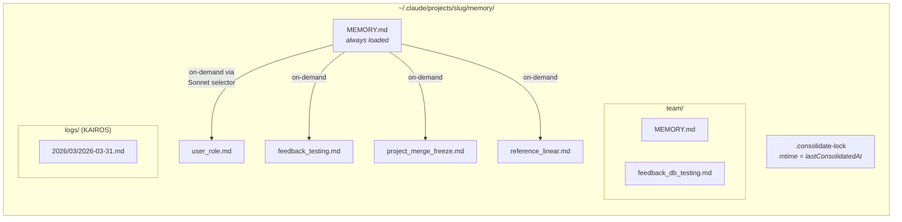
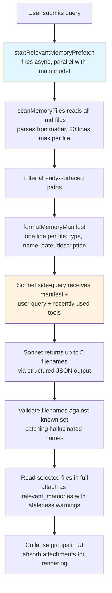
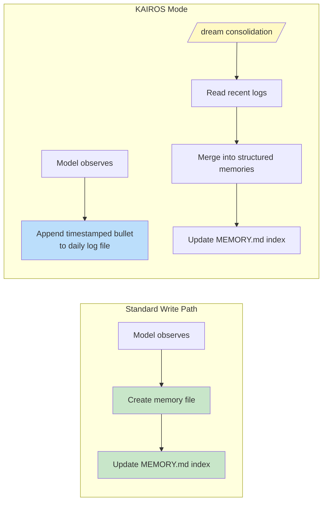

# 第 11 章：记忆——跨会话学习

## 无状态问题

到目前为止，每一章描述的都是单个会话内部存在的机制。智能体循环运行，工具执行，子智能体协调；当进程退出时，这一切都会消失。下一次对话以同样的系统提示、同样的工具定义、同样的模型开始——并且对之前发生过什么一无所知。

这是无状态架构的根本限制。开发者周一纠正了模型的测试方法，周二模型又犯同样错误。用户解释了自己的角色、项目约束、代码风格偏好，而每个新会话都要求他们重新解释。模型不是健忘——它从未知道过。每次对话都是一个独立宇宙。

这个问题不是理论上的。它会以具体方式侵蚀信任。用户说“记住，我们在测试中使用真实数据库实例，而不是 mocks”——下一周模型又生成 mocked tests。用户解释自己是高级工程师，不需要入门级解释——下一次会话又以教程级 walkthrough 开场。没有记忆，每个会话都从零开始。智能体永远像第一天入职的新员工。

行业中的标准解法是 Retrieval-Augmented Generation（RAG）：把文档嵌入为向量，存进向量数据库，在查询时检索相关 chunks。这对知识库很有效——文档、FAQ、参考材料。但它与智能体跨会话真正需要记住的东西在架构上不匹配。智能体的记忆不是知识库。它是一组观察：用户是谁，用户纠正过什么，项目当前约束是什么，东西在哪里。这些观察很小、变化频繁，而且必须能被人类编辑。向量数据库解决的是错误问题。

Claude Code 的记忆系统押注完全不同：磁盘文件、Markdown 格式、由 LLM 驱动的回忆、零基础设施。这个赌注是：存储层保持简单，检索层使用智能，会产生比存储和检索都复杂更好的系统。

这种设计哲学带来塑造整个系统的后果：

- **人类可读。** 用户想看 Claude Code 记住了什么时，可以用任何文本编辑器打开 `~/.claude/projects/<slug>/memory/MEMORY.md`。不需要特殊工具，不需要解密，不需要 export 命令。
- **人类可编辑。** 陈旧记忆可以用 vim 修正。错误记忆可以用 `rm` 删除。用户对智能体知识拥有完整控制权。
- **可版本控制。** 团队记忆可以提交到 git。因为是 Markdown，memory changes 可以干净 diff。
- **零基础设施。** 记忆系统离线可用，不需要服务器，能在任何有文件系统的 OS 上工作。没有迁移路径，因为没有 schema。
- **可调试。** 当记忆行为异常时，诊断路径是 `ls` 和 `cat`，不是 query logs 和数据库检查。

模型使用 `FileWriteTool` 和 `FileEditTool` 读写 memories——也就是它编辑源码时使用的同一组工具（第 6 章介绍）。不存在特殊 memory API。系统提示教模型一个两步写入协议（创建文件，更新索引），模型在新指令下用已有能力执行它。这是把工具复用作为架构原则——记忆系统不是 bolt onto agent 的子系统，而是智能体使用既有能力时涌现出的行为。

文件式选择在这里能成立，还有一个更深原因。对 AI agent 来说，memory 与传统应用中的 memory 根本不同。传统应用的数据库保存权威状态——系统数据的真实来源。agent 的 memory 保存的是 *观察*——在某个时间点为真、现在可能仍然为真也可能不再为真的东西。文件天然传达这种认识论状态。它们有修改时间，显示观察何时被记录。它们可以被知道观察错误的人类读取、编辑和删除。数据库暗示持久性和权威性；Markdown 文件暗示某人写下的笔记，可能需要更新。存储介质传达了数据性质——这些是工作笔记，不是福音。

### 按项目作用域

Memory 作用域是 git repository root，而不是工作目录。如果用户在 `src/components/` 打开一个终端，在 `tests/` 打开另一个终端，两个会话共享同一个 memory directory。解析逻辑会先找到 canonical git root，再 fallback 到 project root：

base path resolution 会先找到 canonical git root，再 fallback 到 project root。这确保同一仓库的所有 git worktrees 共享单个 memory directory。

`findCanonicalGitRoot` 调用确保同一仓库的所有 git worktrees 共享单个 memory directory。git root 会被 sanitize（slashes 通过 `sanitizePath()` 变成 dashes），生成扁平目录名：

```
~/.claude/projects/-Users-alex-code-myapp/memory/
```

一个完整填充的 memory directory 揭示了系统结构：



命名约定是语义化的：`<type>_<topic>.md`。type 前缀不是由代码强制执行，但它是 prompt 指令的一部分，让人可以一眼扫过目录并理解 memory landscape。

---

## 四类型分类法

不是所有东西都值得记住。记忆系统把所有 memories 限制为恰好四种类型：

四种类型是：**user**、**feedback**、**project** 和 **reference**。

这个分类法围绕一个标准设计：**这些知识能否从当前项目状态中重新推导出来？** 代码模式、架构、文件结构、git 历史——所有这些都可以通过阅读代码库重新推导。它们被排除在外。四种类型捕获的是无法重新推导的东西。

**User memories** 记录人的信息：角色、目标、职责、专业水平。一个资深 Go 工程师但刚接触 React 的用户，与首次编程者需要不同解释。

**Feedback memories** 捕获关于如何工作的指导——包括纠正和确认。系统明确指示模型记录两者：“如果你只保存纠正，你会偏离用户已经验证过的方法。” 每条 feedback memory 都有特定结构：规则本身，然后是带原因的 `**Why:**` 行（通常是过去事故），再是带触发条件的 `**How to apply:**` 行。

**Project memories** 记录进行中的工作上下文——谁在做什么，为什么做，什么时候前完成。prompt 强调把相对日期转换为绝对日期：“Thursday” 变成 “2026-03-05”，让 memory 几周后仍可理解。

**Reference memories** 是书签——指向外部系统中信息位置的指针。Linear project URL、Grafana dashboard、Slack channel。这些告诉模型去哪里找，而不是找什么。

### 分类法作为过滤器

四种类型不只是分类——它们是过滤器。通过精确定义什么算 memory，系统隐式定义了什么不算。没有分类法，热心模型会保存一切：代码模式、架构图、错误消息。它们都可以从代码库推导出来。保存它们会创建一份平行的、可能陈旧的信息副本，而这些信息最好从源头获取。

分类法还防止一个更微妙的失败：memory 作为拐杖。如果模型把架构决策保存为 memories，它就会停止阅读代码库来理解架构。通过排除可推导信息，系统强制模型保持扎根于当前代码状态。

排除列表是显式的：代码模式、git 历史、调试解决方案、CLAUDE.md 中的任何内容、短暂任务细节。即使用户明确要求保存，这些排除也适用。如果用户说“记住这个 PR 列表”，模型被指示要追问或反推——“它里面有什么 *令人意外* 或 *非显而易见* 的地方？” 那个意外部分值得保留。原始列表不值得。这个指令通过 evals 验证：加入 exclusion-override instruction 后，结果从 0/2 提升到 3/3。

### Frontmatter 作为契约

每个 memory file 都使用 YAML frontmatter，包含三个必填字段：

```markdown
---
name: {{memory name}}
description: {{one-line description -- used to decide relevance}}
type: {{user, feedback, project, reference}}
---
```

`description` 是最承重的字段。相关性选择器（下面讨论的 Sonnet side-query）用它决定是否 surfacing 这条 memory。像“testing stuff”这样模糊的 description 要么匹配过宽，要么完全匹配不到。像“Integration tests must hit real DB, not mocks -- burned by mock divergence Q4”这样具体的 description，正好匹配它重要的对话。description 是 memory 的搜索索引——消费它的不是搜索引擎，而是能理解细微差别、上下文和意图的语言模型。

frontmatter 也是 recall 期间扫描系统唯一读取的部分。`scanMemoryFiles()` 每个文件只读前 30 行来提取 header。body 在文件被明确选择并加载之前是私有的。

---

## 写入路径

写入 memory 是一个用标准文件工具执行的两步过程。

**第 1 步：写入 memory file。** 模型在 memory directory 中创建带 YAML frontmatter 的 `.md` 文件：

```markdown
---
name: Testing Policy
description: Integration tests must hit real DB, not mocks
type: feedback
---

Don't mock the database in integration tests.

**Why:** We got burned last quarter when mocked tests passed but production
queries hit edge cases the mocks didn't cover.

**How to apply:** Any test file under `__tests__/` that touches database
operations should use the real PGlite instance from test-utils.
```

**第 2 步：更新索引。** 模型向 `MEMORY.md` 添加一行指针：

```markdown
- [Testing Policy](feedback_testing.md) -- integration tests must hit real DB
```

每个条目必须保持在约 150 字符以内。索引是目录，不是知识库。

当模型学到会修改现有 memory 的新信息时，它使用 `FileEditTool` 更新已有文件，而不是创建重复项。系统内部不对 memories 做版本控制——文件在本地文件系统上，如果用户想要版本控制，可以使用 `git`。prompt 构建之前，`ensureMemoryDirExists()` 会创建 memory directory，prompt 会告诉模型目录已经存在，避免在 `ls` 和 `mkdir -p` 上浪费 turns。

---

## 回忆路径

写入 memories 是必要的，但不充分。更难的问题是检索：给定用户查询，潜在数百个 memory files 中哪些应该加载进模型上下文？全部加载会耗尽 token 预算。一个都不加载会让记忆失去意义。加载错误的 memories 会把 token 浪费在无关信息上，同时错过本该改变模型行为的知识。

recall 系统分两层运行。`MEMORY.md` 索引总是在会话启动时加载进上下文，用于提供方向。单个 memory files 通过 LLM-powered relevance query 按需 surfacing，每 turn 最多选择五条 memories。

### 完整 Recall 流水线



第 2 步的 async prefetch 是关键性能决策。到主模型到达 recalled context 有用的位置时，side-query 通常已经完成。用户不会感知到额外延迟。

### Sonnet Side-Query

manifest 会作为 side-query 发送给 Sonnet 模型。这个 selector 的系统提示很精确：

selector 的系统提示要求它保守：只包含对当前 query 有用的 memories；不确定就跳过；避免选择已经在主动使用中的工具的 API/usage 文档（因为模型已经加载了这些工具）——但仍然 surfacing 关于这些工具的 warnings、gotchas 或 known issues。

响应使用 structured output——`{ selected_memories: string[] }`——并且 filenames 会与已知集合校验。

这个方法用延迟换精度，而取舍分析很有启发。**关键词匹配** 很快，但不理解上下文——它无法表达“不要为已经在主动使用中的工具选择 memories”。**Embedding similarity** 可以处理语义匹配，但会引入基础设施（embedding model、vector store、update pipeline），并且难以处理否定——“do NOT use database mocks” 的 embedding 与 “use database mocks” 很接近。**Sonnet side-query** 理解语义相关性，能基于上下文推理，能处理否定，而且不需要任何基础设施。延迟成本有界（数百毫秒），并隐藏在主模型初始处理背后。

遥测系统会跟踪选择率，即使没有 memories 被选择也会记录。0/150 的选择率与 0/3 含义不同——前者说明精度问题，后者说明覆盖问题。

---

## 陈旧性

staleness 系统解决的是来自真实使用的失败模式。用户报告旧 memories——包含已变化代码的 file:line 引用——被模型当作事实断言。citation 让陈旧 claim 听起来 *更* 权威，而不是更不权威。

解决方案不是过期。旧 memories 不会被删除——它们可能包含多年有效的组织知识。系统改为附加 age warnings：

staleness 函数会计算 memory 的年龄（天数）。今天或昨天的 memories 没有 warning（函数返回空字符串）。更旧的 memories 会随内容注入 caveat：一条 message 说明年龄天数，并警告代码行为声明或 file:line citations 可能过时，建议对照当前代码验证。

今天或昨天的 memories 不显示 warning。更旧的 memories 会在内容旁注入 staleness caveat。人类可读格式——“today”、“yesterday”、“47 days ago”——存在的原因是模型不擅长日期算术。原始 ISO timestamp 不像“47 days ago”那样触发陈旧性推理。这是关于模型行为的经验观察，通过 evals 验证：action-cue framing “Before recommending from memory” 得分 3/3，而更抽象的 “Trusting what you recall” 在正文相同情况下得分 0/3。

这里有一个值得点名的哲学张力。staleness 系统把 memories 当作假设，而不是事实。但模型的自然倾向是自信地呈现信息。staleness warning 在与模型自己的声音对抗——利用它的指令遵循能力，覆盖它生成自信的倾向。

---

## MEMORY.md 作为始终加载的索引

每次对话都会以 `MEMORY.md` 进入上下文。它不是一条 memory——它是索引，是实际 memory files 的目录。

索引有两个硬上限：

索引有两个硬上限：200 行和 25,000 字节。

200 行上限捕获正常增长。25KB 字节上限捕获一个观察到的失败模式：用户塞入超长行，仍然低于 200 行，却消耗巨大 token 预算。在第 97 百分位，一个只有 197 行的 MEMORY.md 重达 197KB。当任一上限触发时，actionable guidance 会告诉用户怎么修：“Keep index entries to one line under ~200 chars; move detail into topic files.”

这种双层架构——轻量的 always-on index，加上重量的 on-demand content——让 memory 可以扩展。一个拥有 150 条 memories 的项目，会有一个 150 行索引，消耗也许 3,000 token，而不是加载 150 个完整文件、消耗 100,000 token。

---

从个人记忆到共享知识的过渡很自然。测试策略、部署约定、构建系统中的 known gotcha——这些都需要在团队中共享。

## 团队记忆

团队记忆是 auto-memory directory 下的一个子目录 `<autoMemPath>/team/`，受 feature flag gate 控制，并要求 auto-memory 已启用。这种架构嵌套是刻意的：禁用 auto-memory 会传递性禁用 team memory。

### Defense in Depth

Team memory 引入了个人 memory 没有的攻击面。团队同步文件来自其他用户，恶意 teammate 可能尝试 path traversal。安全模型使用三层防御。

**第 1 层：输入清洗。** `sanitizePathKey()` 函数会验证 null bytes、URL-encoded traversals（`%2e%2e%2f`）、Unicode normalization attacks（会规范化为 `../` 的全角字符）、backslashes 和 absolute paths。

**第 2 层：字符串级路径验证。** 清洗后，`path.resolve()` 会规范化剩余 `..` segments，resolved path 会与 team directory prefix 比较（包含尾随 separator，防止 `team-evil/` 匹配 `team/`）。

**第 3 层：Symlink 解析。** `realpathDeepestExisting()` 会解析最深 existing ancestor 上的 symlinks，捕获字符串级验证无法检测的攻击。如果 `team/evil` 是指向 `/etc/` 的 symlink，字符串验证看到的是合法前缀，但 `realpath` 会揭示真实目标。

所有验证失败都会产生 `PathTraversalError`。没有部分成功，没有 fallback。Fail closed。

### 作用域指导

prompt 会教模型区分 private 与 shared memory。User memories 总是 private。Reference memories 通常属于 team。Feedback memories 默认 private，除非它们代表 project-wide conventions。交叉检查指令——“保存 private feedback memory 前，检查它是否与 team feedback memory 冲突”——可以防止相互冲突的指导由于 recall 顺序不同而不可预测地浮现。

---

## KAIROS 模式：Append-Only Daily Logs

标准 memory 假设离散会话。KAIROS 模式（Claude Code 的 assistant mode）打破这个假设——sessions 长寿命，可能运行数天。两步写入模式无法扩展到持续运行。

解决方案是在 capture 和 consolidation 之间做架构分离：



在 KAIROS mode 中，模型会追加到按日期命名的 log files（`<autoMemPath>/logs/YYYY/MM/YYYY-MM-DD.md`）。每个 entry 是一个短的 timestamped bullet。模型被指示：“不要重写或重新组织 log”——capture 期间重组会丢失 consolidation 需要的时间顺序信号。

prompt 中的路径被描述为一种 *pattern*，而不是今天的字面日期。这是缓存优化：memory prompt 会被缓存，不会在午夜日期变化时失效。模型从单独的 `date_change` attachment 推导当前日期。

### /dream Consolidation

Consolidation 分四个阶段运行：**Orient**（列目录、读索引、略读已有文件）、**Gather**（搜索 logs，检查 drifted memories）、**Consolidate**（写入或更新文件，合并而不是重复）、**Prune**（把索引更新到 200 行以内，移除 stale pointers）。强调合并进已有文件而不是创建新文件很重要——否则 memory directory 会随使用线性增长。

### Consolidation Lock

lock file `.consolidate-lock` 有双重用途：内容是 holder 的 PID（互斥），mtime *就是* `lastConsolidatedAt`（调度状态）。auto-dream 会在三个 gate 都通过时触发，并按最便宜优先顺序评估：距离上次 consolidation 的小时数超过 24，之后修改过的 sessions 超过 5，且没有其他进程持有 lock。Crash recovery 通过 `process.kill(pid, 0)` 检测死亡 PID，并用一小时 staleness timeout 防御 PID reuse。

---

## 后台提取

主 agent 拥有主动写入 memories 的完整指令。但 agents 并不完美——而且这种不完美是可预测的。当用户说“记住始终使用 integration tests”，然后立刻说“现在修复 login bug”时，模型注意力会完全转向 bug。memory-saving 指令已被处理，但可能不会执行。

每次完整 query loop 结束时，一个 forked agent——共享父级提示缓存——会分析最近 messages，并写入主 agent 遗漏的 memories。当主 agent 已经在当前 turn range 写入 memories 时，extraction agent 会跳过该范围。extraction agent 有受限工具预算：只读工具，加上只对 memory directory paths 的写入访问。它的 prompt 指示两轮策略：第 1 轮并行读取，第 2 轮并行写入。

这种交互是协作的，不是竞争的。主 agent 的 prompt 始终包含完整保存指令。主 agent 保存时，后台 agent 让步。主 agent 没保存时，后台 agent 捕获缺口。这种模式——主路径加后台安全网——让 memory capture 更可靠，而不增加主交互负担。单靠任一方都不充分。

---

## 路径解析与安全

auto-memory 路径通过优先级链解析：

1. **`CLAUDE_COWORK_MEMORY_PATH_OVERRIDE`**——Cowork 的完整路径 override。
2. **settings.json 中的 `autoMemoryDirectory`**——仅 trusted settings sources。Project settings 被刻意排除。
3. **默认计算路径**——`~/.claude/projects/<sanitized-git-root>/memory/`。

排除 project settings 是安全决策。恶意仓库可以提交 `.claude/settings.json`，其中写入 `autoMemoryDirectory: "~/.ssh"`，而 memory files 的 permission carve-out 会授予模型对 SSH keys 的自动写访问。通过把 override 限制为 policy、flag、local 和 user settings——这些都不能提交到仓库——这个攻击向量被关闭。

`isAutoMemPath()` 函数会在 prefix-check 前规范化路径以防 traversal，尾随 separator 约定确保 prefix matching 需要目录边界。

### Enable/Disable 链

auto-memory 是否激活由 `isAutoMemoryEnabled()` 决定，它实现自己的优先级链：环境变量、bare mode、无持久存储的 CCR、settings、默认启用。禁用时，prompt section 会被移除（模型不会收到 memory 指令），后台 processes 也会停止（extract-memories、auto-dream、team sync）。两个 gates 必须一致——只移除 prompt 不会停止 extraction agent，因为它有自己的 prompt。

---

## 应用到你的系统：设计智能体记忆

记忆系统的复杂性在行为层——prompt instructions、LLM-powered recall、staleness management、background extraction——而不是存储基础设施。这种复杂性分布本身就是一个设计原则。

**对 agent memory 来说，文件胜过数据库。** 文件可检查、可编辑、可版本控制。透明性建立信任。当替代方案是用户无法轻易读取的数据库时，文件仅凭信任就胜出。

**约束保存什么，而不只是如何保存。** derivability test——这些知识能否从当前项目状态重新推导？——能消除绝大多数潜在 memories，同时保留真正重要的内容。

**用 LLM 做 recall，不用关键词或 embeddings。** LLM side-query 理解上下文，能推理对话中已经可用的信息，能处理否定，并且不需要索引维护。延迟成本真实存在，但有界，并隐藏在主模型处理背后。

**警告陈旧性，不要过期。** 组织知识可能多年有效。附加 age warnings 让模型把旧 memories 当作假设，而不是事实。人类可读的年龄格式会以 raw timestamps 无法做到的方式触发正确推理。

**为 capture 建立安全网。** 主 agent 会漏掉 memories。一个审查最近对话的后台 extraction agent 可以让系统更可靠，而不增加主交互负担。主 agent 保存时，后台 agent 让步。

---

智能体现在可以跨会话学习——积累关于用户、用户偏好、项目状态和用户做过纠正的知识。memory 系统做出了一个哲学承诺：智能体与用户的关系应该随时间加深，而不是每次交互都重置。基于文件的实现让这个承诺变得具体——在磁盘上可见，可由人类编辑，并能与代码一起版本控制。智能体的记忆不是黑箱。它是一个文件夹中的一组笔记，用模型和人类都能阅读的语言写成。

下一章会研究 Claude Code 如何扩展其核心之外的能力：skills 系统教模型新行为，hooks 系统让外部代码在二十多个生命周期点约束和修改这些行为。
