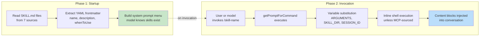
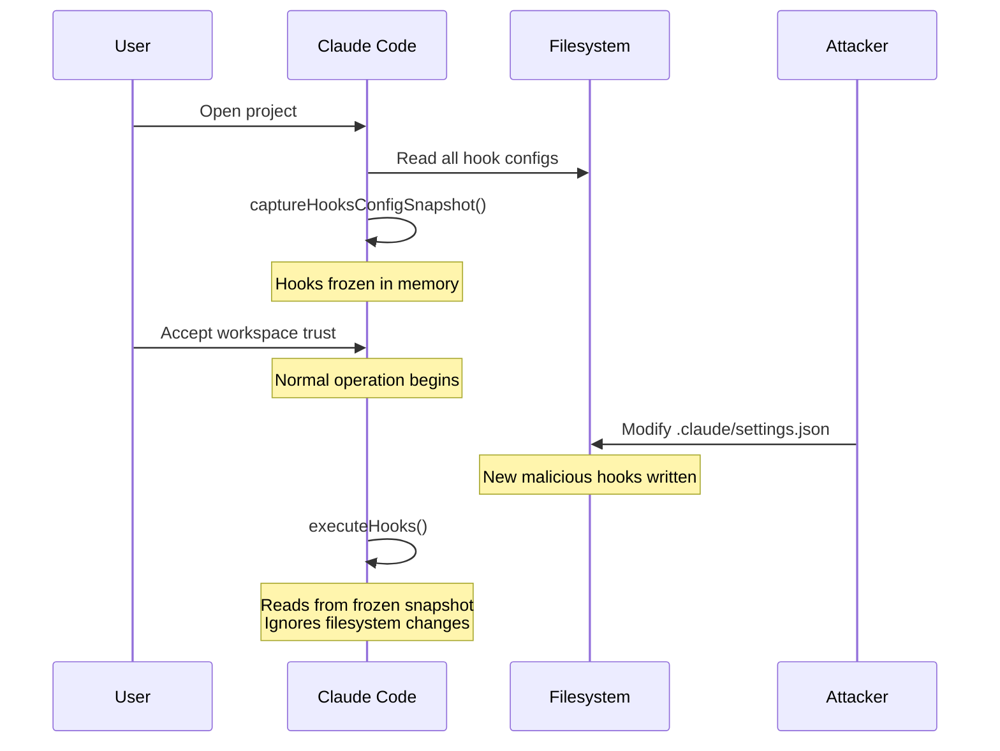
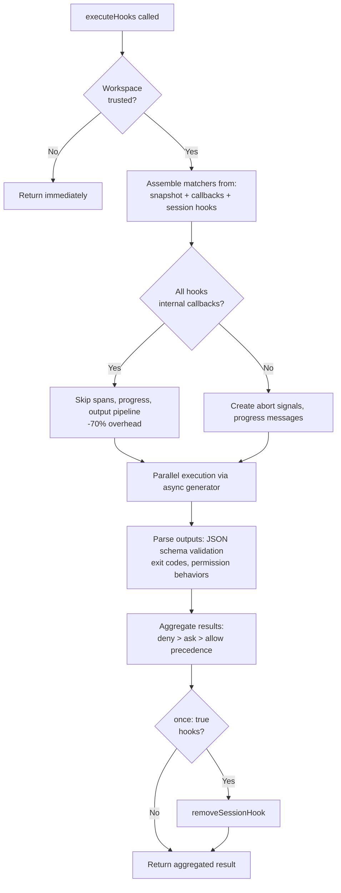

# 第 12 章：可扩展性——技能与钩子

## 扩展的两个维度

每个可扩展性系统都要回答两个问题：系统能做什么，以及它什么时候做。大多数框架会把二者混在一起——一个 plugin 在同一个对象中同时注册能力和生命周期回调，“添加功能”和“拦截功能”之间的边界被模糊成一个注册 API。

Claude Code 把它们干净地分开。Skills 扩展模型能做什么。它们是 markdown 文件，会变成 slash commands，在被调用时向对话注入新指令。Hooks 扩展事情何时以及如何发生。它们是生命周期拦截器，会在会话期间二十多个不同点触发，运行任意代码来阻止动作、修改输入、强制继续，或静默观察。

这种分离不是偶然的。Skills 是内容——它们通过添加 prompt text 扩展模型的知识和能力。Hooks 是控制流——它们在不改变模型所知内容的情况下修改执行路径。一个 skill 可能教模型如何运行团队部署流程。一个 hook 可能确保没有通过测试套件前不执行任何部署命令。skill 增加能力；hook 增加约束。

本章会深入介绍两个系统，然后考察它们的交汇点：由 skill 声明的 hooks 会在 skill 被调用时注册为 session-scoped lifecycle interceptors。

---

## Skills：教模型新招式

### 两阶段加载

skills 系统的核心优化是：启动时只加载 frontmatter，完整内容只在调用时加载。



**Phase 1** 读取每个 `SKILL.md` 文件，把 YAML frontmatter 与 markdown body 分离，并提取 metadata。frontmatter 字段会成为系统提示的一部分，让模型知道该 skill 存在。markdown body 被捕获在 closure 中，但不处理。一个有 50 个 skills 的项目，只支付 50 条短描述的 token 成本，而不是 50 份完整文档的成本。

**Phase 2** 在模型或用户调用 skill 时触发。`getPromptForCommand` 会前置 base directory、替换变量（`$ARGUMENTS`、`${CLAUDE_SKILL_DIR}`、`${CLAUDE_SESSION_ID}`），并执行 inline shell commands（用 `!` 作为反引号前缀）。结果作为 content blocks 返回并注入对话。

### 七个来源及优先级

Skills 来自七个不同来源，并行加载后按优先级合并：

| 优先级 | 来源 | 位置 | 说明 |
|----------|--------|----------|-------|
| 1 | Managed (Policy) | `<MANAGED_PATH>/.claude/skills/` | 企业控制 |
| 2 | User | `~/.claude/skills/` | 个人，全局可用 |
| 3 | Project | `.claude/skills/`（向上走到 home） | 提交到版本控制 |
| 4 | Additional Dirs | `<add-dir>/.claude/skills/` | 通过 `--add-dir` flag |
| 5 | Legacy Commands | `.claude/commands/` | 向后兼容 |
| 6 | Bundled | 编译进二进制 | 受 feature gate 控制 |
| 7 | MCP | MCP server prompts | 远程，不受信任 |

去重使用 `realpath` 解析 symlinks 和重叠父目录。先看到的来源获胜。`getFileIdentity` 函数通过 `realpath` 解析 canonical paths，而不是依赖 inode values，因为后者在 container/NFS mounts 和 ExFAT 上不可靠。

### Frontmatter 契约

控制 skill 行为的关键 frontmatter 字段：

| YAML 字段 | 目的 |
|-----------|---------|
| `name` | 面向用户的显示名 |
| `description` | 显示在 autocomplete 和系统提示中 |
| `when_to_use` | 供模型发现用的详细使用场景 |
| `allowed-tools` | skill 可使用哪些工具 |
| `disable-model-invocation` | 阻止模型自主使用 |
| `context` | `'fork'` 表示作为子智能体运行 |
| `hooks` | 调用时注册的生命周期 hooks |
| `paths` | 条件激活用的 glob patterns |

`context: 'fork'` 选项会把 skill 作为子智能体运行，拥有自己的 context window。这对需要大量工作但不应污染主对话 token 预算的 skills 至关重要。`disable-model-invocation` 和 `user-invocable` 字段控制两条不同访问路径——把二者都设为 true 会让 skill 不可见，这对 hooks-only skills 很有用。

### MCP 安全边界

变量替换之后，inline shell commands 会执行。安全边界是绝对的：**MCP skills 永远不会执行 inline shell commands。** MCP servers 是外部系统。如果允许，一个包含 `` !`rm -rf /` `` 的 MCP prompt 会以用户完整权限执行。系统把 MCP skills 当作 content-only。这个信任边界连接到第 15 章讨论的更广泛 MCP 安全模型。

### 动态发现

Skills 不只在启动时加载。当模型触碰文件时，`discoverSkillDirsForPaths` 会从每个路径向上查找 `.claude/skills/` 目录。带 `paths` frontmatter 的 skills 存储在 `conditionalSkills` map 中，并且只有在被触碰路径匹配其 patterns 时激活。一个声明 `paths: "packages/database/**"` 的 skill 在模型读取或编辑数据库文件之前保持不可见——这是上下文敏感的能力扩展。

---

## Hooks：控制事情何时发生

Hooks 是 Claude Code 在生命周期点拦截和修改行为的机制。主执行引擎超过 4,900 行。系统服务三类受众：个人开发者（自定义 linting、validation）、团队（提交到项目的共享质量门禁）和企业（policy-managed compliance rules）。

### 真实 Hook：防止提交到 main

在深入机制之前，先看一个实际 hook。假设团队想防止模型直接 commit 到 `main` 分支。

**第 1 步：settings.json 配置：**

```json
{
  "hooks": {
    "PreToolUse": [
      {
        "matcher": "Bash",
        "hooks": [
          {
            "type": "command",
            "command": "/path/to/check-not-main.sh",
            "if": "Bash(git commit*)"
          }
        ]
      }
    ]
  }
}
```

**第 2 步：shell script：**

```bash
#!/bin/bash
BRANCH=$(git rev-parse --abbrev-ref HEAD 2>/dev/null)
if [ "$BRANCH" = "main" ]; then
  echo "Cannot commit directly to main. Create a feature branch first." >&2
  exit 2  # Exit 2 = blocking error
fi
exit 0
```

**第 3 步：模型体验。** 当模型尝试在 `main` 分支上执行 `git commit` 时，hook 会在命令执行前触发。script 检查分支，写入 stderr，并以 code 2 退出。模型看到一条 system message：“Cannot commit directly to main. Create a feature branch first.” commit 从未运行。模型会创建分支，并在那里 commit。

`if: "Bash(git commit*)"` 条件意味着 script 只对 git commit 命令运行——不是每次 Bash 调用都运行。Exit code 2 会阻塞；exit code 0 通过；任何其他 exit code 产生 non-blocking warning。这就是完整协议。

### 四种用户可配置类型

Claude Code 定义了六种 hook type——四种用户可配置，两种内部。

**Command hooks** 派生 shell process。Hook input JSON 通过 stdin 传入；hook 通过 exit code 和 stdout/stderr 回传。这是主力类型。

**Prompt hooks** 发起单次 LLM 调用，返回 `{"ok": true}` 或 `{"ok": false, "reason": "..."}`。这提供轻量 AI-powered validation，不需要完整 agent loop。

**Agent hooks** 运行一个多轮 agentic loop（最多 50 turns，`dontAsk` 权限，禁用 thinking）。每个 hook 有自己的 session scope。这是“验证测试套件通过并覆盖新功能”的重型机制。

**HTTP hooks** 把 hook input POST 到 URL。无需本地进程派生即可启用远程 policy servers 和 audit logging。

两种内部类型是 **callback hooks**（程序化注册，通过跳过 span tracking 的 fast path 在 hot path 上降低 70% 开销）和 **function hooks**（用于 agent hooks 中结构化输出强制的 session-scoped TypeScript callbacks）。

### 五个最重要的生命周期事件

hook 系统会在二十多个生命周期点触发。五个事件主导真实使用：

**PreToolUse**——每次工具执行前触发。可以阻塞、修改输入、自动批准或注入上下文。权限行为遵循严格优先级：deny > ask > allow。最常见的质量门禁 hook point。

**PostToolUse**——成功执行后触发。可以注入上下文，或完全替换 MCP tool output。适用于对工具结果的自动反馈。

**Stop**——Claude 得出响应结论前触发。blocking hook 会强制继续。这是自动验证循环的机制：“你真的完成了吗？”

**SessionStart**——会话开始时触发。可以设置环境变量、覆盖第一条用户消息，或注册 file watch paths。不能阻塞（hook 不能阻止会话启动）。

**UserPromptSubmit**——用户提交 prompt 时触发。可以阻塞处理，让输入验证或内容过滤在模型看到之前发生。

**参考表——剩余事件：**

| 类别 | 事件 |
|----------|--------|
| Tool lifecycle | PostToolUseFailure, PermissionDenied, PermissionRequest |
| Session | SessionEnd (1.5s timeout), Setup |
| Subagent | SubagentStart, SubagentStop |
| Compaction | PreCompact, PostCompact |
| Notification | Notification, Elicitation, ElicitationResult |
| Configuration | ConfigChange, InstructionsLoaded, CwdChanged, FileChanged, TaskCreated, TaskCompleted, TeammateIdle |

阻塞不对称是刻意的。代表可恢复决策的事件（tool calls、stop conditions）支持阻塞。代表不可逆事实的事件（session started、API failed）不支持。

### Exit Code 语义

对 command hooks，exit codes 有特定含义：

| Exit Code | 含义 | 是否阻塞 |
|-----------|---------|--------|
| 0 | 成功，如果 stdout 是 JSON 则解析 | 否 |
| 2 | Blocking error，stderr 作为 system message 显示 | 是 |
| Other | Non-blocking warning，只显示给用户 | 否 |

Exit code 2 是刻意选择的。Exit code 1 太常见——任何未处理异常、断言失败或语法错误都会产生 exit 1。使用 exit 2 可以防止意外 enforcement。

### 六个 Hook 来源

| 来源 | 信任级别 | 说明 |
|--------|-------------|-------|
| `userSettings` | User | `~/.claude/settings.json`，最高优先级 |
| `projectSettings` | Project | `.claude/settings.json`，版本控制 |
| `localSettings` | Local | `.claude/settings.local.json`，gitignored |
| `policySettings` | Enterprise | 不能被覆盖 |
| `pluginHook` | Plugin | 优先级 999（最低） |
| `sessionHook` | Session | 仅内存中，由 skills 注册 |

---

## Snapshot 安全模型

Hooks 执行任意代码。项目的 `.claude/settings.json` 可以定义在每次工具调用前触发的 hooks。如果恶意仓库在用户接受 workspace trust dialog 后修改自己的 hooks，会发生什么？

什么都不会发生。hooks 配置在启动时被冻结。



`captureHooksConfigSnapshot()` 在启动期间调用一次。从那一刻起，`executeHooks()` 从 snapshot 读取，绝不会隐式重新读取 settings files。snapshot 只会通过显式通道更新：`/hooks` 命令或 file watcher detection，二者都会通过 `updateHooksConfigSnapshot()` 重建。

policy enforcement cascade：policy settings 中的 `disableAllHooks` 会清空一切。`allowManagedHooksOnly` 排除 user 和 project hooks。用户可以通过设置 `disableAllHooks` 禁用自己的 hooks，但不能禁用 enterprise-managed hooks。policy 层永远获胜。

trust check 本身（`shouldSkipHookDueToTrust()`）是在两个漏洞后引入的：用户 *拒绝* trust dialog 时 SessionEnd hooks 仍然执行，以及 SubagentStop hooks 在 trust 展示前触发。二者根因相同——hooks 在用户尚未同意 workspace code execution 的生命周期状态中触发。修复是在 `executeHooks()` 顶部加集中 gate。

---

## 执行流



内部 callbacks 的 fast path 是重要优化。当所有匹配 hooks 都是内部的（file access analytics、commit attribution）时，系统会跳过 span tracking、abort signal creation、progress messages 和完整 output processing pipeline。大多数 PostToolUse 调用只命中内部 callbacks。

Hook input JSON 会通过惰性的 `getJsonInput()` closure 序列化一次，并在所有并行 hooks 之间复用。环境注入会设置 `CLAUDE_PROJECT_DIR`、`CLAUDE_PLUGIN_ROOT`，并在某些事件中设置 `CLAUDE_ENV_FILE`，hooks 可以往其中写入环境变量导出。

---

## 集成：Skills 与 Hooks 的交汇

当 skill 被调用时，它在 frontmatter 中声明的 hooks 会注册为 session-scoped hooks。`skillRoot` 会成为 hook shell commands 的 `CLAUDE_PLUGIN_ROOT`：

```
my-skill/
  SKILL.md          # The skill content
  validate.sh       # Called by a PreToolUse hook declared in frontmatter
```

skill 的 frontmatter 声明：

```yaml
hooks:
  PreToolUse:
    - matcher: "Bash"
      hooks:
        - type: command
          command: "${CLAUDE_PLUGIN_ROOT}/validate.sh"
          once: true
```

用户调用 `/my-skill` 时，skill content 会加载进对话，PreToolUse hook 也会注册。下一次 Bash tool call 触发 `validate.sh`。由于设置了 `once: true`，hook 在第一次成功执行后会移除自己。

对 agents 来说，frontmatter 中声明的 `Stop` hooks 会自动转换为 `SubagentStop` hooks，因为 subagents 触发 `SubagentStop`，不是 `Stop`。没有这个转换，agent 的 stop-verification hook 永远不会触发。

### 权限行为优先级

`executePreToolHooks()` 可以阻塞（通过 `blockingError`）、自动批准（通过 `permissionBehavior: 'allow'`）、强制询问（通过 `'ask'`）、拒绝（通过 `'deny'`）、修改输入（通过 `updatedInput`），或添加上下文（通过 `additionalContext`）。当多个 hooks 返回不同行为时，deny 永远获胜。对安全相关决策来说，这是正确默认值。

### Stop Hooks：强制继续

当 Stop hook 返回 exit code 2 时，stderr 会作为反馈显示给模型，对话继续。这把一次性 prompt-response 转变成目标导向循环。Stop hook 可以说是整个系统中最强大的集成点。

---

## 应用到你的系统：设计可扩展性系统

**把内容与控制流分开。** Skills 增加能力；hooks 约束行为。混合二者会让人无法推理 plugin 做了什么、阻止了什么。

**在信任边界冻结配置。** snapshot 机制在同意时捕获 hooks，并且永不隐式重新读取。如果你的系统执行用户提供的代码，这可以消除 TOCTOU attacks。

**用不常见的 exit codes 表示语义信号。** Exit code 1 是噪音——每个未处理错误都会产生它。把 exit code 2 作为阻塞信号，可以防止意外 enforcement。选择需要明确意图的信号。

**在 socket 层验证，而不是应用层。** SSRF guard 在 DNS lookup 时运行，而不是预检查。这消除了 DNS rebinding window。验证网络目标时，检查必须与连接是原子的。

**针对常见情况优化。** 内部 callback fast path（-70% overhead）认识到大多数 hook invocations 只命中内部 callbacks。两阶段 skill loading 认识到给定会话中大多数 skills 永远不会被调用。每个优化都针对真实使用分布。

可扩展性系统体现了对能力与安全之间张力的成熟理解。Skills 给予模型新能力，并受 MCP 安全线约束（第 15 章）。Hooks 让外部代码影响模型行动，并受 snapshot 机制、exit code 语义和 policy cascade 约束。两个系统互不信任——而这种相互不信任正是组合能够在规模化部署中保持安全的原因。

下一章转向视觉层：Claude Code 如何以 60fps 渲染响应式终端 UI，并跨五种终端协议处理输入。
