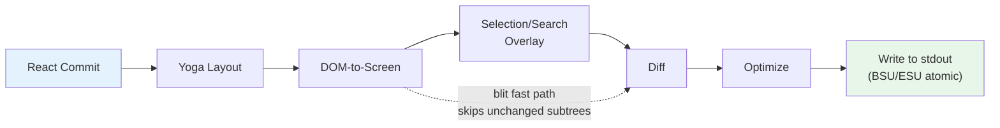
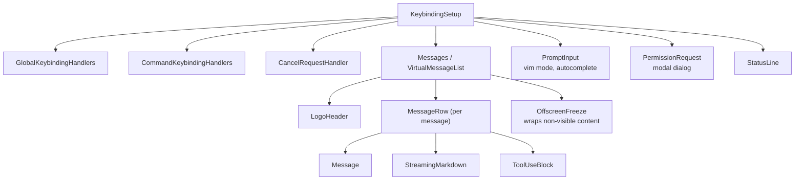

# 第 13 章：终端 UI

## 为什么要构建自定义渲染器？

终端不是浏览器。它没有 DOM，没有 CSS 引擎，没有 compositor，也没有 retained-mode 图形管线。它只有一条写向 stdout 的字节流，以及一条来自 stdin 的字节流。这两条流之间的一切——layout、styling、diffing、hit-testing、scrolling、selection——都必须从零发明。

Claude Code 需要响应式 UI。它有 prompt input、流式 markdown 输出、权限对话框、进度 spinner、可滚动 message lists、搜索高亮和 vim-mode editor。React 是声明这种组件树的自然选择。但 React 需要一个 host environment 来渲染，而终端并不提供这样的环境。

Ink 是标准答案：一个基于 Yoga 做 flexbox layout 的终端 React renderer。Claude Code 一开始使用 Ink，然后把它 fork 到几乎面目全非。原版每帧为每个 cell 分配一个 JavaScript object——在 200x120 终端上，就是每 16ms 创建并回收 24,000 个对象。它在字符串层 diff，比较整行 ANSI-encoded 文本。它没有 blit optimization 概念，没有 double buffering，没有 cell-level dirty tracking。对于每秒刷新一次的简单 CLI dashboard，这没问题。对于一个 LLM agent 一边以 60fps streaming tokens，一边让用户滚动包含数百条 messages 的对话，这完全不可接受。

Claude Code 中留下的是一个自定义渲染引擎，它共享 Ink 的概念 DNA——React reconciler、Yoga layout、ANSI output——但重写了关键路径：用 packed typed arrays 代替 object-per-cell，用基于 pool 的 string interning 代替 string-per-frame，用 cell-level diffing 做 double-buffered rendering，并通过 optimizer 把相邻 terminal writes 合并成最少 escape sequences。

结果是在 200 列终端中以 60fps 运行，同时 streaming Claude tokens。要理解它如何做到这一点，需要考察四层：React reconciles 的自定义 DOM，把该 DOM 转换为 terminal output 的渲染管线，让系统在数小时会话中不被 GC 淹没的 pool-based memory management，以及把所有东西连接起来的 component architecture。

---

## 自定义 DOM

React reconciler 需要一个 reconcile 目标。在浏览器中，那是 DOM。在 Claude Code 的终端里，它是一个自定义内存树，包含七种 element types 和一种 text node type。

element types 直接映射到终端渲染概念：

- **`ink-root`**——document root，每个 Ink instance 一个
- **`ink-box`**——flexbox container，终端中的 `<div>` 等价物
- **`ink-text`**——带 Yoga measure function 的 text node，用于 word wrapping
- **`ink-virtual-text`**——另一个 text node 内部的嵌套 styled text（在 text context 中由 `ink-text` 自动提升）
- **`ink-link`**——hyperlink，通过 OSC 8 escape sequences 渲染
- **`ink-progress`**——progress indicator
- **`ink-raw-ansi`**——带已知尺寸的预渲染 ANSI content，用于 syntax-highlighted code blocks

每个 `DOMElement` 都携带渲染管线需要的状态：

```typescript
// Illustrative — actual interface extends this significantly
interface DOMElement {
  yogaNode: YogaNode;           // Flexbox layout node
  style: Styles;                // CSS-like properties mapped to Yoga
  attributes: Map<string, DOMNodeAttribute>;
  childNodes: (DOMElement | TextNode)[];
  dirty: boolean;               // Needs re-rendering
  _eventHandlers: EventHandlerMap; // Separated from attributes
  scrollTop: number;            // Imperative scroll state
  pendingScrollDelta: number;
  stickyScroll: boolean;
  debugOwnerChain?: string;     // React component stack for debug
}
```

`_eventHandlers` 与 `attributes` 分离是刻意的。在 React 中，handler identity 每次 render 都会变化（除非手动 memoize）。如果 handlers 被存为 attributes，每次 render 都会把 node 标为 dirty 并触发 full repaint。分开存储后，reconciler 的 `commitUpdate` 可以更新 handlers，而不 dirty node。

`markDirty()` 函数是 DOM mutations 和渲染管线之间的桥梁。当任何 node 内容变化时，`markDirty()` 会沿祖先链向上走，把每个 element 的 `dirty = true`，并对叶子 text nodes 调用 `yogaNode.markDirty()`。这就是一个深层 text node 中的单字符变化如何调度从它到 root 的整条路径重渲染——但只重渲染那条路径。兄弟子树保持 clean，可以从上一帧 blit。

`ink-raw-ansi` element type 值得特别说明。当代码块已经被 syntax-highlighted（产生 ANSI escape sequences）时，重新解析这些 sequences 以提取字符和样式是浪费。相反，预高亮内容会包在 `ink-raw-ansi` node 中，并带有告诉 Yoga 精确尺寸的 `rawWidth` 和 `rawHeight` attributes。渲染管线会把 raw ANSI content 直接写入 output buffer，而不拆成单个 styled characters。这让 syntax-highlighted code blocks 在初次高亮后几乎零成本——UI 中最昂贵的视觉元素，也是最便宜的渲染元素。

`ink-text` node 的 measure function 值得理解，因为它运行在 Yoga 的 layout pass 中，而 Yoga 是同步且阻塞的。该函数接收可用宽度，必须返回 text 尺寸。它执行 word wrapping（遵守 `wrap` style prop：`wrap`、`truncate`、`truncate-start`、`truncate-middle`），处理 grapheme cluster boundaries（不会把多 codepoint emoji 拆到两行），正确测量 CJK double-width characters（每个算 2 列），并从宽度计算中剥离 ANSI escape codes（escape sequences 视觉宽度为零）。所有这些都必须在每个 node 微秒级完成，因为包含 50 个可见 text nodes 的对话意味着每个 layout pass 有 50 次 measure function calls。

---

## React Fiber Container

reconciler bridge 使用 `react-reconciler` 创建自定义 host config。这是 React DOM 和 React Native 使用的同一个 API。关键区别是：Claude Code 运行在 `ConcurrentRoot` mode。

```typescript
createContainer(rootNode, ConcurrentRoot, ...)
```

ConcurrentRoot 启用 React concurrent features——用于 lazy-loaded syntax highlighting 的 Suspense，以及 streaming 期间非阻塞 state updates 的 transitions。替代方案 `LegacyRoot` 会强制同步渲染，并在 heavy markdown re-parses 期间阻塞 event loop。

host config methods 把 React operations 映射到自定义 DOM：

- **`createInstance(type, props)`** 通过 `createNode()` 创建 `DOMElement`，应用初始 styles 和 attributes，附加 event handlers，并捕获 React component owner chain 作为 debug attribution。owner chain 存为 `debugOwnerChain`，并由 `CLAUDE_CODE_DEBUG_REPAINTS` mode 用于把 full-screen resets 归因到具体 components
- **`createTextInstance(text)`** 创建 `TextNode`——但只有当我们处于 text context 中才允许。reconciler 强制 raw strings 必须包在 `<Text>` 中。试图在 text context 外创建 text node 会抛错，让一类 bug 在 reconciliation time 而不是 render time 被捕获
- **`commitUpdate(node, type, oldProps, newProps)`** 通过 shallow comparison diff old/new props，然后只应用变化部分。Styles、attributes 和 event handlers 各有自己的 update path。如果没有变化，diff function 返回 `undefined`，完全避免不必要 DOM mutations
- **`removeChild(parent, child)`** 从树中移除 node，递归释放 Yoga nodes（在 `free()` 前调用 `unsetMeasureFunc()`，避免访问已释放 WASM memory），并通知 focus manager
- **`hideInstance(node)` / `unhideInstance(node)`** 切换 `isHidden`，并在 Yoga node 上切换 `Display.None` 与 `Display.Flex`。这是 React 的 Suspense fallback transitions 机制
- **`resetAfterCommit(container)`** 是关键 hook：它调用 `rootNode.onComputeLayout()` 运行 Yoga，然后调用 `rootNode.onRender()` 调度 terminal paint

reconciler 为每个 commit cycle 跟踪两个性能计数器：Yoga layout time（`lastYogaMs`）和 total commit time（`lastCommitMs`）。这些会进入 Ink class 报告的 `FrameEvent`，支持生产性能监控。

event system 镜像浏览器的 capture/bubble model。`Dispatcher` class 实现完整事件传播，包含三个阶段：capture（root 到 target）、at-target 和 bubble（target 到 root）。Event types 映射到 React scheduling priorities——keyboard 和 click 是 discrete（最高优先级，立即处理），scroll 和 resize 是 continuous（可延后）。dispatcher 会把所有事件处理包在 `reconciler.discreteUpdates()` 中，以获得正确 React batching。

当你在终端按键时，产生的 `KeyboardEvent` 会通过自定义 DOM tree dispatch，从 focused element 一路 bubble 到 root，语义与 keyboard event 在浏览器 DOM elements 中 bubble 完全一致。路径上的任何 handler 都可以调用 `stopPropagation()` 或 `preventDefault()`，语义与浏览器规范相同。

---

## 渲染管线

每一帧穿过七个阶段，每个阶段单独计时：



每个阶段都会单独计时并在 `FrameEvent.phases` 中报告。这种分阶段 instrumentation 对诊断性能问题至关重要：当一帧花了 30ms，你需要知道瓶颈是 Yoga 重新测量 text（第 2 阶段）、renderer 遍历巨大 dirty subtree（第 3 阶段），还是慢终端带来的 stdout backpressure（第 7 阶段）。答案决定修复方式。

**第 1 阶段：React commit 和 Yoga layout。** reconciler 处理 state updates 并调用 `resetAfterCommit`。这会把 root node 宽度设为 `terminalColumns`，并运行 `yogaNode.calculateLayout()`。Yoga 按 CSS flexbox 规范一次性计算整棵 flexbox tree：解析 flex-grow、flex-shrink、padding、margin、gap、alignment 和 wrapping。结果——`getComputedWidth()`、`getComputedHeight()`、`getComputedLeft()`、`getComputedTop()`——按 node 缓存。对 `ink-text` nodes，Yoga 在 layout 期间调用自定义 measure function（`measureTextNode`），通过 word wrapping 和 grapheme measurement 计算 text 尺寸。这是最昂贵的 per-node 操作：它必须处理 Unicode grapheme clusters、CJK double-width characters、emoji sequences 和嵌入 text content 的 ANSI escape codes。

**第 2 阶段：DOM-to-screen。** renderer depth-first 遍历 DOM tree，把字符和样式写入 `Screen` buffer。每个字符变成一个 packed cell。输出是一帧完整画面：终端上的每个 cell 都有确定字符、样式和宽度。

**第 3 阶段：Overlay。** Text selection 和 search highlighting 就地修改 screen buffer，翻转匹配 cells 的 style IDs。Selection 应用 inverse video，创建熟悉的“高亮文本”外观。Search highlighting 使用更强视觉处理：当前 match 使用 inverse + yellow foreground + bold + underline，其他 matches 仅 inverse。这会污染 buffer——由 `prevFrameContaminated` flag 跟踪，让下一帧知道跳过 blit fast-path。污染是刻意取舍：就地修改 buffer 避免分配单独 overlay buffer（在 200x120 终端上节省 48KB），代价是 overlay 清除后需要一帧 full-damage。

**第 4 阶段：Diff。** 新 screen 与 front frame 的 screen 逐 cell 比较。只有变化 cells 产生输出。比较是每个 cell 两次 integer comparison（两个 packed `Int32` words），diff 遍历 damage rectangle 而不是全屏。在 steady-state frame（只有 spinner tick）中，这可能只为 24,000 个 cells 中的 3 个产生 patches。每个 patch 是一个 `{ type: 'stdout', content: string }` object，包含 cursor-move sequence 和 ANSI-encoded cell content。

**第 5 阶段：Optimize。** 同一行相邻 patches 会合并成一次 write。冗余 cursor moves 被消除——如果 patch N 结束在 column 10，而 patch N+1 从 column 11 开始，cursor 已经在正确位置，不需要 move sequence。Style transitions 通过 `StylePool.transition()` cache 预序列化，因此从 “bold red” 切到 “dim green” 是一次 cached string lookup，而不是 diff-and-serialize。optimizer 通常比 naive per-cell output 减少 30-50% byte count。

**第 6 阶段：Write。** optimized patches 被序列化为 ANSI escape sequences，并在一次 `write()` 调用中写入 stdout；在支持的终端上，会包在 synchronized update markers（BSU/ESU）中。BSU（Begin Synchronized Update，`ESC [ ? 2026 h`）告诉终端 buffer 后续所有输出，ESU（`ESC [ ? 2026 l`）告诉它 flush。这在支持该协议的终端上消除可见 tearing——整帧原子出现。

每一帧都会通过 `FrameEvent` 对象报告 timing breakdown：

```typescript
interface FrameEvent {
  durationMs: number;
  phases: {
    renderer: number;    // DOM-to-screen
    diff: number;        // Screen comparison
    optimize: number;    // Patch merging
    write: number;       // stdout write
    yoga: number;        // Layout computation
  };
  yogaVisited: number;   // Nodes traversed
  yogaMeasured: number;  // Nodes that ran measure()
  yogaCacheHits: number; // Nodes with cached layout
  flickers: FlickerEvent[];  // Full-reset attributions
}
```

启用 `CLAUDE_CODE_DEBUG_REPAINTS` 时，full-screen resets 会通过 `findOwnerChainAtRow()` 归因到来源 React component。这是终端版 React DevTools “Highlight Updates”——它告诉你哪个 component 导致整屏 repaint，而这正是渲染管线中最昂贵的事情。

blit optimization 值得特别关注。当 node 不 dirty，且自上一帧以来位置未变化（通过 node cache 检查）时，renderer 会直接从 `prevScreen` 拷贝 cells 到当前 screen，而不是重新渲染 subtree。这让 steady-state frames 极其便宜——典型帧中只有 spinner 在 ticking，blit 覆盖 99% 屏幕，只有 spinner 的 3-4 个 cells 从头渲染。

三种情况下禁用 blit：

1. **`prevFrameContaminated` 为 true**——selection overlay 或 search highlight 就地修改了 front frame screen buffer，因此这些 cells 不能被信任为“正确”上一状态
2. **absolute-positioned node 被移除**——absolute positioning 意味着该 node 可能画到 non-sibling cells 上，这些 cells 需要由真正拥有它们的 elements 重渲染
3. **layout shifted**——任何 node 的 cached position 与当前 computed position 不同，意味着 blit 会把 cells 拷贝到错误坐标

`screen.damage` damage rectangle 跟踪当前帧所有被写 cells 的 bounding box。diff 只检查该 rectangle 内的 rows，跳过完全未变化区域。在一个 120 行终端上，streaming message 占据 rows 80-100 时，diff 检查 20 行而不是 120 行——比较工作减少 6 倍。

---

## Double-Buffer Rendering 与 Frame Scheduling

Ink class 维护两个 frame buffers：

```typescript
private frontFrame: Frame;  // Currently displayed on terminal
private backFrame: Frame;   // Being rendered into
```

每个 `Frame` 包含：

- `screen: Screen`——cell buffer（packed `Int32Array`）
- `viewport: Size`——渲染时 terminal dimensions
- `cursor: { x, y, visible }`——terminal cursor 停放位置
- `scrollHint`——alt-screen mode 中的 DECSTBM（scroll region）optimization hint
- `scrollDrainPending`——ScrollBox 是否还有剩余 scroll delta 要处理

每次 render 后，frames 交换：`backFrame = frontFrame; frontFrame = newFrame`。旧 front frame 变成下一次 back frame，提供 blit optimization 的 `prevScreen`，以及 cell-level diffing 的 baseline。

这种 double-buffer design 消除了 allocation。renderer 不是每帧创建新 `Screen`，而是复用 back frame 的 buffer。swap 是指针赋值。这个模式借鉴自图形编程，在图形系统中 double buffering 通过保证显示读取完整帧、renderer 写入另一帧来防止 tearing。在终端上下文中，tearing 不是主要问题（BSU/ESU 协议处理它）；主要问题是每 16ms 分配并丢弃包含 48KB+ typed arrays 的 `Screen` objects 所造成的 GC pressure。

Render scheduling 使用 lodash `throttle`，间隔 16ms（约 60fps），启用 leading 和 trailing edges：

```typescript
const deferredRender = () => queueMicrotask(this.onRender);
this.scheduleRender = throttle(deferredRender, FRAME_INTERVAL_MS, {
  leading: true,
  trailing: true,
});
```

microtask deferral 不是偶然的。`resetAfterCommit` 在 React layout effects 阶段之前运行。如果 renderer 在这里同步运行，就会错过 `useLayoutEffect` 设置的 cursor declarations。microtask 在 layout effects 之后、但仍在同一个 event-loop tick 内运行——终端看到的是单个一致 frame。

对 scroll operations，单独的 4ms `setTimeout`（FRAME_INTERVAL_MS >> 2）提供更快 scroll frames，且不干扰 throttle。Scroll mutations 完全绕过 React：`ScrollBox.scrollBy()` 直接修改 DOM node properties，调用 `markDirty()`，并通过 microtask 调度 render。没有 React state update，没有 reconciliation overhead，没有为单个 wheel event 重新渲染整个 message list。

**Resize handling** 是同步的，不 debounce。终端 resize 时，`handleResize` 立即更新 dimensions 以保持 layout 一致。对 alt-screen mode，它会 reset frame buffers，并把 `ERASE_SCREEN` 延后到下一次 atomic BSU/ESU paint block，而不是立即写入。同步写 erase 会让屏幕在 render 所需的约 80ms 内空白；延后到 atomic block 意味着旧内容保持可见，直到新 frame 完全准备好。

**Alt-screen management** 还增加一层。`AlternateScreen` component 在 mount 时进入 DEC 1049 alternate screen buffer，并把高度限制为 terminal rows。它使用 `useInsertionEffect`——不是 `useLayoutEffect`——确保 `ENTER_ALT_SCREEN` escape sequence 在第一帧 render 前到达终端。使用 `useLayoutEffect` 会太晚：第一帧会渲染到 main screen buffer，在切换前产生可见 flash。`useInsertionEffect` 在 layout effects 之前、浏览器（或终端）paint 之前运行，让切换无缝。

---

## Pool-Based Memory：为什么 Interning 很重要

一个 200 列 x 120 行的终端有 24,000 个 cells。如果每个 cell 都是一个 JavaScript object，包含 `char` string、`style` string 和 `hyperlink` string，那就是每帧 72,000 次 string allocation——再加上 cells 自身的 24,000 次 object allocation。60fps 下，每秒 576 万次 allocations。V8 的垃圾回收器能处理这些，但无法避免会表现为掉帧的 pauses。GC pauses 通常是 1-5ms，但不可预测：它们可能正好发生在 streaming token update 期间，在用户盯着输出时造成可见 stutter。

Claude Code 用 packed typed arrays 和三个 interning pools 完全消除了这一点。结果是：cell buffer 每帧零 object allocation。唯一 allocations 发生在 pools 本身（摊销后很少，因为大多数字符和样式在第一帧 intern 后复用）以及 diff 产生的 patch strings（不可避免，因为 stdout.write 需要 string 或 Buffer arguments）。

**cell layout** 每个 cell 使用两个 `Int32` words，存储在连续 `Int32Array` 中：

```
word0: charId        (32 bits, index into CharPool)
word1: styleId[31:17] | hyperlinkId[16:2] | width[1:0]
```

同一 buffer 上的并行 `BigInt64Array` view 支持批量操作——清除一行是对 64-bit words 的一次 `fill()` 调用，而不是逐字段归零。

**CharPool** 把 character strings intern 为 integer IDs。它有 ASCII fast path：一个 128-entry `Int32Array` 直接把 character codes 映射到 pool indices，完全避免 `Map` lookup。多字节字符（emoji、CJK ideographs）落到 `Map<string, number>`。Index 0 始终是空格，index 1 始终是空字符串。

```typescript
export class CharPool {
  private strings: string[] = [' ', '']
  private ascii: Int32Array = initCharAscii()

  intern(char: string): number {
    if (char.length === 1) {
      const code = char.charCodeAt(0)
      if (code < 128) {
        const cached = this.ascii[code]!
        if (cached !== -1) return cached
        const index = this.strings.length
        this.strings.push(char)
        this.ascii[code] = index
        return index
      }
    }
    // Map fallback for multi-byte characters
    ...
  }
}
```

**StylePool** 把 ANSI style codes 数组 intern 为 integer IDs。聪明之处在于：每个 ID 的 bit 0 编码该 style 是否对空格字符有可见效果（background color、inverse、underline）。仅 foreground 的 styles 得到偶数 ID；对空格可见的 styles 得到奇数 ID。这让 renderer 可以用一次 bitmask check 跳过不可见空格——`if (!(styleId & 1) && charId === 0) continue`——而无需查找 style definition。pool 还缓存任意两个 style IDs 之间预序列化的 ANSI transition strings，因此从 “bold red” 切到 “dim green” 是一次 cached string concatenation，而不是 diff-and-serialize 操作。

**HyperlinkPool** intern OSC 8 hyperlink URIs。Index 0 表示无 hyperlink。

三个 pools 在 front 和 back frames 之间共享。这是关键设计决策。因为 pools 共享，interned IDs 跨 frames 有效：blit optimization 可以直接把 packed cell words 从 `prevScreen` 拷贝到当前 screen，而无需重新 intern。diff 可以把 IDs 当整数比较，不需要 string lookup。如果每帧有自己的 pools，blit 就必须重新 intern 每个拷贝的 cell（通过旧 ID 查 string，再 intern 到新 pool），这会抵消 blit 的大部分性能收益。

Pools 会周期性 reset（每 5 分钟一次），防止长会话中无界增长。migration pass 会把 front frame 的 live cells 重新 intern 到 fresh pools。

**CellWidth** 用 2-bit 分类处理 double-wide characters：

| Value | Meaning |
|-------|---------|
| 0 (Narrow) | 标准单列字符 |
| 1 (Wide) | CJK/emoji head cell，占两列 |
| 2 (SpacerTail) | 宽字符的第二列 |
| 3 (SpacerHead) | Soft-wrap continuation marker |

它存储在 `word1` 的低 2 bits 中，让 packed cells 上的 width checks 几乎免费——常见路径无需字段提取。

额外 per-cell metadata 存在 parallel arrays 中，而不是 packed cells 中：

- **`noSelect: Uint8Array`**——per-cell flag，把内容排除在 text selection 之外。用于不应出现在复制文本中的 UI chrome（边框、指示器）
- **`softWrap: Int32Array`**——per-row marker，表示 word-wrap continuation。用户跨 soft-wrapped line 选择文本时，selection logic 知道不要在 wrap 点插入 newline
- **`damage: Rectangle`**——当前帧所有 written cells 的 bounding box。diff 只检查该 rectangle 内的 rows，跳过完全未变化区域

这些 parallel arrays 避免扩大 packed cell format（那会增加 diff inner loop 的 cache pressure），同时提供 selection、copy 和 optimization 所需 metadata。

`Screen` 还暴露 `createScreen()` factory，接收 dimensions 和 pool references。创建 screen 时，通过 `BigInt64Array` view 上的 `fill(0n)` 清零 `Int32Array`——一个 native call 在微秒内清空整个 buffer。resize（需要新 frame buffers）和 pool migration（把旧 screen cells 重新 intern 到 fresh pools）都会使用它。

---

## REPL Component

REPL（`REPL.tsx`）大约 5,000 行。它是代码库中最大的单个 component，原因充分：它是整个交互体验的 orchestrator。一切都流经它。

component 大致组织为九个部分：

1. **Imports**（约 100 行）——引入 bootstrap state、commands、history、hooks、components、keybindings、cost tracking、notifications、swarm/team support、voice integration
2. **Feature-flagged imports**——通过带 `require()` 的 `feature()` guards 条件加载 voice integration、proactive mode、brief tool 和 coordinator agent
3. **State management**——大量 `useState`，覆盖 messages、input mode、pending permissions、dialogs、cost thresholds、session state、tool state 和 agent state
4. **QueryGuard**——管理 active API call lifecycle，防止并发 requests 互相踩踏
5. **Message handling**——处理来自 query loop 的 incoming messages，规范化顺序，管理 streaming state
6. **Tool permission flow**——协调 tool use blocks 和 PermissionRequest dialog 之间的 permission requests
7. **Session management**——resume、switch、export conversations
8. **Keybinding setup**——接线 keybinding providers：`KeybindingSetup`、`GlobalKeybindingHandlers`、`CommandKeybindingHandlers`
9. **Render tree**——从以上所有部分组合最终 UI

它的 render tree 在 fullscreen mode 中组合完整界面：



`OffscreenFreeze` 是专门针对终端渲染的性能优化。当 message 滚动到 viewport 上方时，它的 React element 会被缓存，subtree 会被冻结。这防止 off-screen messages 中基于 timer 的 updates（spinners、elapsed time counters）触发 terminal resets。没有它，即使用户正在看 message 47，message 3 中的 spinning indicator 也会导致 full repaint。

component 全面由 React Compiler 编译。compiler 不依赖手写 `useMemo` 和 `useCallback`，而是用 slot arrays 插入 per-expression memoization：

```typescript
const $ = _c(14);  // 14 memoization slots
let t0;
if ($[0] !== dep1 || $[1] !== dep2) {
  t0 = expensiveComputation(dep1, dep2);
  $[0] = dep1; $[1] = dep2; $[2] = t0;
} else {
  t0 = $[2];
}
```

这个模式出现在代码库每个 component 中。它比 `useMemo` 粒度更细（`useMemo` 在 hook 层 memoize）——render function 内的单个 expressions 获得自己的 dependency tracking 和 caching。对 REPL 这样 5,000 行 component，这消除了每次 render 中数百个潜在不必要 recomputations。

---

## Selection 与 Search Highlighting

Text selection 和 search highlighting 作为 screen-buffer overlays 运行，在主 render 之后、diff 之前应用。

**Text selection** 仅限 alt-screen。Ink instance 持有 `SelectionState`，跟踪 anchor 和 focus points、drag mode（character/word/line），以及已滚出屏幕的 captured rows。用户 click-and-drag 时，selection handler 更新这些坐标。在 `onRender` 期间，`applySelectionOverlay` 遍历受影响 rows，并用 `StylePool.withSelectionBg()` 就地修改 cell style IDs，后者返回一个添加了 inverse video 的新 style ID。这种直接修改 screen buffer 正是 `prevFrameContaminated` flag 存在的原因——front frame buffer 已被 overlay 修改，所以下一帧不能信任它做 blit optimization，必须做 full-damage diff。

Mouse tracking 使用 SGR 1003 mode，它会报告带 column/row coordinates 的 clicks、drags 和 motion。`App` component 实现 multi-click detection：double-click 选择 word，triple-click 选择 line。检测使用 500ms timeout 和 1-cell position tolerance（鼠标在 clicks 之间移动一格不会重置 multi-click counter）。Hyperlink clicks 被这个 timeout 刻意延后——double-click link 会选择 word，而不是打开浏览器，这符合用户对文本编辑器的预期。

lost-release recovery 机制处理这种情况：用户在终端内开始 drag，把鼠标移到窗口外释放。终端报告 press 和 drag，但不报告 release（release 发生在窗口外）。没有 recovery，selection 会永久卡在 drag mode。recovery 通过检测没有 buttons pressed 的 mouse motion events 工作——如果我们处于 drag state 并收到 no-button motion event，就推断按钮已在窗口外释放，并 finalize selection。

**Search highlighting** 有两个并行机制。scan-based path（`applySearchHighlight`）遍历可见 cells 查找 query string，并应用 SGR inverse styling。position-based path 使用来自 `scanElementSubtree()` 的预计算 `MatchPosition[]`，以 message-relative 形式存储，并在已知 offsets 处应用“current match”黄色高亮，使用 stacked ANSI codes（inverse + yellow foreground + bold + underline）。yellow foreground 与 inverse 组合后变成黄色背景——终端在 inverse 激活时会交换 fg/bg。underline 是 fallback visibility marker，用于黄色与现有背景色冲突的 themes。

**Cursor declaration** 解决一个微妙问题。Terminal emulators 会在物理 cursor 位置渲染 IME（Input Method Editor）preedit text。CJK 用户组字时，需要 cursor 位于 text input 的 caret，而不是终端自然停放的屏幕底部。`useDeclaredCursor` hook 让 component 声明每帧后 cursor 应处位置。Ink class 从 `nodeCache` 读取 declared node 位置，转换为 screen coordinates，并在 diff 后发出 cursor-move sequences。Screen readers 和 magnifiers 也跟踪物理 cursor，所以这个机制同样有利于 accessibility 和 CJK input。

在 main-screen mode 中，declared cursor position 与 `frame.cursor` 分开跟踪（后者必须停留在 content bottom，以维持 log-update 的 relative-move invariants）。在 alt-screen mode 中问题更简单：每帧从 `CSI H`（cursor home）开始，所以 declared cursor 只是帧末发出的绝对位置。

---

## Streaming Markdown

渲染 LLM output 是终端 UI 面临的最高负载任务。tokens 一个接一个到达，每秒 10-50 个，每个 token 都会改变一条 message 的内容，而该 message 可能包含 code blocks、lists、bold text 和 inline code。朴素方法——每个 token 都重新 parse 整条 message——在规模上会灾难性失败。

Claude Code 使用三种优化：

**Token caching。** 一个 module-level LRU cache（500 entries）按 content hash 存储 `marked.lexer()` 结果。cache 能跨 virtual scrolling 期间的 React unmount/remount cycles 存活。当用户滚回之前可见的 message 时，markdown tokens 从 cache 提供，而不是重新 parse。

**Fast-path detection。** `hasMarkdownSyntax()` 用单个 regex 检查前 500 个字符是否包含 markdown markers。如果没有发现语法，它直接构造单 paragraph token，绕过完整 GFM parser。这在 plain-text messages 上每次 render 节省约 3ms——当你每秒渲染 60 帧时，这很重要。

**Lazy syntax highlighting。** Code block highlighting 通过 React `Suspense` 加载。`MarkdownBody` component 会先用 `highlight={null}` fallback 立即渲染，然后异步 resolve cli-highlight instance。用户立刻看到代码（未上色），一两帧后颜色出现。

streaming 情况还有一个细节。当 tokens 从模型到达时，markdown 内容增量增长。在每个 token 上重新 parse 全部内容，会在一条 message 生命周期内形成 O(n^2)。fast-path detection 有帮助——大多数 streaming content 是 plain text paragraphs，会绕过 parser——但对于带 code blocks 和 lists 的 messages，LRU cache 才是真正优化。cache key 是 content hash，因此当 10 个 tokens 到达且只有最后一个 paragraph 变化时，未变化前缀的 cached parse result 会被复用。markdown renderer 只重新 parse 变化的 tail。

`StreamingMarkdown` component 不同于静态 `Markdown` component。它处理内容仍在生成中的情况：未完成 code fences（有 ` ``` ` 但没有 closing fence）、partial bold markers、truncated list items。streaming variant 的 parsing 更宽容——它不会因未闭合语法报错，因为 closing syntax 还没到。message streaming 完成后，component 转换到静态 `Markdown` renderer，应用完整 GFM parsing 和严格 syntax checking。

code blocks 的 syntax highlighting 是渲染管线中最昂贵的 per-element 操作。一个 100 行 code block 用 cli-highlight 高亮可能花 50-100ms。加载 highlighting library 本身需要 200-300ms（它打包了几十种语言的 grammar definitions）。两个成本都隐藏在 React `Suspense` 后面：code block 立即以 plain text 渲染，highlighting library 异步加载，resolve 后 code block 带颜色重渲染。用户立刻看到代码，稍后看到颜色——比 library 加载期间 300ms blank frame 好得多。

---

## 应用到你的系统：高效渲染 Streaming Output

终端渲染管线是一项消除工作的案例研究。三个原则驱动设计：

**Intern everything。** 如果一个值出现在数千个 cells 中——style、character、URL——只存一次，并用 integer ID 引用它。整数比较是一条 CPU 指令。字符串比较是循环。当 inner loop 每帧以 60fps 运行 24,000 次时，integer `===` 和 string `===` 的差异就是平滑滚动和可见 lag 的差异。

**在正确层级 diff。** Cell-level diffing 听起来昂贵——每帧 24,000 次比较。但它是每个 cell 两次 integer comparison（packed words），而且在 steady-state frame 中，diff 检查第一个 cell 后就会跳过大多数 rows。替代方案——重新渲染整屏并写入 stdout——每帧会产生 100KB+ ANSI escape sequences。diff 通常产生不到 1KB。

**把 hot path 与 React 分开。** Scroll events 以 mouse-input frequency 到达（可能每秒数百次）。让每次都穿过 React reconciler——state update、reconciliation、commit、layout、render——会为每个事件增加 5-10ms 延迟。通过直接修改 DOM nodes 并用 microtask 调度 renders，scroll path 保持在 1ms 以下。React 只参与最终 paint，而这本来就会运行。

这些原则适用于任何 streaming output system，不只是终端。如果你正在构建渲染 real-time data 的 web application——log viewer、chat client、monitoring dashboard——同样取舍都适用。Intern repeated values。Diff against previous frame。Keep the hot path out of your reactive framework。

第四个原则专门针对长会话：**周期性清理。** Claude Code 的 pools 会随着新 characters 和 styles 被 intern 单调增长。多小时会话中，pools 可能积累数千个不再被任何 live cell 引用的 entries。5 分钟 reset cycle 限制这种增长：每 5 分钟创建 fresh pools，迁移 front frame 的 cells（重新 intern 到新 pools），旧 pools 变成垃圾。这是应用层 generational collection strategy，因为 JavaScript GC 无法理解 pool entries 的语义活性。

选择 `Int32Array` 而不是普通 objects，除了 GC pressure 外还有更微妙收益：memory locality。当 diff 比较 24,000 个 cells 时，它遍历的是连续 typed array。现代 CPU 会预取顺序内存访问，因此整屏比较在 L1/L2 cache 内完成。object-per-cell layout 会把 cells 散落在 heap 上，让每次比较都变成 cache miss。性能差异可测：在 200x120 screen 上，typed-array diff 在 0.5ms 内完成，而等价 object-based diff 需要 3-5ms——与其他管线阶段叠加后足以打爆 16ms frame budget。

第五个原则适用于任何渲染到 fixed-size grid 的系统：**跟踪 damage bounds。** 每个 screen 上的 `damage` rectangle 记录渲染期间写过的 cells bounding box。diff 查询这个 rectangle，并完全跳过之外的 rows。当 streaming message 占据 120 行终端底部 20 行时，diff 检查 20 行，而不是 120 行。结合 blit optimization（它只为重渲染区域填充 damage rectangle，而不是为 blitted 区域），这意味着常见情况——一条 message streaming，而其余对话静止——只触碰 screen buffer 的一小部分。

更广泛的教训是：渲染系统中的性能不是让某个单一操作变快，而是完全消除操作。blit 消除重渲染。damage rectangle 消除 diffing。pool sharing 消除 re-interning。packed cells 消除 allocation。每个优化都移除一整类工作，并且它们以乘法叠加。

用数字说明：在 200x120 终端上，一帧最坏情况（全部 dirty、无 blit、full-screen damage）约 12ms。最好情况（一处 dirty node、其余全部 blit、3-row damage rectangle）低于 1ms。系统大多数时间都处于最好情况。streaming token 到达会触发一个 dirty text node，进而 dirty 它到 message container 的 ancestors，通常占屏幕 10-30 行。blit 处理剩余 90-110 行。damage rectangle 把 diff 限制到 dirty region。pool lookups 是 integer operations。streaming 一个 token 的 steady-state 成本主要由 Yoga layout（重新测量 dirty text node 及其 ancestors）和 markdown re-parse 主导——而不是渲染管线本身。

---
