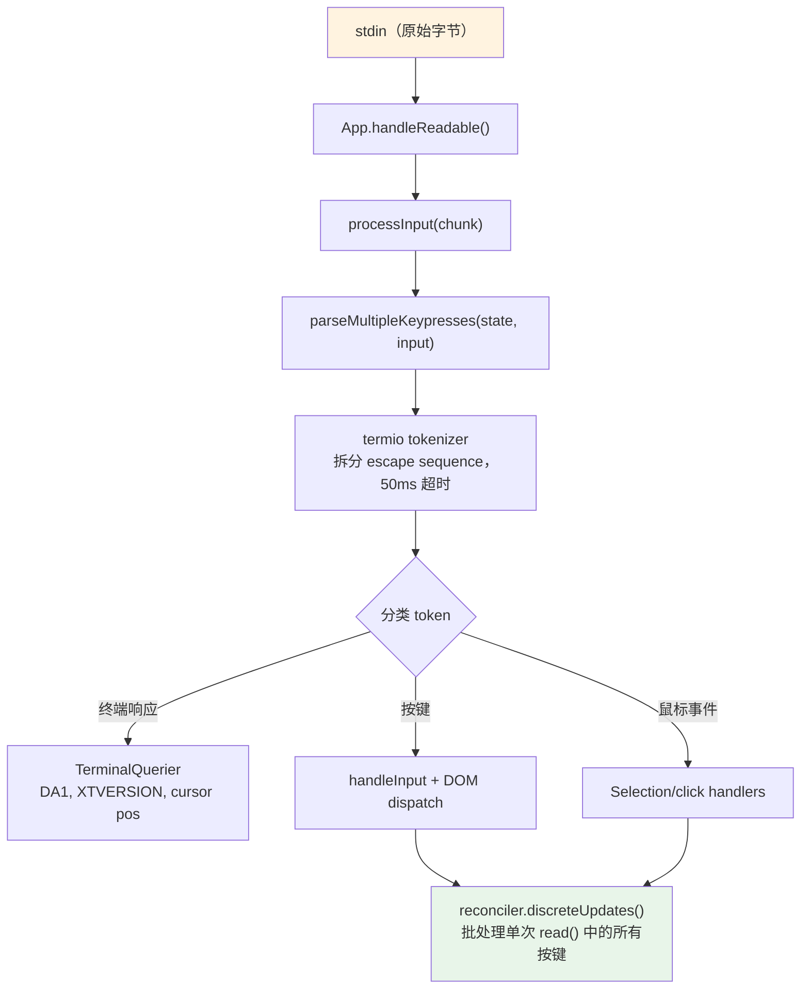
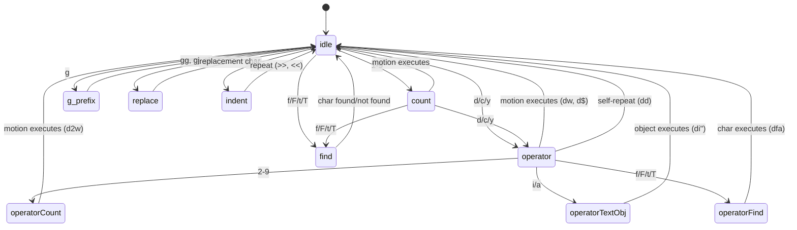

# 第 14 章：输入与交互

## 原始字节，语义动作

当你在 Claude Code 中按下 Ctrl+X，随后按下 Ctrl+K 时，终端会发送两段字节序列，二者之间也许只隔 200 毫秒。第一段是 `0x18`（ASCII CAN），第二段是 `0x0B`（ASCII VT）。除了“控制字符”这个事实，这两个字节本身没有任何内在语义。输入系统必须识别出：这两个字节在一个超时窗口内连续到达，构成组合键 `ctrl+x ctrl+k`，它映射到动作 `chat:killAgents`，而这个动作会终止所有正在运行的子智能体。

从原始字节到被终止的智能体之间，有六个系统被激活：tokenizer 拆分 escape sequence；parser 在五种终端协议之间分类；keybinding resolver 根据上下文匹配按键序列；组合键状态机管理多键序列；handler 执行动作；React 把由此产生的状态更新批处理成一次渲染。

难点不在其中任何一个系统本身，而在终端多样性带来的组合爆炸。iTerm2 会发送 Kitty keyboard protocol 序列。macOS Terminal 会发送 legacy VT220 序列。Ghostty over SSH 会发送 xterm modifyOtherKeys。tmux 可能根据配置吞掉、转换或透传其中任何序列。Windows Terminal 在 VT mode 上还有自己的细节。输入系统必须从所有这些输入中产出正确的 `ParsedKey` 对象，因为用户不应该需要知道自己的终端使用哪种键盘协议。

本章会沿着这片复杂地形，追踪原始字节如何变成有意义的动作。

设计哲学是：渐进增强，优雅降级。在支持 Kitty keyboard protocol 的现代终端上，Claude Code 能获得完整的 modifier 检测（Ctrl+Shift+A 区别于 Ctrl+A）、super key 上报（Cmd 快捷键），以及无歧义的按键识别。在 SSH 上的 legacy terminal 中，它会退回到可用的最佳协议，损失一部分 modifier 区分能力，但保留核心功能。用户永远不会看到“你的终端不受支持”之类的错误。他们可能无法用 `ctrl+shift+f` 做全局搜索，但 `ctrl+r` 历史搜索在任何地方都能工作。

---

## 按键解析管线

输入以字节块形式从 stdin 到达。管线分阶段处理它们：



Tokenizer 是基础。终端输入是一条字节流，里面混合了可打印字符、控制码和多字节 escape sequence，而且没有显式帧边界。一次 stdin `read()` 可能返回 `\x1b[1;5A`（Ctrl+Up arrow），也可能先返回 `\x1b`，下一次 read 才返回 `[1;5A`，这取决于字节从 PTY 到达的速度。Tokenizer 维护一个状态机，缓冲不完整的 escape sequence，并在序列完整时发出 token。

不完整序列问题是根本性的。当 tokenizer 看到单独的 `\x1b` 时，它无法知道这是 Escape 键，还是某个 CSI sequence 的开头。它会缓冲这个字节，并启动一个 50ms 计时器。如果没有后续字节到达，缓冲区会被 flush，`\x1b` 就成为 Escape keypress。但在 flush 之前，tokenizer 会检查 `stdin.readableLength`——如果 kernel buffer 中已有字节等待读取，它会重新启动计时器，而不是立刻 flush。这处理的是 event loop 阻塞超过 50ms 的情况：后续字节其实已经在缓冲区里，只是还没被读出来。

对 paste 操作，超时时间会扩展到 500ms。粘贴文本可能很大，并且分多个 chunk 到达。

同一次 `read()` 中解析出的所有按键，都会在同一个 `reconciler.discreteUpdates()` 调用中处理。这会批处理 React 状态更新，让粘贴 100 个字符只产生一次重渲染，而不是 100 次。这个批处理很关键：没有它，粘贴中的每个字符都会触发完整 reconciliation cycle——state update、reconciliation、commit、Yoga layout、render、diff、write。每轮 5ms 时，100 字符粘贴要花 500ms。通过批处理，同样的粘贴只需要一个 5ms 周期。

### stdin 管理

`App` component 通过引用计数管理 raw mode。当任何 component 需要原始输入（prompt、dialog、vim mode）时，它调用 `setRawMode(true)`，计数器递增。不再需要原始输入时，它调用 `setRawMode(false)`，计数器递减。只有计数器归零时才会禁用 raw mode。这避免了终端应用中的常见 bug：component A 启用 raw mode，component B 也启用 raw mode，component A 禁用 raw mode，然后 component B 的输入突然坏掉，因为 raw mode 被全局关闭了。

第一次启用 raw mode 时，App 会：

1. 停止 early input capture（React mount 之前收集按键的 bootstrap 阶段机制）
2. 将 stdin 放入 raw mode（无行缓冲、无回显、无 signal processing）
3. 挂接 `readable` listener，用于异步输入处理
4. 启用 bracketed paste（从而可识别粘贴文本）
5. 启用 focus reporting（让 app 知道终端窗口何时获得/失去焦点）
6. 启用 extended key reporting（Kitty keyboard protocol + xterm modifyOtherKeys）

禁用时，会按相反顺序撤销所有这些设置。谨慎的顺序可以避免 escape sequence 泄漏——先禁用 extended key reporting，再禁用 raw mode，可以确保 app 停止解析后，终端不会继续发送 Kitty 编码序列。

`onExit` signal handler（通过 `signal-exit` package）确保即使进程异常终止，也会执行清理。如果进程收到 SIGTERM 或 SIGINT，handler 会禁用 raw mode、恢复终端状态、退出 alternate screen（如果已启用），并在进程退出前重新显示光标。没有这个清理，崩溃的 Claude Code session 会把终端留在 raw mode，没有光标，也没有回显——用户需要盲打 `reset` 才能恢复终端。

---

## 多协议支持

终端之间并不认同键盘输入应该如何编码。Kitty 这样的现代终端模拟器会发送带有完整 modifier 信息的结构化序列。SSH 上的 legacy terminal 会发送有歧义的字节序列，需要依赖上下文解释。Claude Code 的 parser 同时处理五种不同协议，因为用户的终端可能是其中任何一种。

**CSI u（Kitty keyboard protocol）** 是现代标准。格式：`ESC [ codepoint [; modifier] u`。例如，`ESC[13;2u` 是 Shift+Enter，`ESC[27u` 是没有 modifier 的 Escape。codepoint 无歧义地标识按键——Escape 键和作为序列前缀的 Escape 不再混淆。modifier word 用独立 bit 编码 shift、alt、ctrl 和 super（Cmd）。Claude Code 启动时会通过 `ENABLE_KITTY_KEYBOARD` escape sequence 在支持该协议的终端上启用它，退出时通过 `DISABLE_KITTY_KEYBOARD` 关闭。协议能力通过 query/response handshake 检测：应用发送 `CSI ? u`，终端返回 `CSI ? flags u`，其中 `flags` 表示支持的协议级别。

**xterm modifyOtherKeys** 是 Kitty 协议未协商成功时的 fallback，常见于 Ghostty over SSH 等场景。格式：`ESC [ 27 ; modifier ; keycode ~`。注意参数顺序与 CSI u 相反——先 modifier，再 keycode，然后还是 keycode。这是 parser bug 的常见来源。该协议通过 `CSI > 4 ; 2 m` 启用，由 Ghostty、tmux 和 xterm 在终端 `TERM` 标识无法被检测到时发出（SSH 中 `TERM_PROGRAM` 不转发时很常见）。

**Legacy terminal sequences** 覆盖其他所有情况：通过 `ESC O` 和 `ESC [` 序列表示的 function keys、arrow keys、numpad、Home/End/Insert/Delete，以及 40 年终端演化积累出的完整 VT100/VT220/xterm 变体集合。Parser 使用两个正则表达式匹配这些序列：`FN_KEY_RE` 匹配 `ESC O/N/[/[[` 前缀模式（function keys、arrow keys 及其 modified variants），`META_KEY_CODE_RE` 匹配 meta-key codes（`ESC` 后跟单个字母数字字符，也就是传统 Alt+key 编码）。

Legacy sequence 的挑战是歧义。`ESC [ 1 ; 2 R` 可能是 Shift+F3，也可能是 cursor position report，取决于上下文。Parser 通过 private-marker check 解决这个问题：cursor position report 使用 `CSI ? row ; col R`（带 `?` private marker），而 modified function keys 使用 `CSI params R`（不带 private marker）。这种消歧正是 Claude Code 请求 DECXCPR（extended cursor position reports）而不是标准 CPR 的原因——extended form 没有歧义。

终端识别又增加了一层复杂度。启动时，Claude Code 会发送 `XTVERSION` query（`CSI > 0 q`）来发现终端名称和版本。响应（`DCS > | name ST`）可以穿过 SSH 连接——不像 `TERM_PROGRAM`，后者是不会通过 SSH 传播的环境变量。知道终端身份后，parser 可以处理终端特定怪癖。例如，VS Code integrated terminal 使用的 xterm.js 与原生 xterm 有不同的 escape sequence 行为，而 identification string（`xterm.js(X.Y.Z)`）让 parser 能对这些差异做适配。

**SGR mouse events** 使用格式 `ESC [ < button ; col ; row M/m`，其中 `M` 表示 press，`m` 表示 release。Button code 编码动作：0/1/2 表示 left/middle/right click，64/65 表示 wheel up/down（0x40 OR 上 wheel bit），32+ 表示 drag（0x20 OR 上 motion bit）。Wheel event 会转换为 `ParsedKey` 对象，因此可以流经 keybinding system；click 和 drag event 会成为 `ParsedMouse` 对象，路由到 selection handler。

**Bracketed paste** 会把粘贴内容包在 `ESC [200~` 和 `ESC [201~` 标记之间。不管粘贴文本中包含什么 escape sequence，两个标记之间的所有内容都会变成一个带 `isPasted: true` 的 `ParsedKey`。这可以防止粘贴代码被解释为命令——当用户粘贴包含 `\x03`（原始字节形式的 Ctrl+C）的代码片段时，这是关键安全特性。

Parser 的输出类型形成干净的判别联合：

```typescript
type ParsedKey = {
  kind: 'key';
  name: string;        // 'return', 'escape', 'a', 'f1', etc.
  ctrl: boolean; meta: boolean; shift: boolean;
  option: boolean; super: boolean;
  sequence: string;    // Raw escape sequence for debugging
  isPasted: boolean;   // Inside bracketed paste
}

type ParsedMouse = {
  kind: 'mouse';
  button: number;      // SGR button code
  action: 'press' | 'release';
  col: number; row: number;  // 1-indexed terminal coordinates
}

type ParsedResponse = {
  kind: 'response';
  response: TerminalResponse;  // Routed to TerminalQuerier
}
```

`kind` 判别字段确保下游代码显式处理每种输入类型。按键不会被意外当作鼠标事件处理；终端响应也不会被意外解释成 keypress。`ParsedKey` 类型还携带原始 `sequence` 字符串用于调试——当用户报告“按 Ctrl+Shift+A 没反应”时，debug log 能显示终端实际发送了什么字节序列，从而判断问题是在终端编码、parser 识别，还是 keybinding 配置中。

`ParsedKey` 上的 `isPasted` flag 对安全性很关键。启用 bracketed paste 后，终端会用标记序列包裹粘贴内容。Parser 会在得到的 key event 上设置 `isPasted: true`，keybinding resolver 会跳过对粘贴按键的 keybinding 匹配。没有它，粘贴包含 `\x03`（原始字节形式的 Ctrl+C）或 escape sequence 的文本会触发应用命令。有了它，粘贴内容无论字节内容如何，都会被当作字面文本输入。

Parser 还识别 terminal responses——也就是终端对 query 作出的响应序列。这包括 device attributes（DA1、DA2）、cursor position reports、Kitty keyboard flag responses、XTVERSION（terminal identification）和 DECRPM（mode status）。这些响应会路由到 `TerminalQuerier`，而不是输入 handler：

```typescript
type TerminalResponse =
  | { type: 'decrpm'; mode: number; status: number }
  | { type: 'da1'; params: number[] }
  | { type: 'da2'; params: number[] }
  | { type: 'kittyKeyboard'; flags: number }
  | { type: 'cursorPosition'; row: number; col: number }
  | { type: 'osc'; code: number; data: string }
  | { type: 'xtversion'; version: string }
```

**Modifier decoding** 遵循 XTerm 约定：modifier word 为 `1 + (shift ? 1 : 0) + (alt ? 2 : 0) + (ctrl ? 4 : 0) + (super ? 8 : 0)`。`ParsedKey` 中的 `meta` 字段映射到 Alt/Option（bit 2）。`super` 字段是独立的（bit 8，在 macOS 上是 Cmd）。这个区别很重要，因为 Cmd 快捷键通常被 OS 保留，终端应用捕获不到——除非终端使用 Kitty protocol，上报那些其他协议会静默吞掉的 super-modified keys。

stdin-gap detector 会在 5 秒没有输入之后出现间隔时，触发 terminal mode re-assertion。这处理的是 tmux 重新 attach 和笔记本从睡眠唤醒的场景：终端的 keyboard mode 可能已被 multiplexer 或 OS 重置。Re-assertion 触发后，会重新发送 `ENABLE_KITTY_KEYBOARD`、`ENABLE_MODIFY_OTHER_KEYS`、bracketed paste 和 focus reporting sequence。没有它，从 tmux session detach 再 reattach 会把 keyboard protocol 静默降级到 legacy mode，导致后续整个 session 的 modifier detection 失效。

### Terminal I/O 层

Parser 下方是 `ink/termio/` 中结构化的 terminal I/O 子系统：

- **csi.ts**——CSI（Control Sequence Introducer）序列：cursor movement、erase、scroll regions、bracketed paste enable/disable、focus event enable/disable、Kitty keyboard protocol enable/disable
- **dec.ts**——DEC private mode 序列：alternate screen buffer（1049）、mouse tracking modes（1000/1002/1003）、cursor visibility、bracketed paste（2004）、focus events（1004）
- **osc.ts**——Operating System Commands：clipboard access（OSC 52）、tab status、iTerm2 progress indicators、tmux/screen multiplexer wrapping（用于需要穿过 multiplexer 边界的序列的 DCS passthrough）
- **sgr.ts**——Select Graphic Rendition：ANSI style code system（colors、bold、italic、underline、inverse）
- **tokenize.ts**——用于 escape sequence 边界检测的有状态 tokenizer

Multiplexer wrapping 值得单独说明。当 Claude Code 在 tmux 内运行时，某些 escape sequence（例如 Kitty keyboard protocol negotiation）必须穿过 tmux 到达外层终端。tmux 使用 DCS passthrough（`ESC P ... ST`）转发它不理解的序列。`osc.ts` 中的 `wrapForMultiplexer` 函数会检测 multiplexer 环境，并适当地包裹序列。没有这个处理，Kitty keyboard mode 会在 tmux 中静默失败，用户也不会知道为什么 Ctrl+Shift bindings 停止工作。

### 事件系统

`ink/events/` 目录实现了一个与浏览器兼容的事件系统，包含七种事件类型：`KeyboardEvent`、`ClickEvent`、`FocusEvent`、`InputEvent`、`TerminalFocusEvent` 和基础 `TerminalEvent`。每个事件都携带 `target`、`currentTarget`、`eventPhase`，并支持 `stopPropagation()`、`stopImmediatePropagation()` 和 `preventDefault()`。

包装 `ParsedKey` 的 `InputEvent` 是为了兼容旧的 `EventEmitter` 路径，较老的 component 可能仍在使用它。新 component 使用带 capture/bubble phase 的 DOM-style keyboard event dispatch。两条路径都由同一个 parsed key 触发，因此始终一致——stdin 上到达的一个 key 恰好产生一个 `ParsedKey`，然后同时派生一个 `InputEvent`（给 legacy listener）和一个 `KeyboardEvent`（给 DOM-style dispatch）。这种双路径设计允许系统从 EventEmitter pattern 增量迁移到 DOM event pattern，同时不破坏既有 component。

---

## Keybinding 系统

Keybinding system 把三个常被混在一起的问题分开：什么键触发什么动作（bindings）、动作触发时发生什么（handlers）、哪些 bindings 当前处于激活状态（contexts）。

### Bindings：声明式配置

Default bindings 在 `defaultBindings.ts` 中定义为 `KeybindingBlock` 对象数组，每个对象限定在一个 context 内：

```typescript
export const DEFAULT_BINDINGS: KeybindingBlock[] = [
  {
    context: 'Global',
    bindings: {
      'ctrl+c': 'app:interrupt',
      'ctrl+d': 'app:exit',
      'ctrl+l': 'app:redraw',
      'ctrl+r': 'history:search',
    },
  },
  {
    context: 'Chat',
    bindings: {
      'escape': 'chat:cancel',
      'ctrl+x ctrl+k': 'chat:killAgents',
      'enter': 'chat:submit',
      'up': 'history:previous',
      'ctrl+x ctrl+e': 'chat:externalEditor',
    },
  },
  // ... 14 more contexts
]
```

平台特定 bindings 在定义阶段处理。Image paste 在 macOS/Linux 上是 `ctrl+v`，但在 Windows 上是 `alt+v`（因为 `ctrl+v` 是系统粘贴）。Mode cycling 在支持 VT mode 的终端上是 `shift+tab`，但在不支持的 Windows Terminal 上是 `meta+m`。Feature-flagged bindings（quick search、voice mode、terminal panel）会被条件性包含。

用户可以通过 `~/.claude/keybindings.json` 覆盖任何 binding。Parser 接受 modifier aliases（`ctrl`/`control`、`alt`/`opt`/`option`、`cmd`/`command`/`super`/`win`）、key aliases（`esc` -> `escape`、`return` -> `enter`）、chord notation（像 `ctrl+k ctrl+s` 这样的空格分隔步骤），以及用 null action 解绑 default keys。Null action 不等于未定义 binding——它会显式阻止 default binding 触发，这对想把某个键留给终端自身使用的用户很重要。

### Contexts：16 种活动作用域

每个 context 表示一种交互模式，其中有一组特定 bindings 生效：

| Context | 激活时机 |
|---------|------------|
| Global | 始终 |
| Chat | Prompt input 获得焦点 |
| Autocomplete | Completion menu 可见 |
| Confirmation | Permission dialog 显示中 |
| Scroll | Alt-screen 中存在可滚动内容 |
| Transcript | 只读 transcript viewer |
| HistorySearch | 反向历史搜索（ctrl+r） |
| Task | 有后台任务正在运行 |
| Help | Help overlay 已显示 |
| MessageSelector | Rewind dialog |
| MessageActions | Message cursor navigation |
| DiffDialog | Diff viewer |
| Select | 通用 selection list |
| Settings | Config panel |
| Tabs | Tab navigation |
| Footer | Footer indicators |

当一个 key 到达时，resolver 会从当前激活的 contexts（由 React component state 决定）构造 context list，去重并保留优先级顺序，然后查找匹配的 binding。最后一个匹配项获胜——这就是 user overrides 优先于 defaults 的实现方式。Context list 会在每次 keystroke 上重建（很便宜：最多 16 个字符串的数组拼接和去重），因此 context 变化可以立即生效，不需要任何 subscription 或 listener 机制。

Context 设计处理了一种棘手交互模式：嵌套 modal。运行中的 task 弹出 permission dialog 时，`Confirmation` 和 `Task` context 可能同时激活。`Confirmation` context 优先级更高（它在 component tree 中注册得更晚），所以 `y` 会触发“approve”，而不是任何 task-level binding。Dialog 关闭后，`Confirmation` context 停用，`Task` bindings 恢复。这种 stack 行为自然来自 context list 的优先级顺序，不需要特殊 modal-handling code。

### 保留快捷键

不是所有快捷键都能重新绑定。系统强制执行三层 reservation：

**不可重新绑定**（hardcoded behavior）：`ctrl+c`（interrupt/exit）、`ctrl+d`（exit）、`ctrl+m`（在所有终端中都等同于 Enter——重新绑定会破坏 Enter）。

**终端保留**（warnings）：`ctrl+z`（SIGTSTP）、`ctrl+\`（SIGQUIT）。这些技术上可以绑定，但在大多数配置中，终端会先于应用拦截它们。

**macOS 保留**（errors）：`cmd+c`、`cmd+v`、`cmd+x`、`cmd+q`、`cmd+w`、`cmd+tab`、`cmd+space`。OS 会在它们到达终端之前拦截。绑定这些快捷键会创建一个永远不会触发的 shortcut。

### 解析流程

当一个 key 到达时，解析路径如下：

1. 构建 context list：component 注册的 active contexts 加上 Global，去重并保留优先级
2. 针对合并后的 binding table 调用 `resolveKeyWithChordState(input, key, contexts)`
3. 如果结果是 `match`：清除任何 pending chord，调用 handler，并在事件上执行 `stopImmediatePropagation()`
4. 如果结果是 `chord_started`：保存 pending keystrokes，停止传播，并启动 chord timeout
5. 如果结果是 `chord_cancelled`：清除 pending chord，让事件继续 fall through
6. 如果结果是 `unbound`：清除 chord——这是显式解绑（用户把 action 设为 `null`），所以停止传播，但不运行 handler
7. 如果结果是 `none`：fall through 到其他 handlers

“最后一个获胜”的解析策略意味着，如果 default bindings 和 user bindings 都在 `Chat` context 中定义了 `ctrl+k`，用户 binding 会优先生效。系统不是在 load time 构建 override map，而是在 match time 按定义顺序遍历 bindings，并保留最后一个匹配项。优势是：context-specific overrides 可以自然组合。用户可以只覆盖 `Chat` 中的 `enter`，而不影响 `Confirmation` 中的 `enter`。

---

## 组合键支持

`ctrl+x ctrl+k` binding 是一个 chord：两个 keystroke 合起来形成一个动作。Resolver 用一个状态机管理它。

当 key 到达时：

1. Resolver 把它追加到任何 pending chord prefix 后面
2. 检查是否有 binding 的 chord 以该 prefix 开头。如果有，返回 `chord_started` 并保存 pending keystrokes
3. 如果完整 chord 精确匹配某个 binding，返回 `match` 并清除 pending state
4. 如果没有任何 chord prefix 匹配，返回 `chord_cancelled`

`ChordInterceptor` component 会在 chord wait state 期间拦截所有输入。它有 1000ms timeout——如果第二个 keystroke 没有在一秒内到达，chord 会被取消，第一个 keystroke 被丢弃。`KeybindingContext` 提供 `pendingChordRef`，用于同步访问 pending state，避免 React state update 延迟导致第二个 keystroke 在第一个 keystroke 的 state update 完成前就被处理。

Chord 设计避免遮蔽 readline 编辑键。没有 chord 时，“kill agents”的 keybinding 可能会是 `ctrl+k`——但那是 readline 的“删除到行尾”，终端文本输入用户会期待这个行为。通过使用 `ctrl+x` 作为 prefix（与 readline 自己的 chord prefix 约定一致），系统得到一片不会和单键编辑快捷键冲突的 binding namespace。

实现还处理了大多数 chord system 漏掉的边界情况：用户按下 `ctrl+x` 后，输入了一个不属于任何 chord 的字符，会发生什么？如果处理不仔细，这个字符会被吞掉——chord interceptor 消费了输入，chord 被取消，字符也没了。Claude Code 的 `ChordInterceptor` 在这种情况下返回 `chord_cancelled`，这会丢弃 pending input，但允许不匹配的字符继续进入普通输入处理。字符不会丢失；只有 chord prefix 被丢弃。这与用户对 Emacs-style chord prefix 的预期一致。

---

## Vim 模式

### 状态机

Vim 实现是一个带穷尽类型检查的纯状态机。类型本身就是文档：

```typescript
export type VimState =
  | { mode: 'INSERT'; insertedText: string }
  | { mode: 'NORMAL'; command: CommandState }

export type CommandState =
  | { type: 'idle' }
  | { type: 'count'; digits: string }
  | { type: 'operator'; op: Operator; count: number }
  | { type: 'operatorCount'; op: Operator; count: number; digits: string }
  | { type: 'operatorFind'; op: Operator; count: number; find: FindType }
  | { type: 'operatorTextObj'; op: Operator; count: number; scope: TextObjScope }
  | { type: 'find'; find: FindType; count: number }
  | { type: 'g'; count: number }
  | { type: 'operatorG'; op: Operator; count: number }
  | { type: 'replace'; count: number }
  | { type: 'indent'; dir: '>' | '<'; count: number }
```

这是一个包含 12 个变体的判别联合。TypeScript 的穷尽检查确保每个针对 `CommandState.type` 的 `switch` 语句都处理全部 12 种情况。给联合添加新状态会让每个不完整的 switch 产生编译错误。状态机不可能存在 dead state 或 missing transition——类型系统禁止这种情况。

注意每个 state 都只携带下一次 transition 所需的数据。`operator` state 知道哪个 operator（`op`）和前置 count。`operatorCount` state 增加 digit accumulator（`digits`）。`operatorTextObj` state 增加 scope（`inner` 或 `around`）。没有 state 携带自己不需要的数据。这不仅是品味问题——它能防止一整类 bug：handler 从上一个 command 读取 stale data。如果你处在 `find` state，你拥有 `FindType` 和 `count`。你没有 operator，因为没有 pending operator。类型让不可能状态不可表示。

状态图说明了整体故事：



从 `idle` 开始，按下 `d` 会进入 `operator` state。从 `operator` 中按 `w` 会执行带 `w` motion 的 `delete`。再次按 `d`（`dd`）会触发行删除。按 `2` 进入 `operatorCount`，于是 `d2w` 变成“删除接下来 2 个词”。按 `i` 进入 `operatorTextObj`，于是 `di"` 变成“删除引号内部”。每个中间 state 都恰好携带下一次 transition 所需的上下文——不多，也不少。

### 作为纯函数的 Transition

`transition()` 函数根据当前 state type 分发到 10 个 handler function 之一。每个 handler 返回一个 `TransitionResult`：

```typescript
type TransitionResult = {
  next?: CommandState;    // New state (omitted = stay in current)
  execute?: () => void;   // Side effect (omitted = no action yet)
}
```

副作用被返回，而不是立即执行。Transition function 是纯的——给定一个 state 和一个 key，它返回下一个 state，并可选地返回一个执行 action 的 closure。调用方决定何时运行这个 effect。这让状态机极易测试：喂给它 states 和 keys，断言返回的 states，忽略 closures。它也意味着 transition function 不依赖 editor state、cursor position 或 buffer content。这些细节在 closure 创建时被捕获，而不是在 transition time 被状态机消费。

`fromIdle` handler 是入口点，覆盖完整的 vim vocabulary：

- **Count prefix**：`1-9` 进入 `count` state，累积 digits。`0` 是特殊的——它是“行首” motion，不是 count digit，除非已经累积了 digits
- **Operators**：`d`、`c`、`y` 进入 `operator` state，等待 motion 或 text object 定义范围
- **Find**：`f`、`F`、`t`、`T` 进入 `find` state，等待要搜索的字符
- **G-prefix**：`g` 进入 `g` state，用于组合 command（`gg`、`gj`、`gk`）
- **Replace**：`r` 进入 `replace` state，等待 replacement character
- **Indent**：`>`、`<` 进入 `indent` state（用于 `>>` 和 `<<`）
- **Simple motions**：`h/j/k/l/w/b/e/W/B/E/0/^/$` 立即执行，移动 cursor
- **Immediate commands**：`x`（delete char）、`~`（toggle case）、`J`（join lines）、`p/P`（paste）、`D/C/Y`（operator shortcuts）、`G`（go to end）、`.`（dot-repeat）、`;/,`（find repeat）、`u`（undo）、`i/I/a/A/o/O`（进入 insert mode）

### Motions、Operators 与 Text Objects

**Motions** 是把 key 映射到 cursor position 的纯函数。`resolveMotion(key, cursor, count)` 会应用 motion `count` 次，如果 cursor 停止移动则短路（不能向左越过 column 0）。这个短路对行尾的 `3w` 很重要——它会停在最后一个 word，而不是换行或报错。

Motions 按它们与 operators 的交互方式分类：

- **Exclusive**（默认）——destination 上的字符不包含在 range 内。`dw` 删除到下一个 word 的第一个字符之前，但不包括那个字符
- **Inclusive**（`e`、`E`、`$`）——destination 上的字符包含在 range 内。`de` 删除到当前 word 的最后一个字符，包括该字符
- **Linewise**（`j`、`k`、`G`、`gg`、`gj`、`gk`）——与 operators 搭配时，range 扩展为完整行。`dj` 删除当前行及下一行，而不是只删除两个 cursor position 之间的字符

**Operators** 应用于一个 range。`delete` 删除文本并保存到 register。`change` 删除文本并进入 insert mode。`yank` 把文本复制到 register，不修改 buffer。`cw`/`cW` special case 遵循 vim 约定：change-word 到当前 word 末尾，而不是到下一个 word 开头（不同于 `dw`）。

一个有意思的边界情况是 `[Image #N]` chip snapping。当 word motion 落在 image reference chip 内部时（它在终端中渲染为一个单一视觉单元），range 会扩展为覆盖整个 chip。这避免了用户感知为原子元素的东西被部分删除——你不能删除半个 `[Image #3]`，因为 motion system 把整个 chip 当作一个 word。

其他 commands 覆盖完整预期的 vim vocabulary：`x`（删除字符）、`r`（替换字符）、`~`（切换大小写）、`J`（join lines）、`p`/`P`（按 linewise/characterwise 语义 paste）、`>>` / `<<`（以 2-space stops 缩进/反缩进）、`o`/`O`（在下方/上方打开新行并进入 insert mode）。

**Text objects** 查找 cursor 周围的边界。它们回答的问题是：“cursor 位于哪个东西内部？”

Word objects（`iw`、`aw`、`iW`、`aW`）把文本切分成 grapheme，分类为 word-character、whitespace 或 punctuation，并把 selection 扩展到 word boundary。`i`（inner）变体只选择 word 本身。`a`（around）变体包含周围空白——优先 trailing whitespace，行尾则 fallback 到 leading whitespace。大写变体（`W`、`aW`）把任何非空白序列视为 word，忽略 punctuation boundary。

Quote objects（`i"`、`a"`、`i'`、`a'`、`` i` ``、`` a` ``）在当前行查找成对 quote。Pairs 按顺序匹配（第一和第二个 quote 构成一对，第三和第四个构成下一对，以此类推）。如果 cursor 位于第一和第二个 quote 之间，这就是 match。`a` 变体包含 quote characters；`i` 变体排除它们。

Bracket objects（`ib`/`i(`、`ab`/`a(`、`i[`/`a[`、`iB`/`i{`/`aB`/`a{`、`i<`/`a<`）用 depth-tracking search 查找匹配 delimiter。它们从 cursor 向外搜索，维护 nesting count，直到找到 depth zero 的匹配 pair。这能正确处理嵌套括号——在 `foo((bar))` 内执行 `d i (` 会删除 `bar`，而不是 `(bar)`。

### 持久状态与 Dot-Repeat

Vim mode 维护一个跨 command 存活的 `PersistentState`——这份“记忆”让 vim 像 vim：

```typescript
interface PersistentState {
  lastChange: RecordedChange;   // For dot-repeat
  lastFind: { type: FindType; char: string };  // For ; and ,
  register: string;             // Yank buffer
  registerIsLinewise: boolean;  // Paste behavior flag
}
```

每个 mutating command 都会把自己记录为 `RecordedChange`——这是一个判别联合，覆盖 insert、operator+motion、operator+textObj、operator+find、replace、delete-char、toggle-case、indent、open-line 和 join。`.` command 会从 persistent state 重放 `lastChange`，使用记录下来的 count、operator 和 motion，在当前 cursor position 复现完全相同的编辑。

Find-repeat（`;` 和 `,`）使用 `lastFind`。`;` command 按相同方向重复上一次 find。`,` command 反转方向：`f` 变成 `F`，`t` 变成 `T`，反之亦然。这意味着执行 `fa`（向前查找下一个 'a'）之后，`;` 会继续向前找下一个 'a'，`,` 会向后找上一个 'a'——用户不需要记住自己刚才搜索的是哪个方向。

Register 跟踪 yanked 和 deleted text。当 register content 以 `\n` 结尾时，它被标记为 linewise，这会改变 paste behavior：`p` 插入到当前行下方（不是 cursor 后方），`P` 插入到当前行上方。这个区别对用户不可见，但对 vim 用户高度依赖的“删除一行，然后把它粘贴到别处”工作流至关重要。

---

## 虚拟滚动

长时间 Claude Code session 会产生很长的对话。一次重度 debugging session 可能生成 200+ messages，每条 message 都可能包含 markdown、code blocks、tool use results 和 permission records。没有 virtualization，React 会在内存中维护 200+ component subtree，每个都有自己的 state、effects 和 memoization caches。DOM tree 会包含数千个 nodes。Yoga layout 每帧都会访问它们。终端会变得不可用。

`VirtualMessageList` component 通过只渲染 viewport 中可见的 messages，加上上下各一个小 buffer，解决了这个问题。在包含数百条 message 的 conversation 中，这就是挂载 500 个 React subtrees（每个都包含 markdown parsing、syntax highlighting 和 tool use blocks）与挂载 15 个之间的差别。

该 component 维护：

- **每条 message 的 height cache**，terminal column count 变化时失效
- **Jump handle**，用于 transcript search navigation（跳到 index、下一个/上一个 match）
- **Search text extraction**，带 warm-cache support（用户输入 `/` 时预先 lowercase 所有 messages）
- **Sticky prompt tracking**——用户滚离 input 后，最后一条 prompt text 会显示在顶部作为上下文
- **Message actions navigation**——用于 rewind feature 的 cursor-based message selection

`useVirtualScroll` hook 基于 `scrollTop`、`viewportHeight` 和 cumulative message heights 计算应该 mount 哪些 messages。它会维护 `ScrollBox` 上的 scroll clamp bounds，防止 burst `scrollTo` 调用跑在 React async re-render 前面而产生空白屏幕——这是 virtualized lists 中的典型问题：scroll position 可能跑得比 DOM update 更快。

Virtual scrolling 和 markdown token cache 之间的交互值得注意。当一条 message 滚出 viewport 时，它的 React subtree 会 unmount。用户滚回来时，subtree 会 remount。没有缓存，这意味着用户每滚过一条 message，就要重新 parse 一次 markdown。Module-level LRU cache（500 entries，以 content hash 为 key）保证昂贵的 `marked.lexer()` 调用对每份唯一 message content 最多发生一次，不管 component mount 和 unmount 多少次。

`ScrollBox` component 自身通过 `useImperativeHandle` 提供 imperative API：

- `scrollTo(y)`——绝对滚动，打破 sticky-scroll mode
- `scrollBy(dy)`——累加到 `pendingScrollDelta`，由 renderer 以 capped rate drain
- `scrollToElement(el, offset)`——通过 `scrollAnchor` 延迟到 render time 读取位置
- `scrollToBottom()`——重新启用 sticky-scroll mode
- `setClampBounds(min, max)`——约束 virtual scroll window

所有 scroll mutations 都直接写入 DOM node properties，并通过 microtask 调度 render，绕过 React reconciler。`markScrollActivity()` 调用会通知后台 intervals（spinners、timers）跳过下一次 tick，从而减少 active scrolling 期间的 event-loop contention。这是一种 cooperative scheduling pattern：scroll path 告诉后台任务“我正在执行 latency-sensitive operation，请让出一帧”。后台 intervals 在调度下一次 tick 前检查这个 flag，如果 scrolling active，就延迟一帧。结果是，即使后台同时跑着多个 spinners 和 timers，滚动也能保持平滑。

---

## 应用到你的系统：构建上下文感知的 Keybinding System

Claude Code 的 keybinding 架构为任何具有 modal input 的应用提供了模板——编辑器、IDE、绘图工具、terminal multiplexer 都适用。关键洞察如下。

**把 bindings 与 handlers 分开。** Bindings 是数据（哪个 key 映射到哪个 action name）。Handlers 是代码（action 触发后发生什么）。保持二者分离，意味着 bindings 可以序列化为 JSON 供用户定制，而 handlers 仍留在拥有相关 state 的 components 中。用户可以把 `ctrl+k` 重新绑定到 `chat:submit`，而不触碰任何 component code。

**把 context 作为一等概念。** 不要使用一个扁平 keymap，而要定义随 application state 激活和停用的 contexts。Dialog 打开时，`Confirmation` context 激活，并且它的 bindings 优先于 `Chat` bindings。Dialog 关闭后，`Chat` bindings 恢复。这消除了散落在 event handlers 中的 `if (dialogOpen && key === 'y')` 条件汤。

**把 chord state 表达为显式机器。** 多键序列（chords）不是单键 bindings 的特例——它们是另一种 binding，需要带 timeout 和 cancellation semantics 的状态机。把这一点显式化（使用专门的 `ChordInterceptor` component 和 `pendingChordRef`）可以避免微妙 bug：由于 React state update 还没传播，chord 的第二个 keystroke 被另一个 handler 消费。

**尽早保留，清晰提示。** 在定义阶段识别不能重新绑定的 keys（system shortcuts、terminal control characters），不要等到 resolution time。用户试图绑定 `ctrl+c` 时，在 configuration loading 期间报错，而不是静默接受一个永远不会触发的 binding。这就是“能用的 keybinding system”和“制造神秘 bug report 的 keybinding system”之间的差别。

**为终端多样性而设计。** Claude Code 的 keybinding system 在 binding 层定义 platform-specific alternatives，而不是在 handler 层定义。Image paste 根据 OS 是 `ctrl+v` 或 `alt+v`。Mode cycling 根据 VT mode support 是 `shift+tab` 或 `meta+m`。每个 action 的 handler 不关心是哪个 key 触发了它。这意味着测试覆盖的是每个 action 一条 code path，而不是每个平台/按键组合一条 code path。当新的终端怪癖出现时（例如 Node 24.2.0 之前 Windows Terminal 缺少 VT mode），修复是 binding definition 中的一个条件，而不是 handler code 中散落的一组 `if (platform === 'windows')`。

**提供逃生口。** Null-action unbinding 机制很小，但很重要。在 terminal multiplexer 中运行 Claude Code 的用户，可能发现 `ctrl+t`（toggle todos）与 multiplexer 的 tab-switching shortcut 冲突。通过把 `{ "ctrl+t": null }` 加到 `keybindings.json`，他们可以完全禁用这个 binding。该 key press 会传递给 multiplexer。没有 null unbinding，用户唯一选择是把 `ctrl+t` 重新绑定到某个自己不想要的 action，或者重新配置 multiplexer——二者体验都不好。

Vim mode 实现还增加了一条经验：**让类型系统强制约束你的状态机。** 12 变体的 `CommandState` 联合让你不可能在 switch statement 中漏掉某个 state。`TransitionResult` 类型把 state change 与 side effect 分开，使状态机可以作为纯函数测试。如果你的应用有 modal input，就把 modes 表达为判别联合，让 compiler 验证穷尽性。花在定义类型上的时间，会通过消除 runtime bugs 收回来。

考虑替代方案：用 mutable state 和 imperative conditionals 实现 vim。`fromOperator` handler 会变成一堆嵌套的 `if (mode === 'operator' && pendingCount !== null && isDigit(key))` 检查，每个分支都修改共享变量。添加新 state（比如 macro-recording mode）意味着审计每个分支，确保新 state 被正确处理。使用判别联合时，compiler 会替你完成审计——添加新 variant 的 PR 在每个 switch statement 都处理它之前无法构建通过。

这就是 Claude Code 输入系统更深层的教训：在每一层——tokenizer、parser、keybinding resolver、vim state machine——架构都会尽早把非结构化输入转换成有类型、可穷尽处理的结构。Raw bytes 在 parser 边界变成 `ParsedKey`。`ParsedKey` 在 keybinding 边界变成 action name。Action name 在 component 边界变成 typed handler。每次转换都会缩小可能状态空间，而且每次缩小都由 TypeScript 类型系统强制。等一个 keystroke 到达 application logic 时，歧义已经消失。不存在“key 如果是 undefined 怎么办？”不存在“modifier combination 如果不可能怎么办？”类型已经禁止这些状态存在。

第 13 章和第 14 章共同讲述同一个故事。第 13 章展示 rendering system 如何消除不必要工作——blit 未变化区域、intern 重复值、cell-level diff、跟踪 damage bounds。第 14 章展示 input system 如何消除歧义——把五种协议解析成一种类型、根据 contextual bindings 解析 keys、把 modal state 表达为穷尽联合。Rendering system 回答“如何每秒 60 次绘制 24,000 个 cells？”Input system 回答“如何在碎片化生态中把字节流变成有意义的动作？”两个答案遵循同一个原则：把复杂度推到边界，在那里一次性正确处理，让下游所有东西都运行在干净、有类型、边界明确的数据上。终端是混沌。应用是秩序。边界代码负责把前者转换成后者。

---

## 总结：两个系统，一个设计哲学

第 13 章和第 14 章覆盖了终端界面的两半：输出与输入。尽管关注点不同，两个系统遵循相同架构原则。

**Interning 与间接引用。** Rendering system 把 characters、styles 和 hyperlinks intern 到 pools 中，在整个 hot path 中用 integer comparison 替代 string comparison。Input system 在 parser 边界把 escape sequences intern 成结构化 `ParsedKey` 对象，在整个 handler path 中用 typed field access 替代 byte-level pattern matching。

**分层消除工作。** Rendering system 叠加五项优化（dirty flags、blit、damage rectangles、cell-level diff、patch optimization），每一项都消除一类不必要计算。Input system 叠加三项机制（tokenizer、protocol parser、keybinding resolver），每一项都消除一类歧义。

**纯函数与有类型状态机。** Vim mode 是带 typed transitions 的纯状态机。Keybinding resolver 是从（key、contexts、chord-state）到 resolution-result 的纯函数。Rendering pipeline 是从（DOM tree、previous screen）到（new screen、patches）的纯函数。副作用发生在边界——写 stdout、dispatch 到 React——而不是发生在核心逻辑中。

**跨环境优雅降级。** Rendering system 适配 terminal size、alt-screen support 和 synchronized-update protocol availability。Input system 适配 Kitty keyboard protocol、xterm modifyOtherKeys、legacy VT sequences 和 multiplexer passthrough requirements。两个系统都不要求特定终端才能工作；在能力更强的终端上，它们会变得更好。

这些原则并不特定于终端应用。任何需要在多样化 runtime environment 中处理高频输入并产生低延迟输出的系统，都适用这些原则。终端只是一个约束足够锋利的环境：违背这些原则会立刻产生可见退化——掉帧、吞按键、闪烁。这种锋利让它成为极好的老师。

下一章会从 UI 层转向协议层：Claude Code 如何实现 MCP——一种让任何外部服务都能成为一等工具的通用工具协议。终端 UI 处理用户体验的最后一公里——把数据结构转换成屏幕上的像素，把 keystrokes 转换成应用动作。MCP 处理可扩展性的第一公里——发现、连接并执行位于智能体自身代码库之外的工具。在它们之间，记忆系统（第 11 章）和技能/钩子系统（第 12 章）定义了智能与控制层。整个系统的质量上限取决于全部四者：再多模型智能也无法补偿迟滞的 UI，再强渲染性能也无法补偿触达不到所需工具的模型。
