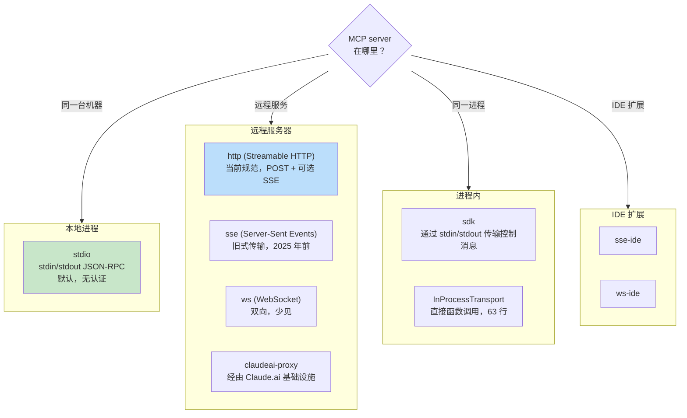
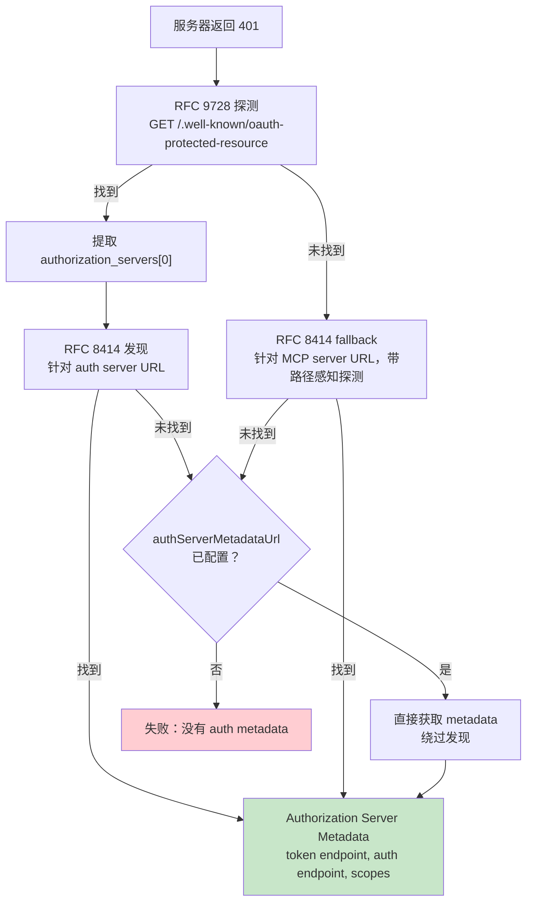

# 第 15 章：MCP——通用工具协议

## 为什么 MCP 的意义超越 Claude Code

本书其他章节讨论的都是 Claude Code 的内部机制。本章不同。Model Context Protocol 是一个任何智能体都可以实现的开放规范，而 Claude Code 的 MCP 子系统是现存最完整的生产级客户端之一。如果你正在构建一个需要调用外部工具的智能体——任何智能体、任何语言、任何模型——本章中的模式都可以直接迁移。

核心主张很直白：MCP 定义了一套 JSON-RPC 2.0 协议，用于在客户端（智能体）和服务器（工具提供方）之间进行工具发现与调用。客户端发送 `tools/list` 来发现服务器提供的能力，然后发送 `tools/call` 来执行。服务器用名称、描述以及输入的 JSON Schema 来描述每个工具。这就是完整契约。其他一切——传输选择、认证、配置加载、工具名称规范化——都是把一份干净规范变成能经受真实世界考验的实现工作。

Claude Code 的 MCP 实现横跨四个核心文件：`types.ts`、`client.ts`、`auth.ts` 和 `InProcessTransport.ts`。它们共同支持八种传输类型、七种配置作用域、跨两个 RFC 的 OAuth 发现，以及一个让 MCP 工具与内置工具不可区分的工具包装层——也就是第 6 章讨论过的同一个 `Tool` 接口。本章会逐层展开。

---

## 八种传输类型

任何 MCP 集成里的第一个设计决策，都是客户端如何与服务器通信。Claude Code 支持八种传输配置：



有三个设计选择值得注意。第一，`stdio` 是默认值——当省略 `type` 时，系统会假定这是一个本地子进程。这与最早的 MCP 配置保持向后兼容。第二，fetch wrapper 是叠放的：超时包装在 step-up 检测外层，step-up 检测又在基础 fetch 外层。每个 wrapper 只处理一个关注点。第三，`ws-ide` 分支存在 Bun/Node 运行时分流——Bun 的 `WebSocket` 原生接受代理和 TLS 选项，而 Node 需要 `ws` 包。

**什么时候用哪一种。** 对本地工具（文件系统、数据库、自定义脚本），使用 `stdio`——没有网络，没有认证，只有管道。对远程服务，`http`（Streamable HTTP）是当前规范推荐。`sse` 属于旧式方案，但部署广泛。`sdk`、IDE 和 `claudeai-proxy` 类型则属于各自生态系统内部。

---

## 配置加载与作用域

MCP 服务器配置会从七个作用域加载，然后合并并去重：

| 作用域 | 来源 | 信任 |
|-------|--------|-------|
| `local` | 工作目录中的 `.mcp.json` | 需要用户批准 |
| `user` | `~/.claude.json` 的 mcpServers 字段 | 用户管理 |
| `project` | 项目级配置 | 共享项目设置 |
| `enterprise` | 托管企业配置 | 由组织预先批准 |
| `managed` | 插件提供的服务器 | 自动发现 |
| `claudeai` | Claude.ai Web 界面 | 通过 Web 预授权 |
| `dynamic` | 运行时注入（SDK） | 以编程方式添加 |

**去重基于内容，而不是基于名称。** 两个名称不同但命令或 URL 相同的服务器会被识别为同一个服务器。`getMcpServerSignature()` 函数会计算一个规范 key：本地服务器是 `stdio:["command","arg1"]`，远程服务器是 `url:https://example.com/mcp`。如果插件提供的服务器签名与手动配置匹配，就会被屏蔽。

---

## 工具包装：从 MCP 到 Claude Code

连接成功后，客户端会调用 `tools/list`。每个工具定义都会被转换成 Claude Code 内部的 `Tool` 接口——也就是内置工具使用的同一个接口。包装完成后，模型无法区分一个工具是内置工具还是 MCP 工具。

包装过程分为四个阶段：

**1. 名称规范化。** `normalizeNameForMCP()` 会把无效字符替换成下划线。完全限定名遵循 `mcp__{serverName}__{toolName}`。

**2. 描述截断。** 上限是 2,048 个字符。实践中观察到，OpenAPI 生成的服务器会把 15-60KB 内容倾倒进 `tool.description`——对单个工具来说，每轮大约 15,000 个 token。

**3. Schema 透传。** 工具的 `inputSchema` 会直接传给 API。包装时不做转换，也不做验证。Schema 错误会在调用时暴露，而不是在注册时暴露。

**4. 注解映射。** MCP annotations 会映射到行为标志：`readOnlyHint` 将工具标记为可安全并发执行（如第 7 章的流式执行器所讨论），`destructiveHint` 会触发额外的权限审查。这些 annotations 来自 MCP 服务器——恶意服务器可以把破坏性工具标记为只读。这是一个被接受的信任边界，但值得理解：用户选择接入了该服务器，而恶意服务器把破坏性工具标记为只读是真实攻击向量。系统接受这个权衡，因为替代方案——完全忽略 annotations——会阻止合法服务器改善用户体验。

---

## MCP 服务器的 OAuth

远程 MCP 服务器通常需要认证。Claude Code 实现了完整的 OAuth 2.0 + PKCE 流程，包括基于 RFC 的发现、Cross-App Access 和错误 body 规范化。

### 发现链



`authServerMetadataUrl` 这个兜底配置之所以存在，是因为有些 OAuth 服务器两个 RFC 都没有实现。

### Cross-App Access (XAA)

当 MCP 服务器配置带有 `oauth.xaa: true` 时，系统会通过 Identity Provider 执行联合式 token exchange——一次 IdP 登录即可解锁多个 MCP 服务器。

### 错误 Body 规范化

`normalizeOAuthErrorBody()` 函数用于处理违反规范的 OAuth 服务器。Slack 会对错误响应返回 HTTP 200，并把错误埋在 JSON body 中。该函数会检查 2xx POST 响应 body；当 body 匹配 `OAuthErrorResponseSchema` 但不匹配 `OAuthTokensSchema` 时，会把响应重写为 HTTP 400。它还会把 Slack 特有错误码（`invalid_refresh_token`、`expired_refresh_token`、`token_expired`）规范化为标准的 `invalid_grant`。

---

## 进程内传输

不是每个 MCP 服务器都需要成为独立进程。`InProcessTransport` 类让 MCP 服务器和客户端可以运行在同一个进程中：

```typescript
class InProcessTransport implements Transport {
  async send(message: JSONRPCMessage): Promise<void> {
    if (this.closed) throw new Error('Transport is closed')
    queueMicrotask(() => { this.peer?.onmessage?.(message) })
  }
  async close(): Promise<void> {
    if (this.closed) return
    this.closed = true
    this.onclose?.()
    if (this.peer && !this.peer.closed) {
      this.peer.closed = true
      this.peer.onclose?.()
    }
  }
}
```

整个文件只有 63 行。有两个设计决策值得注意。第一，`send()` 通过 `queueMicrotask()` 交付消息，以防同步请求/响应循环中出现栈深度问题。第二，`close()` 会级联到 peer，避免半开状态。Chrome MCP server 和 Computer Use MCP server 都使用这种模式。

---

## 连接管理

### 连接状态

每个 MCP 服务器连接都处于五种状态之一：`connected`、`failed`、`needs-auth`（带 15 分钟 TTL 缓存，用于防止 30 个服务器各自独立发现同一个过期 token）、`pending` 或 `disabled`。

### Session 过期检测

MCP 的 Streamable HTTP 传输使用 session ID。当服务器重启时，请求会返回 HTTP 404，并带有 JSON-RPC 错误码 -32001。`isMcpSessionExpiredError()` 函数会同时检查这两个信号——注意，它使用错误消息中的字符串包含关系来检测错误码，这很务实但也脆弱：

```typescript
export function isMcpSessionExpiredError(error: Error): boolean {
  const httpStatus = 'code' in error ? (error as any).code : undefined
  if (httpStatus !== 404) return false
  return error.message.includes('"code":-32001') ||
    error.message.includes('"code": -32001')
}
```

检测到后，连接缓存会清空，并且调用会重试一次。

### 批量连接

本地服务器以 3 个为一批连接（拉起进程可能耗尽文件描述符），远程服务器以 20 个为一批连接。React context provider `MCPConnectionManager.tsx` 负责管理生命周期，将当前连接与新配置做 diff。

---

## Claude.ai 代理传输

`claudeai-proxy` 传输展示了一种常见的智能体集成模式：通过中介连接。Claude.ai 订阅者通过 Web 界面配置 MCP “连接器”（connectors），而 CLI 会经由 Claude.ai 的基础设施路由，由后者处理供应商侧 OAuth。

`createClaudeAiProxyFetch()` 函数会在请求时捕获 `sentToken`，而不是在 401 之后重新读取。在来自多个连接器的并发 401 下，另一个连接器的重试可能已经刷新了 token。即使 refresh handler 返回 false，该函数也会检查是否发生了并发刷新——也就是 “ELOCKED contention” 场景：另一个连接器赢得了 lockfile 竞争。

---

## 超时架构

MCP 超时是分层的，每一层都防护一种不同的失败模式：

| 层级 | 时长 | 防护对象 |
|-------|----------|------------------|
| 连接 | 30s | 不可达或启动缓慢的服务器 |
| 单请求 | 60s（每个请求新建） | 过期 timeout signal bug |
| 工具调用 | ~27.8 小时 | 合法的长时间操作 |
| Auth | 每个 OAuth 请求 30s | 不可达的 OAuth 服务器 |

单请求超时值得强调。早期实现会在连接时创建一个 `AbortSignal.timeout(60000)`。空闲 60 秒后，下一个请求会立即 abort——因为这个 signal 已经过期。修复方式是：`wrapFetchWithTimeout()` 为每个请求创建一个新的 timeout signal。它还会在最后一步规范化 `Accept` header，以防运行时和代理把它丢掉。

---

## 应用到你的系统：把 MCP 集成进你自己的智能体

**从 stdio 开始，之后再增加复杂度。** `StdioClientTransport` 会处理所有事情：spawn、pipe、kill。一行配置、一个传输类，你就拥有了 MCP 工具。

**规范化名称并截断描述。** 名称必须匹配 `^[a-zA-Z0-9_-]{1,64}$`。用 `mcp__{serverName}__` 作为前缀来避免冲突。把描述上限设为 2,048 个字符——否则 OpenAPI 生成的服务器会浪费上下文 token。

**惰性处理 auth。** 在服务器返回 401 之前，不要尝试 OAuth。大多数 stdio 服务器不需要 auth。

**对内置服务器使用进程内传输。** `createLinkedTransportPair()` 可以消除你所控制服务器的子进程开销。

**尊重工具 annotations，并清理输出。** `readOnlyHint` 支持并发执行。要清理响应中可能误导模型的恶意 Unicode（双向覆盖、零宽连接符）。

MCP 协议刻意保持最小化——两个 JSON-RPC 方法。这些方法与生产部署之间的一切都是工程：八种传输、七个配置作用域、两个 OAuth RFC，以及分层超时。Claude Code 的实现展示了这种工程在规模化时的样子。

下一章会考察当智能体越过 localhost 时会发生什么：远程执行协议如何让 Claude Code 运行在云容器中、从 Web 浏览器接收指令，并通过会注入凭据的代理来隧穿 API 流量。
