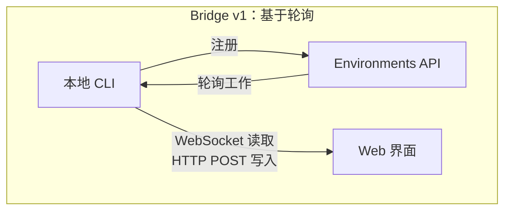
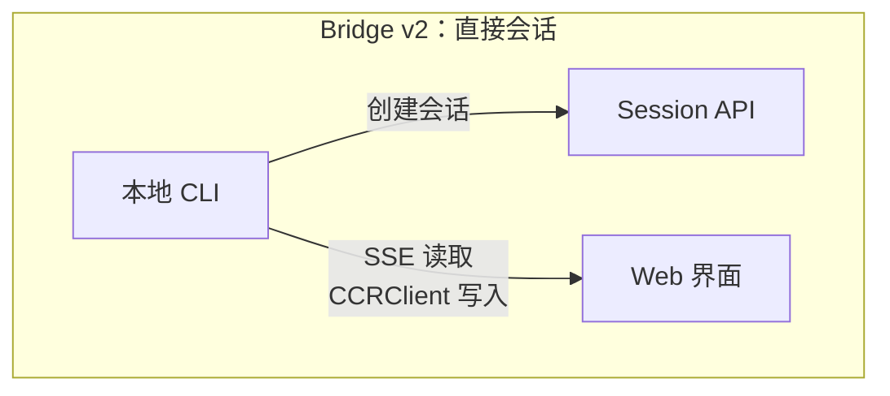
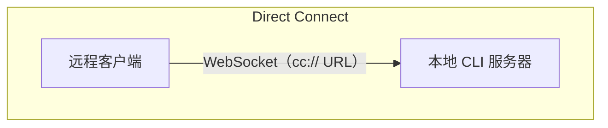
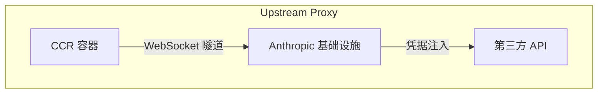

# 第 16 章：远程控制与云端执行

## 智能体越过 localhost

到目前为止，每一章都假设 Claude Code 运行在代码所在的同一台机器上。终端是本地的。文件系统是本地的。模型响应会流式返回给一个同时拥有键盘和工作目录的进程。

一旦你想从浏览器控制 Claude Code、把它运行在云端容器内，或者在 LAN 上把它作为服务暴露出去，这个假设就会失效。智能体需要一种方式，从 Web 浏览器、移动应用或自动化流水线接收指令；把权限提示转发给并不坐在终端前的人；并通过可能会代表智能体注入凭据或终止 TLS 的基础设施，为它的 API 流量建立隧道。

Claude Code 用四个系统解决这个问题，每个系统对应一种不同的拓扑：

<div class="diagram-grid">









</div>

这些系统共享同一种设计哲学：读写不对称，重连自动发生，失败会优雅降级。

---

## Bridge v1：轮询、分发、派生

v1 bridge 是基于环境的远程控制系统。当开发者运行 `claude remote-control` 时，CLI 会向 Environments API 注册、轮询工作，并为每个会话派生一个子进程。

注册之前会先跑过一连串预检：运行时 feature gate、OAuth token 校验、组织策略检查、失效 token 检测（同一个过期 token 连续失败三次后触发跨进程退避），以及主动 token 刷新。主动刷新消除了大约 9% 本来会在第一次尝试时失败的注册。

注册完成后，bridge 进入长轮询循环。工作项会以 session（带有一个 `secret` 字段，其中包含 session token、API base URL、MCP config 和环境变量）或 healthcheck 的形式到达。bridge 会把 “no work” 日志消息限流为每 100 次空轮询记录一次。

每个会话都会派生一个 Claude Code 子进程，并通过 stdin/stdout 上的 NDJSON 与其通信。权限请求通过 bridge transport 流向 Web 界面，由用户在那里批准或拒绝。整个往返必须在大约 10–14 秒内完成。

---

## Bridge v2：直接会话与 SSE

v2 bridge 移除了整个 Environments API 层——没有注册、没有轮询、没有确认、没有心跳、也没有注销。动机是：v1 要求服务器在分发工作前先知道这台机器的能力。v2 把生命周期压缩成三个步骤：

1. **创建会话**：带着 OAuth 凭据调用 `POST /v1/code/sessions`。
2. **连接 bridge**：调用 `POST /v1/code/sessions/{id}/bridge`。返回 `worker_jwt`、`api_base_url` 和 `worker_epoch`。每次 `/bridge` 调用都会提升 epoch——它本身就是注册。
3. **打开 transport**：读取使用 SSE，写入使用 `CCRClient`。

transport 抽象（`ReplBridgeTransport`）把 v1 和 v2 统一到同一个接口背后，因此消息处理不需要知道自己正在和哪一代 bridge 对话。

当 SSE 连接因为 401 掉线时，transport 会通过新的 `/bridge` 调用拿到新凭据并重建，同时保留序列号游标——不会丢失消息。写入路径使用每实例的 `getAuthToken` 闭包，而不是进程级环境变量，防止 JWT 在并发会话之间泄漏。

### FlushGate

这里有一个微妙的顺序问题：bridge 需要发送对话历史，同时又要接受来自 Web 界面的实时写入。如果实时写入在历史刷出期间到达，消息可能会乱序投递。`FlushGate` 会在 flush POST 期间把实时写入排队，并在完成后按顺序排空它们。

### Token 刷新与 Epoch 管理

v2 bridge 会在 worker JWT 过期前主动刷新。新的 epoch 会告诉服务器：这是同一个 worker，只是带着新凭据。Epoch 不匹配（409 响应）会被激进处理：两个连接都会关闭，并抛出异常让调用方栈展开，从而防止 split-brain 场景。

---

## 消息路由与 Echo 去重

两代 bridge 都把 `handleIngressMessage()` 作为中央路由器：

1. 解析 JSON，规范化 control message key。
2. 将 `control_response` 路由到 permission handler，将 `control_request` 路由到 request handler。
3. 对照 `recentPostedUUIDs`（echo 去重）和 `recentInboundUUIDs`（重新投递去重）检查 UUID。
4. 转发已校验的用户消息。

### BoundedUUIDSet：O(1) 查找，O(capacity) 内存

bridge 有一个 echo 问题——消息可能会在读取流上回显回来，或者在 transport 切换期间被投递两次。`BoundedUUIDSet` 是一个 FIFO 有界集合，背后由环形缓冲区支撑：

```typescript
class BoundedUUIDSet {
  private buffer: string[]
  private set: Set<string>
  private head = 0

  add(uuid: string): void {
    if (this.set.size >= this.capacity) {
      this.set.delete(this.buffer[this.head])
    }
    this.buffer[this.head] = uuid
    this.set.add(uuid)
    this.head = (this.head + 1) % this.capacity
  }

  has(uuid: string): boolean { return this.set.has(uuid) }
}
```

两个实例并行运行，每个容量都是 2000。通过 Set 实现 O(1) 查找，通过环形缓冲区驱逐实现 O(capacity) 内存；没有 timer，也没有 TTL。未知的 control request subtype 会得到错误响应，而不是沉默——这避免了服务器一直等待一个永远不会到来的响应。

---

## 不对称设计：持久读取，HTTP POST 写入

CCR 协议使用不对称 transport：读取通过持久连接（WebSocket 或 SSE）流动，写入通过 HTTP POST 进行。这反映了通信模式中的根本不对称。

读取是高频、低延迟、由服务器发起的——token 流式生成期间每秒会有数百条小消息。持久连接是唯一合理的选择。写入是低频、由客户端发起、并且需要确认的——是每分钟若干条消息，而不是每秒若干条。HTTP POST 提供可靠投递、通过 UUID 实现幂等，并且天然适合与负载均衡器集成。

试图把两者统一到单个 WebSocket 上会产生耦合：如果 WebSocket 在写入期间掉线，你需要重试逻辑，并且必须区分“未发送”和“已发送但确认丢失”。分离通道让每一侧都能独立优化。

---

## 远程会话管理

`SessionsWebSocket` 管理 CCR WebSocket 连接的客户端侧。它的重连策略会区分不同失败类型：

| 失败 | 策略 |
|---------|----------|
| 4003（未授权） | 立即停止，不重试 |
| 4001（找不到会话） | 最多 3 次重试，线性退避（压缩期间的暂态问题） |
| 其他暂态问题 | 指数退避，最多 5 次尝试 |

`isSessionsMessage()` type guard 接受任何带有字符串 `type` 字段的对象——这是刻意保持宽松。硬编码的 allowlist 会在客户端更新之前悄悄丢弃新的消息类型。

---

## Direct Connect：本地服务器

Direct Connect 是最简单的拓扑：Claude Code 以服务器形式运行，客户端通过 WebSocket 连接。没有云端中介，也没有 OAuth token。

Session 有五种状态：`starting`、`running`、`detached`、`stopping`、`stopped`。元数据会持久化到 `~/.claude/server-sessions.json`，以便在服务器重启后恢复。`cc://` URL scheme 为本地连接提供了清晰的寻址方式。

---

## Upstream Proxy：容器中的凭据注入

upstream proxy 运行在 CCR 容器内部，解决一个具体问题：在智能体可能执行不受信任命令的容器里，把组织凭据注入到出站 HTTPS 流量中。

设置序列的顺序经过了仔细安排：

1. 从 `/run/ccr/session_token` 读取 session token。
2. 通过 Bun FFI 设置 `prctl(PR_SET_DUMPABLE, 0)`——阻止同 UID 的 ptrace 读取进程堆内存。没有这一步时，被 prompt 注入的 `gdb -p $PPID` 可能从内存中抓取 token。
3. 下载 upstream proxy CA certificate，并与系统 CA bundle 拼接。
4. 在临时端口上启动一个本地 CONNECT-to-WebSocket relay。
5. unlink token 文件——此时 token 只存在于堆内存中。
6. 为所有子进程导出环境变量。

每一步都是 fail open：错误会禁用 proxy，而不是杀掉会话。这是正确的权衡——proxy 失败意味着某些集成不可用，但核心功能仍然可用。

### Protobuf 手工编码

穿过隧道的字节会被包装进 `UpstreamProxyChunk` protobuf message。schema 非常简单——`message UpstreamProxyChunk { bytes data = 1; }`——因此 Claude Code 用十行代码手工编码，而不是引入 protobuf runtime：

```typescript
export function encodeChunk(data: Uint8Array): Uint8Array {
  const varint: number[] = []
  let n = data.length
  while (n > 0x7f) { varint.push((n & 0x7f) | 0x80); n >>>= 7 }
  varint.push(n)
  const out = new Uint8Array(1 + varint.length + data.length)
  out[0] = 0x0a  // field 1, wire type 2
  out.set(varint, 1)
  out.set(data, 1 + varint.length)
  return out
}
```

十行代码替代了完整的 protobuf runtime。单字段 message 不值得引入一个依赖——维护这些位操作的负担，远低于供应链风险。

---

## 应用到你的系统：设计远程智能体执行

**分离读取通道和写入通道。** 当读取是高频流、写入是低频 RPC 时，把它们统一起来会制造不必要的耦合。让每个通道独立失败、独立恢复。

**约束你的去重内存。** BoundedUUIDSet 模式提供固定内存的去重。任何至少一次投递系统都需要一个有界去重缓冲区，而不是一个无界 Set。

**让重连策略与失败信号成比例。** 永久失败不应该重试。暂态失败应该带退避重试。模糊失败应该以较低上限重试。

**在对抗环境中让 secret 只存在于堆内存。** 从文件读取 token、禁用 ptrace、再 unlink 文件，可以同时消除文件系统和内存检查两类攻击向量。

**辅助系统要 fail open。** upstream proxy 采用 fail open，因为它提供的是增强功能（凭据注入），不是核心功能（模型推理）。

远程执行系统编码了一个更深层的原则：智能体的核心循环（第 5 章）应该对指令来自哪里、结果流向哪里保持无感。bridge、Direct Connect 和 upstream proxy 都是 transport layer。无论用户坐在终端前，还是位于 WebSocket 的另一端，它们之上的消息处理、工具执行和权限流都是相同的。

下一章会考察另一个运维关注点：性能——Claude Code 如何在启动、渲染、搜索和 API 成本上榨出每一毫秒、每一个 token 的价值。
