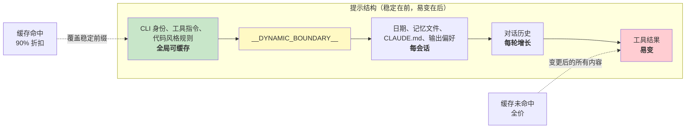

# 第 17 章：性能——每一毫秒和每一个 token 都重要

## 资深工程师的行动手册

智能体系统中的性能优化不是一个问题，而是五个问题：

1. **启动延迟**——从按键到第一个有用输出之间的时间。用户会放弃那些启动感觉缓慢的工具。
2. **Token 效率**——上下文窗口中有多少比例被有用内容而不是开销占用。上下文窗口是最受约束的资源。
3. **API 成本**——每一轮的美元成本。提示缓存可以把成本降低 90%，但前提是系统能在各轮之间保持缓存稳定性。
4. **渲染吞吐**——流式输出期间的每秒帧数。第 13 章介绍了渲染架构；本章介绍让它保持高速的性能测量和优化。
5. **搜索速度**——在一个包含 270,000 条路径的代码库中，每次按键时找到文件所需的时间。

Claude Code 同时攻克这五个问题，所用技术从显而易见的记忆化，到更精妙的用 26-bit bitmap 对模糊搜索做预过滤。关于方法论需要说明一点：这些不是理论优化。Claude Code 内置 50 多个启动性能分析检查点，对内部用户 100% 采样，对外部用户 0.5% 采样。下面每一项优化都来自这些 instrumentation 产生的数据，而不是凭直觉做出的判断。

---

## 在启动时节省毫秒

### 模块级 I/O 并行化

入口点 `main.tsx` 有意违反“模块作用域无副作用”的规则：

```typescript
profileCheckpoint('main_tsx_entry');
startMdmRawRead();       // fires plutil/reg-query subprocesses
startKeychainPrefetch();  // fires both macOS keychain reads in parallel
```

两个 macOS keychain 条目如果按顺序同步 spawn，原本会花费约 65ms。通过在模块级把二者作为 fire-and-forget promise 启动，它们会与约 135ms 的模块加载并行执行；否则这些 I/O 要等到模块加载之后才开始，后续等待会让 CPU 空转。

### API 预连接

`apiPreconnect.ts` 在初始化期间向 Anthropic API 发出一个 `HEAD` 请求，把 TCP+TLS 握手（100-200ms）与设置工作重叠起来。在交互模式下，这种重叠没有固定上限——用户打字时连接就在预热。该请求在 `applyExtraCACertsFromConfig()` 和 `configureGlobalAgents()` 之后发出，因此预热后的连接会使用正确的传输配置。

### 快路径分发和延迟导入

CLI 入口点包含针对专用子命令的 early-return 路径——`claude mcp` 永远不会加载 React REPL，`claude daemon` 永远不会加载工具系统。重模块只在需要时通过动态 `import()` 加载：OpenTelemetry（约 400KB + 约 700KB gRPC）、事件日志、错误对话框、上游代理。`LazySchema` 把 Zod schema 构造推迟到第一次校验时，把成本推过启动阶段。

---

## 在上下文窗口中节省 token

### 槽位预留：默认 8K，升级到 64K

影响最大的单项优化：

默认输出槽位预留为 8,000 tokens，在发生截断时升级到 64,000。API 会为模型响应预留 `max_output_tokens` 容量。SDK 默认值是 32K-64K，但生产数据表明 p99 输出长度是 4,911 tokens。默认值会超额预留 8-16 倍，每轮浪费 24,000-59,000 tokens。Claude Code 把默认上限限制在 8K，并在少见的截断情况（<1% 请求）下以 64K 重试。对一个 200K 窗口来说，这让可用上下文免费提升 12-28%。

### 工具结果预算

| 限制 | 值 | 目的 |
|-------|-------|---------|
| 单工具字符数 | 50,000 | 超过时将结果持久化到磁盘 |
| 单工具 token 数 | 100,000 | 约 400KB 文本上限 |
| 单消息总量 | 200,000 chars | 防止 N 个并行工具在一轮中耗尽预算 |

关键洞察是单消息总量限制。没有它，“读取 src/ 中所有文件”可能产生 10 个并行读取，每个都返回 40K 字符。

### 上下文窗口大小设定

默认 200K-token 窗口可通过模型名称上的 `[1m]` 后缀或实验分组扩展到 1M。当用量接近限制时，一个 4 层压缩系统会渐进式地总结旧内容。Token 计数锚定在 API 实际返回的 `usage` 字段，而不是客户端侧估算——这会计入提示缓存 credits、thinking tokens 和服务端转换。

---

## 节省 API 调用成本

### 提示缓存架构



Anthropic 的提示缓存基于精确前缀匹配。如果前缀中间有一个 token 改变，后面的所有内容都会缓存未命中。Claude Code 会组织整个提示，让稳定部分在前，易变部分在后。

当 `shouldUseGlobalCacheScope()` 返回 true 时，动态边界之前的系统提示条目会获得 `scope: 'global'`——两个运行同一 Claude Code 版本的用户共享前缀缓存。存在 MCP 工具时会禁用 global scope，因为 MCP schema 是按用户不同的。

### 粘性锁存字段

五个 boolean 字段使用“粘性开启”模式——一旦为 true，就会在整个会话中保持 true：

| 锁存字段 | 它防止的问题 |
|-------------|-----------------|
| `promptCache1hEligible` | 会话中途的超额翻转改变缓存 TTL |
| `afkModeHeaderLatched` | Shift+Tab 切换导致缓存失效 |
| `fastModeHeaderLatched` | 进入/退出冷却导致两次缓存失效 |
| `cacheEditingHeaderLatched` | 会话中途配置切换导致缓存失效 |
| `thinkingClearLatched` | 已确认缓存未命中后再翻转 thinking mode |

每个字段都对应一个 header 或参数；如果在会话中途改变它，就会让约 50,000-70,000 tokens 的已缓存提示失效。这些锁存器牺牲会话中途切换能力来保住缓存。

### 记忆化的会话日期

```typescript
const getSessionStartDate = memoize(getLocalISODate)
```

没有这个机制，日期会在午夜改变，导致整个已缓存前缀失效。过期日期只是外观问题；缓存失效则会重新处理整个对话。

### Section 记忆化

系统提示 section 使用两级缓存。大多数内容使用 `systemPromptSection(name, compute)`，并缓存到 `/clear` 或 `/compact` 为止。核选项 `DANGEROUS_uncachedSystemPromptSection(name, compute, reason)` 会每一轮重新计算——这种命名约定强迫开发者说明为什么必须打破缓存。

---

## 在渲染中节省 CPU

第 13 章已经深入介绍了渲染架构——packed typed arrays、基于 pool 的 interning、双缓冲，以及 cell-level diffing。这里我们关注让它保持快速的性能测量和自适应行为。

终端渲染器通过 `throttle(deferredRender, FRAME_INTERVAL_MS)` 限流到 60fps。当终端失焦时，间隔加倍，降到 30fps。Scroll drain frames 以四分之一间隔运行，以获得最大滚动速度。这种自适应限流确保渲染永远不会消耗超过必要的 CPU。

React Compiler（`react/compiler-runtime`）会在整个代码库中自动记忆化组件渲染。手写 `useMemo` 和 `useCallback` 容易出错；编译器在构造上就能正确处理。预分配的冻结对象（`Object.freeze()`）消除了常见渲染路径值的分配——在 alt-screen mode 中每帧节省一次分配，经过数千帧后会显著累积。

完整渲染管线细节——`CharPool`/`StylePool`/`HyperlinkPool` interning 系统、blit optimization、damage rectangle tracking、OffscreenFreeze component——见第 13 章。

---

## 在搜索中节省内存和时间

模糊文件搜索在每次按键时运行，搜索 270,000+ 条路径。三层优化让它保持在几毫秒以内。

### Bitmap 预过滤器

每条被索引的路径都会得到一个 26-bit bitmap，表示它包含哪些小写字母：

```typescript
// Pseudocode — illustrates the 26-bit bitmap concept
function buildCharBitmap(filepath: string): number {
  let mask = 0
  for (const ch of filepath.toLowerCase()) {
    const code = ch.charCodeAt(0)
    if (code >= 97 && code <= 122) mask |= 1 << (code - 97)
  }
  return mask  // Each bit represents presence of a-z
}
```

搜索时：`if ((charBits[i] & needleBitmap) !== needleBitmap) continue`。任何缺少查询字母的路径都会立即失败——一次整数比较，没有字符串操作。拒绝率：像 “test” 这样宽泛的查询约 10%，包含罕见字母的查询则超过 90%。成本：每条路径 4 字节，对 270,000 条路径约 1MB。

### 分数上界拒绝和融合的 indexOf 扫描

通过 bitmap 的路径会先接受一次分数上限检查，然后才进入昂贵的边界/camelCase 评分。如果最佳情况下的分数也无法超过当前 top-K 阈值，就跳过该路径。

实际匹配使用 `String.indexOf()` 把位置查找与 gap/consecutive bonus 计算融合在一起；`String.indexOf()` 在 JSC（Bun）和 V8（Node）中都有 SIMD 加速。引擎优化过的搜索明显快于手写字符循环。

### 支持部分可查询的异步索引

对于大型代码库，`loadFromFileListAsync()` 每完成约 4ms 工作就向 event loop yield 一次（基于时间，而不是基于计数——可适应机器速度）。它返回两个 promise：`queryable`（首个 chunk 完成时 resolve，从而立即启用部分结果）和 `done`（完整索引完成）。文件列表可用后 5-10ms 内，用户就能开始搜索。

yield 检查使用 `(i & 0xff) === 0xff`——一种无分支的 modulo-256，用来摊销 `performance.now()` 的成本。

---

## 记忆相关性旁路查询

有一项优化位于 token 效率和 API 成本的交叉点。如第 11 章所述，记忆系统使用一次轻量级 Sonnet 模型调用——不是主 Opus 模型——来选择应包含哪些 memory files。与不包含无关 memory files 所节省的 token 相比，这个成本（快速模型上的 256 max output tokens）可以忽略不计。单个无关的 2,000-token memory 在上下文中浪费的成本，比旁路查询消耗的 API 调用成本更高。

---

## 推测性工具执行

`StreamingToolExecutor` 会在工具以流式方式到达时就开始执行它们，而不是等待完整响应结束。只读工具（Glob、Grep、Read）可以并行执行；写入工具需要独占访问。`partitionToolCalls()` 函数会把连续的安全工具分组为批次：[Read, Read, Grep, Edit, Read, Read] 会变成三个批次——[Read, Read, Grep] 并发、[Edit] 串行、[Read, Read] 并发。

结果始终按原始工具顺序 yield，以保证模型推理的确定性。当 Bash 工具报错时，一个 sibling abort controller 会终止并行子进程，防止资源浪费。

---

## 流式传输与 Raw API

Claude Code 使用 raw streaming API，而不是 SDK 的 `BetaMessageStream` helper。该 helper 会在每个 `input_json_delta` 上调用 `partialParse()`——相对于工具输入长度是 O(n^2)。Claude Code 会累积 raw strings，并在 block 完成时只解析一次。

如果没有 chunk 到达，streaming watchdog（`CLAUDE_STREAM_IDLE_TIMEOUT_MS`，默认 90 秒）会 abort 并重试；在代理失败时 fallback 到非 streaming 的 `messages.create()`。

---

## 应用到你的系统：智能体系统的性能

**审计你的上下文窗口预算。** 你的 `max_output_tokens` 预留量与你实际 p99 输出长度之间的差距，就是被浪费的上下文。设置一个紧凑的默认值，并在截断时升级。

**为缓存稳定性而设计。** 提示中的每个字段要么稳定，要么易变。稳定在前，易变在后。把稳定前缀在对话中途发生的任何变化，都当作一个带有美元成本的 bug。

**并行化启动 I/O。** 模块加载受 CPU 约束。Keychain 读取和网络握手受 I/O 约束。在 import 之前启动 I/O。

**为搜索使用 bitmap 预过滤器。** 一个廉价预过滤器如果能在昂贵评分之前拒绝 10-90% 的候选项，那么即使每个条目只多花 4 字节，也会带来显著收益。

**在真正重要的地方测量。** Claude Code 有 50 多个启动检查点，对内部用户 100% 采样，对外部用户 0.5% 采样。没有测量的性能工作就是猜测。

---

最后观察一点：这些优化大多并不具备高深的算法复杂度。Bitmap 预过滤器、环形缓冲区、记忆化、interning——这些都是计算机科学基础。真正复杂的是知道该把它们用在哪里。启动性能分析器告诉你毫秒在哪里。API usage 字段告诉你 token 在哪里。缓存命中率告诉你钱在哪里。永远先测量，再优化。
