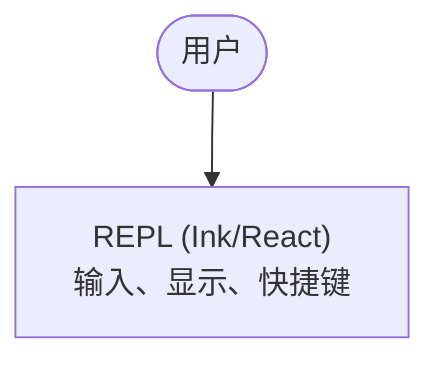
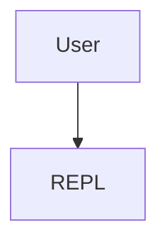

# 简体中文翻译风格指南

本文档定义《Claude Code from Source》简体中文译稿的表达、格式和 Markdown 处理规则。

## 目标读者

目标读者是熟悉工程实践的中文技术读者，包括：

- 构建 AI 智能体系统的高级工程师；
- 评估智能体架构的技术负责人；
- 对生产级 AI 编程工具内部机制感兴趣的开发者。

译文应保持专业、直接、有判断力。不要翻成学术论文腔，也不要过度口语化。

## 语气

保持“专家同行解释给另一个专家听”的语气。

推荐：

> 这个设计聪明之处在于，它把终止原因变成了类型系统的一部分。

避免：

> 值得注意的是，这个设计比较聪明，因为它将终止原因变成了类型系统的一部分。

## 人称

- 原文使用 “we” 时，通常译为“我们”。
- 原文直接对读者说 “you” 时，按上下文译为“你”或省略主语。
- 技术说明中优先使用无主句，使中文更自然。

示例：

| English | 推荐译法 |
|---|---|
| Let’s trace a request. | 我们来跟踪一次请求。 |
| You can steal this pattern. | 你可以把这个模式用到自己的系统里。 |
| What follows is... | 下面是…… |

## 标点与空格

- 中文正文使用中文标点：，。；：？！
- 中文与英文单词之间加空格：使用 Claude Code 构建智能体。
- 中文与数字之间加空格：等待 5 秒。
- 中文与行内代码之间加空格：调用 `query()` 后进入循环。
- 行内代码内部不加中文标点。

## Markdown 规则

### 需要翻译

- 标题
- 正文
- 表格中的说明文字
- 图片 alt 文本
- Mermaid 图中展示给读者看的节点文本
- 章节目录与小节名称

### 通常不翻译

- 代码块中的代码
- 文件名、路径、包名
- 函数名、类名、类型名、变量名
- 命令行输入
- JSON/YAML key
- HTTP header 名称
- API、SDK、CLI、REPL 等常用缩写

### 视情况翻译

- 代码注释：若注释只是说明性文字，可以翻译；若来自真实示例或需要复制运行，保持英文。
- 终端输出：若是实际输出，保持英文；若是说明性伪输出，可翻译。
- Mermaid 节点标签：可翻译显示文本，但不得破坏 Mermaid 语法。

## 代码块规则

- 不翻译代码标识符。
- 不调整缩进。
- 不改变代码块语言标签，例如 ```typescript、```mermaid。
- 若代码是伪代码，也保持原结构。

## Mermaid 规则

可以翻译节点显示文本：



但不要翻译节点 ID：



其中 `User` 和 `REPL` 是图语法中的节点 ID，可保留英文。

## 固定标题译法

| English | 简体中文 |
|---|---|
| Apply This | 应用到你的系统 |
| What You're Looking At | 你正在看的是什么 |
| What You'll Learn | 你将学到什么 |
| The Golden Path | 黄金路径 |
| How the Pieces Connect | 各部分如何连接 |
| What We Learned | 我们学到了什么 |
| The Core Loop | 核心循环 |
| Performance Engineering | 性能工程 |
| The Interface | 界面 |
| Connectivity | 连接性 |
| Foundations | 基础 |

## 常见句式

| English | 推荐译法 |
|---|---|
| The key insight is... | 关键洞察是…… |
| The problem it solves: | 它解决的问题是： |
| This matters because... | 这一点很重要，因为…… |
| The pattern is consistent: | 这个模式是一致的： |
| There is no separate... | 不存在单独的…… |
| From that point forward... | 从这一点开始…… |

## 质量标准

每章完成后至少检查：

1. 标题层级是否与英文原文一致；
2. 代码块数量是否一致；
3. Mermaid 块是否仍能解析；
4. 表格是否仍合法；
5. 术语是否符合 `docs/terminology.zh-CN.md`；
6. 中文是否自然，不是逐词硬译；
7. 技术含义是否没有被改写。
